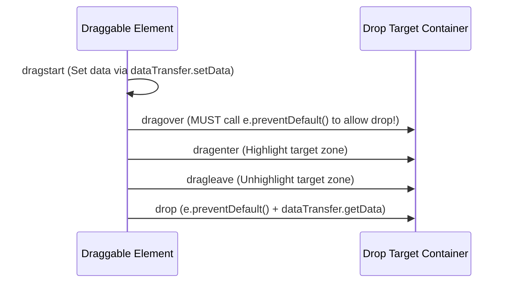

# File 15: Drag and Drop API

## Overview
The HTML5 **Drag and Drop API** allows dragging elements across the screen and dropping them into valid drop target zones using drag events (`dragstart`, `dragover`, `drop`) and the **`DataTransfer`** object.

---

## 1. Drag & Drop Lifecycle Sequence



---

## 2. Drag & Drop Implementation

```javascript
const draggableCard = document.querySelector("#card-1");
const dropZone = document.querySelector("#drop-zone");

// 1. Draggable Element Configuration
draggableCard.setAttribute("draggable", "true");

draggableCard.addEventListener("dragstart", event => {
    event.dataTransfer.setData("text/plain", draggableCard.id);
    event.dataTransfer.effectAllowed = "move";
    draggableCard.classList.add("dragging");
});

draggableCard.addEventListener("dragend", () => {
    draggableCard.classList.remove("dragging");
});

// 2. Drop Target Container Events
dropZone.addEventListener("dragover", event => {
    event.preventDefault(); // MANDATORY: Default browser behavior blocks dropping!
    event.dataTransfer.dropEffect = "move";
});

dropZone.addEventListener("dragenter", () => {
    dropZone.classList.add("hovered");
});

dropZone.addEventListener("dragleave", () => {
    dropZone.classList.remove("hovered");
});

dropZone.addEventListener("drop", event => {
    event.preventDefault(); // Stop default browser behavior
    dropZone.classList.remove("hovered");

    const elementId = event.dataTransfer.getData("text/plain");
    const draggedElement = document.getElementById(elementId);
    
    if (draggedElement) {
        dropZone.appendChild(draggedElement); // Append element into drop zone!
        console.log(`Element ${elementId} successfully dropped into target zone.`);
    }
});
```

---

## Key Takeaways
1. Set **`draggable="true"`** on elements you wish to drag.
2. Store transfer payloads inside **`event.dataTransfer.setData()`**.
3. **MANDATORY**: Always invoke **`event.preventDefault()`** on `dragover` and `drop` events to allow dropping.
