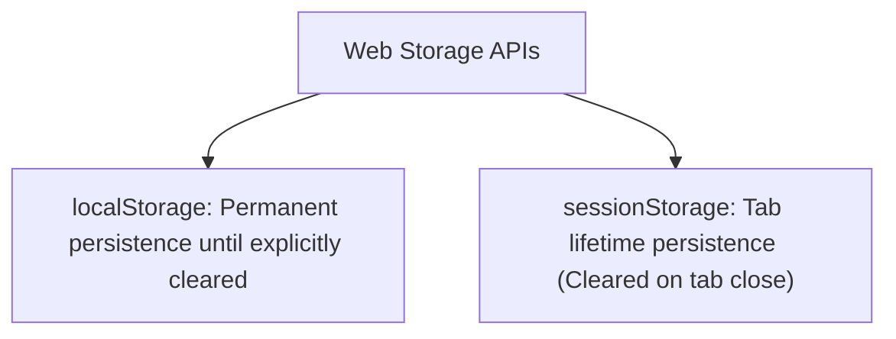

# File 16: Web Storage (localStorage & sessionStorage)

## Overview
Web Storage APIs (**`localStorage`** and **`sessionStorage`**) allow saving key-value string pairs in browser storage. `localStorage` persists data permanently across browser restarts, while `sessionStorage` persists data only for the current tab session.

---

## 1. LocalStorage vs SessionStorage Comparison



| Storage API | Lifetime | Scope | Capacity | Server Transmission |
| :--- | :--- | :--- | :--- | :--- |
| **`localStorage`** | Permanent | Same Origin (All Tabs) | ~5MB - 10MB | No (Client-side only) |
| **`sessionStorage`** | Current Tab Session | Same Origin (Single Tab) | ~5MB | No (Client-side only) |
| **`Cookies`** | Expiration Date | Same Origin (Sent in headers) | ~4KB | **Yes** (Sent in HTTP request headers) |

---

## 2. Safe JSON Wrapper Implementation

```javascript
// Storage Helper Utility handling JSON Serialization
const StorageHelper = {
    set(key, value) {
        try {
            const serialized = JSON.stringify(value);
            localStorage.setItem(key, serialized);
        } catch (err) {
            console.error(`Error saving key '${key}' to localStorage:`, err.message);
        }
    },

    get(key, defaultValue = null) {
        try {
            const item = localStorage.getItem(key);
            return item ? JSON.parse(item) : defaultValue;
        } catch (err) {
            console.error(`Error reading key '${key}':`, err.message);
            return defaultValue;
        }
    },

    remove(key) {
        localStorage.removeItem(key);
    },

    clear() {
        localStorage.clear();
    }
};

// Usage Example
StorageHelper.set("user_theme", { mode: "dark", fontSize: 16 });

const themeConfig = StorageHelper.get("user_theme");
console.log("Stored Theme:", themeConfig.mode); // "dark"
```

---

## Key Takeaways
1. **`localStorage`** persists across tab and browser restarts; **`sessionStorage`** cleared on tab close.
2. Web Storage stores **strings only**—always use `JSON.stringify()` and `JSON.parse()` for object data.
3. Storage APIs operate **synchronously** on the main thread—avoid storing massive objects to prevent UI blocking.
