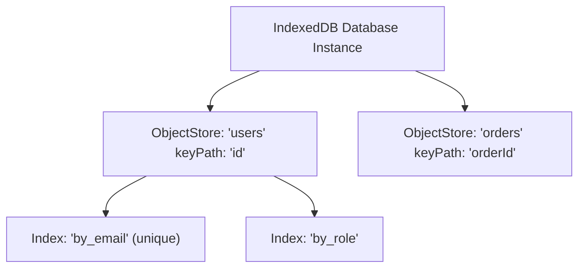

# File 17: IndexedDB API

## Overview
**IndexedDB** is a low-level, asynchronous, transactional NoSQL database built into client browsers. It supports storing large amounts of structured data, objects, binary blobs, and indexed searches.

---

## 1. IndexedDB Database Architecture



---

## 2. IndexedDB Operations Implementation

```javascript
// Opening Database Connection
function openDatabase() {
    return new Promise((resolve, reject) => {
        const request = indexedDB.open("AppDatabase", 1);

        // Version upgrade event (Creates Object Stores & Indexes)
        request.onupgradeneeded = event => {
            const db = event.target.result;
            if (!db.objectStoreNames.contains("users")) {
                const userStore = db.createObjectStore("users", { keyPath: "id" });
                userStore.createIndex("by_email", "email", { unique: true });
            }
        };

        request.onsuccess = () => resolve(request.result);
        request.onerror = () => reject(request.error);
    });
}

// Transactional Store Operations
async function saveUser(user) {
    const db = await openDatabase();
    return new Promise((resolve, reject) => {
        const tx = db.transaction("users", "readwrite");
        const store = tx.objectStore("users");
        
        const req = store.put(user);
        req.onsuccess = () => resolve(true);
        req.onerror = () => reject(req.error);
    });
}

async function getUserById(id) {
    const db = await openDatabase();
    return new Promise((resolve, reject) => {
        const tx = db.transaction("users", "readonly");
        const store = tx.objectStore("users");

        const req = store.get(id);
        req.onsuccess = () => resolve(req.result);
        req.onerror = () => reject(req.error);
    });
}

// Usage
saveUser({ id: 101, name: "Priya", email: "priya@example.com" })
    .then(() => getUserById(101))
    .then(user => console.log("Retrieved User from IndexedDB:", user));
```

---

## Key Takeaways
1. **IndexedDB** is an **asynchronous NoSQL database** supporting gigabytes of client storage.
2. Operations run inside ACID-compliant **Transactions** (`readonly`, `readwrite`).
3. Create indexes to enable high-speed key searches.
