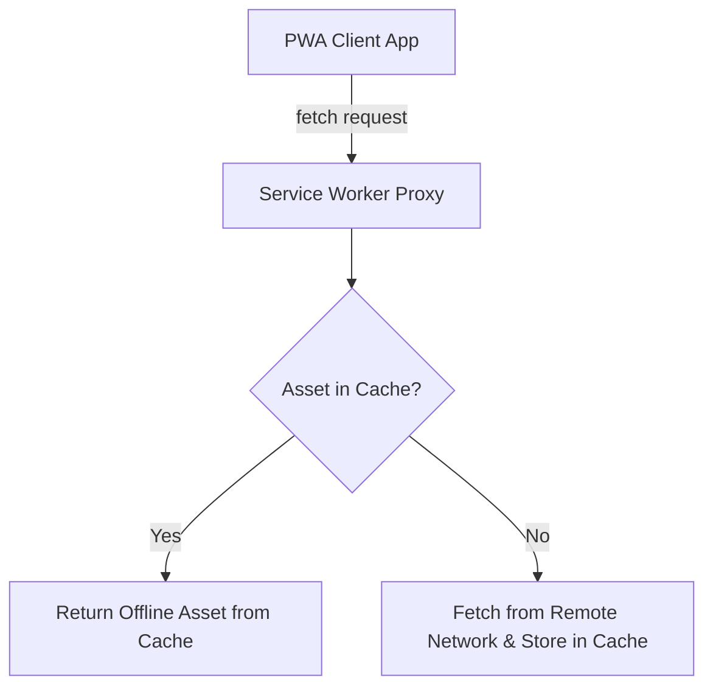

# File 20: Service Workers and Progressive Web Apps (PWA)

## Overview
A **Service Worker** is an event-driven background proxy script registered by the browser that intercepts network requests, manages offline caching strategies, and powers Progressive Web App (PWA) features like push notifications.

---

## 1. Service Worker Offline Cache Architecture



---

## 2. Service Worker Registration & Caching Implementation

### Service Worker Script (`sw.js`)
```javascript
const CACHE_NAME = "pwa-v1";
const ASSETS_TO_CACHE = [
    "/",
    "/index.html",
    "/style.css",
    "/script.js"
];

// 1. Install Event: Pre-cache Static Assets
self.addEventListener("install", event => {
    event.waitUntil(
        caches.open(CACHE_NAME).then(cache => {
            console.log("[SW] Pre-caching static assets");
            return cache.addAll(ASSETS_TO_CACHE);
        })
    );
});

// 2. Fetch Event: Cache-First Network Fallback Strategy
self.addEventListener("fetch", event => {
    event.respondWith(
        caches.match(event.request).then(cachedResponse => {
            if (cachedResponse) {
                return cachedResponse; // Return cached asset
            }
            return fetch(event.request); // Fallback to network
        })
    );
});
```

### Main Page Registration (`app.js`)
```javascript
if ("serviceWorker" in navigator) {
    window.addEventListener("load", () => {
        navigator.serviceWorker.register("/sw.js")
            .then(reg => console.log("Service Worker registered successfully with scope:", reg.scope))
            .catch(err => console.error("Service Worker registration failed:", err.message));
    });
}
```

---

## Key Takeaways
1. Service Workers act as **network proxies** sitting between application and network.
2. Enables **offline support** for Progressive Web Apps (PWAs).
3. Requires **HTTPS** (or localhost for development).
