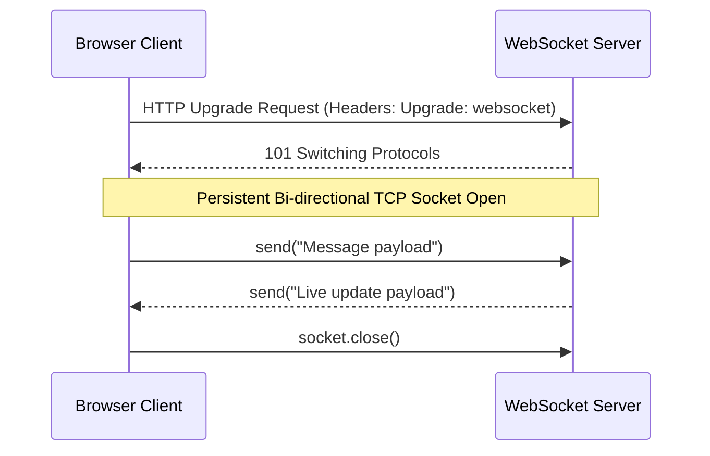

# File 21: WebSockets and Real-Time Communication

## Overview
**WebSockets** provide a persistent, full-duplex, bi-directional communication channel over a single TCP connection between browser clients and servers, enabling low-latency real-time applications (chat apps, live financial tickers, collaborative editors).

---

## 1. WebSocket Protocol Handshake & Lifecycle



---

## 2. WebSocket Client Implementation

```javascript
class RealtimeClient {
    constructor(url) {
        this.url = url;
        this.socket = null;
    }

    connect() {
        this.socket = new WebSocket(this.url);

        this.socket.onopen = event => {
            console.log("[WEBSOCKET CONNECTED] Connected to server:", this.url);
            this.send({ type: "AUTHENTICATE", token: "JWT_TOKEN_123" });
        };

        this.socket.onmessage = event => {
            const data = JSON.parse(event.data);
            console.log("[WEBSOCKET MESSAGE RECEIVED]:", data);
            this.handleMessage(data);
        };

        this.socket.onerror = error => {
            console.error("[WEBSOCKET ERROR]:", error);
        };

        this.socket.onclose = event => {
            console.log(`[WEBSOCKET CLOSED] Code: ${event.code}. Reconnecting in 3s...`);
            setTimeout(() => this.connect(), 3000); // Auto-reconnect!
        };
    }

    send(payload) {
        if (this.socket && this.socket.readyState === WebSocket.OPEN) {
            this.socket.send(JSON.stringify(payload));
        } else {
            console.warn("WebSocket is not connected. Message unsent.");
        }
    }

    handleMessage(data) {
        if (data.type === "CHAT_MESSAGE") {
            renderMessage(data);
        }
    }
}

// Client Instantiation
const chatClient = new RealtimeClient("wss://echo.websocket.org");
// chatClient.connect();
```

---

## Key Takeaways
1. WebSockets enable **full-duplex bi-directional real-time communication**.
2. Handshake starts as HTTP and upgrades to `ws://` or `wss://` (secure TCP socket).
3. Handle **`onopen`**, **`onmessage`**, **`onerror`**, and **`onclose`** lifecycle events.
4. Implement automatic reconnection logic inside `onclose` handlers for production resilience.
