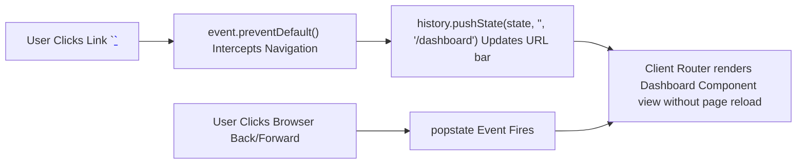

# File 22: History API and Client-Side Routing

## Overview
The **HTML5 History API** (`pushState`, `replaceState`, `popstate` event) allows Single Page Applications (SPAs) to update browser URL paths dynamically without triggering full page reloads.

---

## 1. History API & SPA Router Flow



---

## 2. Minimal SPA Router Implementation

```javascript
class SimpleRouter {
    constructor() {
        this.routes = new Map();
        
        // Listen to browser Back/Forward navigation buttons
        window.addEventListener("popstate", event => {
            this.resolveRoute(window.location.pathname);
        });
    }

    addRoute(path, componentFn) {
        this.routes.set(path, componentFn);
    }

    navigate(path) {
        // Push state to browser history stack without reloading page
        history.pushState({ path }, "", path);
        this.resolveRoute(path);
    }

    resolveRoute(path) {
        const component = this.routes.get(path) || this.routes.get("/404");
        const container = document.querySelector("#app-root");
        if (container && component) {
            container.innerHTML = component();
        }
    }
}

const router = new SimpleRouter();
router.addRoute("/", () => "<h1>Home Page View</h1>");
router.addRoute("/dashboard", () => "<h1>User Dashboard View</h1>");
router.addRoute("/404", () => "<h1>404 Page Not Found</h1>");

// Intercept link clicks globally for SPA navigation
document.addEventListener("click", event => {
    if (event.target.matches("a.nav-link")) {
        event.preventDefault();
        const targetPath = event.target.getAttribute("href");
        router.navigate(targetPath);
    }
});
```

---

## Key Takeaways
1. Use **`history.pushState(state, title, url)`** to update browser URL path without reloading.
2. Use **`history.replaceState()`** to modify current history entry without pushing a new stack entry.
3. Listen to **`window.addEventListener('popstate')`** to handle browser Back/Forward navigation buttons.
