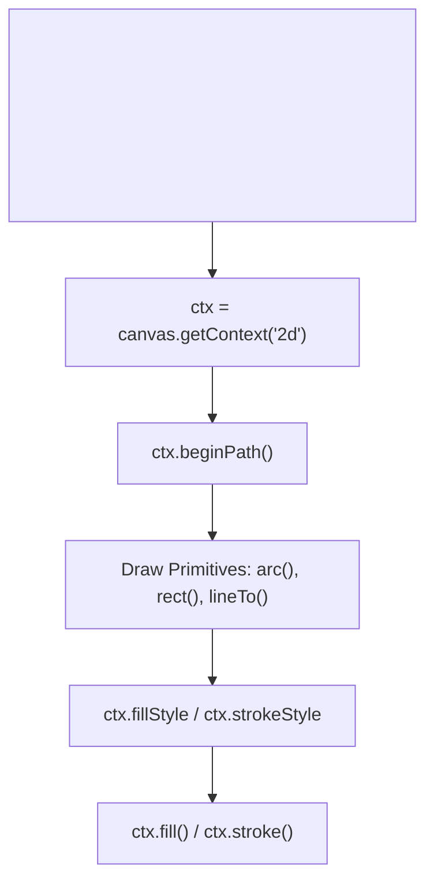

# File 23: HTML5 Canvas API

## Overview
The **HTML5 Canvas API** provides a hardware-accelerated 2D drawing context (`getContext('2d')`) allowing dynamic rendering of shapes, text, images, animations, games, and data visualizations directly in the browser.

---

## 1. Canvas 2D Rendering Pipeline



---

## 2. Canvas 2D Drawing Implementation

```javascript
const canvas = document.querySelector("#my-canvas");
const ctx = canvas.getContext("2d");

// 1. Drawing Rectangles
ctx.fillStyle = "#4a90e2";
ctx.fillRect(10, 10, 150, 100); // (x, y, width, height)

ctx.strokeStyle = "#e74c3c";
ctx.lineWidth = 4;
ctx.strokeRect(180, 10, 150, 100);

// 2. Drawing Paths & Circles
ctx.beginPath();
ctx.arc(100, 200, 50, 0, Math.PI * 2); // Circle (x, y, radius, startAngle, endAngle)
ctx.fillStyle = "#2ecc71";
ctx.fill();
ctx.closePath();

// 3. Drawing Text
ctx.font = "20px Inter, sans-serif";
ctx.fillStyle = "#333";
ctx.fillText("HTML5 Canvas Graphics", 10, 300);

// 4. Clearing Canvas Frame
function clearFrame() {
    ctx.clearRect(0, 0, canvas.width, canvas.height);
}
```

---

## Key Takeaways
1. Get the 2D rendering context via **`canvas.getContext('2d')`**.
2. Drawing primitives start with **`ctx.beginPath()`** and conclude with **`ctx.fill()`** or **`ctx.stroke()`**.
3. Use **`ctx.clearRect(0, 0, width, height)`** to wipe the canvas before drawing each new frame in animation loops.
