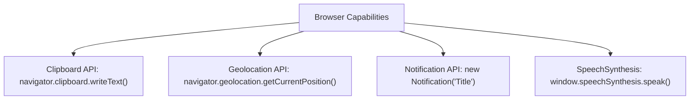

# File 24: Modern Browser APIs (Geolocation, Clipboard, Notification, Speech)

## Overview
Modern web browsers provide rich device integration APIs including **Clipboard API** (copy/paste text), **Geolocation API** (GPS coordinates), **Notification API** (desktop alerts), and **Speech Synthesis API** (text-to-speech).

---

## 1. Browser APIs Feature Capability Matrix



---

## 2. Browser Capabilities Implementation

```javascript
// 1. Clipboard API (Copying Text)
async function copyToClipboard(textToCopy) {
    try {
        await navigator.clipboard.writeText(textToCopy);
        console.log("Copied to clipboard successfully!");
    } catch (err) {
        console.error("Clipboard write failed:", err.message);
    }
}

// 2. Geolocation API (Fetching Lat/Long)
function getUserLocation() {
    if ("geolocation" in navigator) {
        navigator.geolocation.getCurrentPosition(
            position => {
                console.log(`Latitude: ${position.coords.latitude}, Longitude: ${position.coords.longitude}`);
            },
            error => console.error("Geolocation error:", error.message),
            { timeout: 10000, enableHighAccuracy: true }
        );
    }
}

// 3. Desktop Notification API
async function triggerNotification(title, options) {
    if (!("Notification" in window)) return;

    let permission = Notification.permission;
    if (permission === "default") {
        permission = await Notification.requestPermission();
    }

    if (permission === "granted") {
        new Notification(title, options);
    }
}

// 4. Speech Synthesis API (Text to Speech)
function speakText(text) {
    if ("speechSynthesis" in window) {
        const utterance = new SpeechSynthesisUtterance(text);
        utterance.rate = 1.0;
        utterance.pitch = 1.0;
        window.speechSynthesis.speak(utterance);
    }
}
```

---

## Key Takeaways
1. Always check API availability (`if ("clipboard" in navigator)`) before calling modern hardware APIs.
2. Require user permission prompts for Sensitive APIs (**Geolocation**, **Notifications**).
3. Use **`navigator.clipboard.writeText()`** for asynchronous, secure copying.
