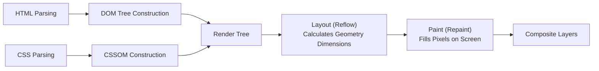

# File 25: DOM Performance and Rendering Optimization

## Overview
Web application performance depends heavily on minimizing browser **Reflows (Layout)** and **Repaints**, eliminating **Layout Thrashing**, and optimizing DOM operations using batch updates and **Virtual DOM / DocumentFragment** techniques.

---

## 1. Critical Rendering Path



### Reflow vs Repaint Causes

| Action | Triggers Reflow? (Layout) | Triggers Repaint? (Paint) |
| :--- | :--- | :--- |
| Changing `width`, `height`, `margin`, `fontSize` | **YES (Expensive)** | **YES** |
| Changing `color`, `background-color`, `visibility` | NO | **YES** |
| Changing `transform` or `opacity` (GPU Layer) | **NO (Hardware Accelerated)** | **NO** |

---

## 2. Layout Thrashing & Fix Example

```javascript
// BAD: Layout Thrashing Anti-Pattern (Interleaving DOM Reads & Writes in a loop!)
function badLayoutLoop(elements) {
    elements.forEach(el => {
        // READ geometry (Forces synchronous reflow calculation!)
        const width = el.offsetWidth;
        // WRITE style (Invalidates layout!)
        el.style.width = `${width + 10}px`;
    });
}

// GOOD: Batch Reads first, then Batch Writes!
function goodLayoutLoop(elements) {
    // 1. BATCH READ PHASE
    const widths = elements.map(el => el.offsetWidth);

    // 2. BATCH WRITE PHASE
    elements.forEach((el, index) => {
        el.style.width = `${widths[index] + 10}px`;
    });
}
```

---

## Key Takeaways
1. Avoid **Layout Thrashing**—separate DOM reading operations (`offsetWidth`, `clientHeight`) from DOM writing operations.
2. Prefer CSS **`transform`** and **`opacity`** properties for smooth GPU-accelerated animations.
3. Use **`createDocumentFragment()`** or `requestAnimationFrame()` to batch bulk DOM updates.
