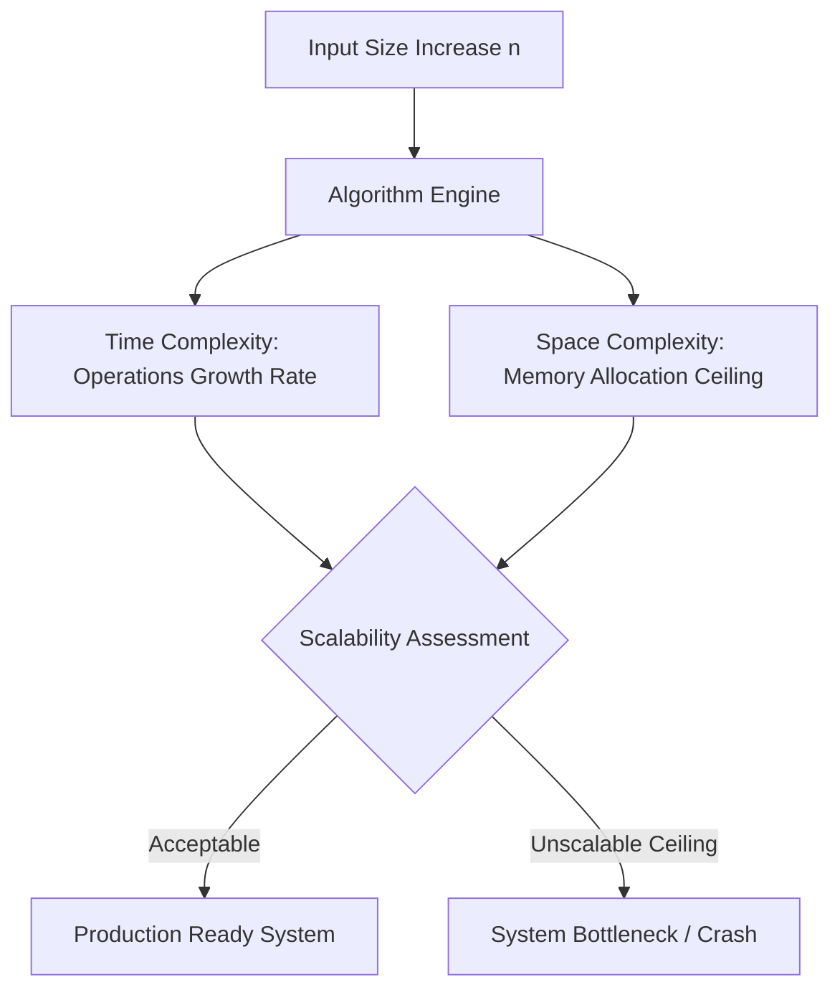
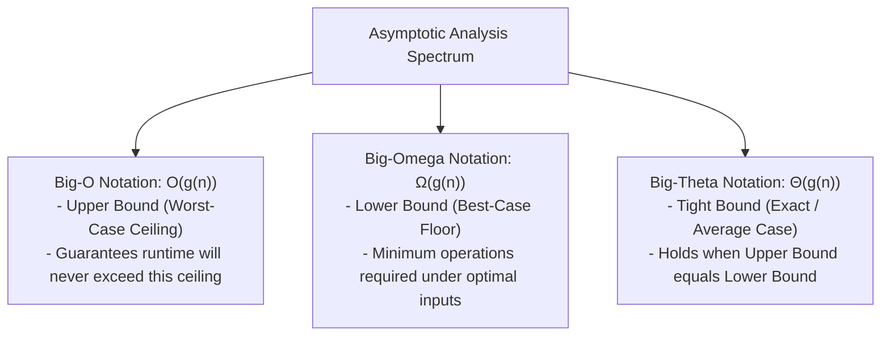
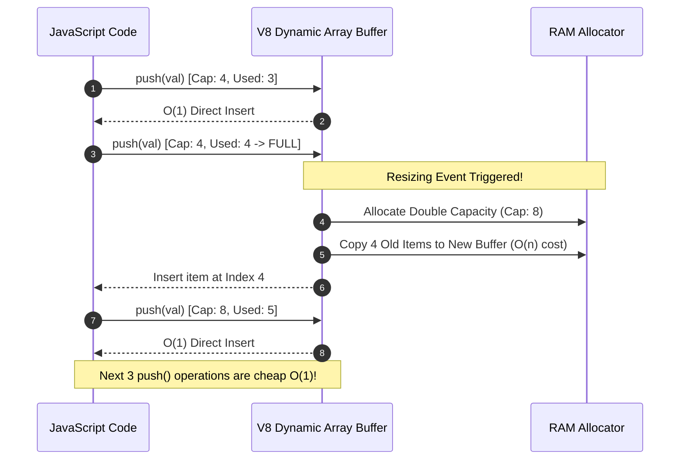

# Module 01: Big-O Notation, Asymptotic Analysis, and Space-Time Trade-offs

## Executive Summary & Theoretical Intuition

**Big-O Notation** ($\mathcal{O}$) is the formal mathematical language used in computer science and software engineering to quantify how an algorithm's performance (execution time and memory consumption) scales as the input size ($n$) approaches infinity.

Rather than measuring performance in milliseconds—which varies wildly depending on hardware architecture, CPU clock rates, operating system thread scheduling, and JavaScript V8 engine optimizations—Big-O measures the **rate of growth** relative to input size.



### Real-World Engineering Case Study: The IRCTC Tatkal Meltdown
Consider a high-traffic ticketing platform like IRCTC. At 10:00 AM, 10,000,000 users hit the platform simultaneously to book Tatkal train tickets:
- An **$\mathcal{O}(n^2)$** search or seat assignment algorithm requires $(10^7)^2 = 100,000,000,000,000$ operations ($10^{14}$ operations), resulting in server timeout and crash.
- An **$\mathcal{O}(n \log n)$** optimal sorting and matching algorithm executes in $10^7 \times 24 \approx 2.4 \times 10^8$ operations, completing smoothly in a fraction of a second.

---

## 1. Asymptotic Notations: Big-$\mathcal{O}$, Big-$\Omega$, and Big-$\Theta$

Algorithmic performance is bounded by three formal mathematical definitions:



1. **Big-$\mathcal{O}$ (Upper Bound / Worst Case)**: Represents the maximum number of operations an algorithm can take for any input of size $n$. This is the standard metric used in software engineering to guarantee system reliability.
2. **Big-$\Omega$ (Lower Bound / Best Case)**: Represents the minimum number of operations an algorithm requires. For example, searching for an item at index 0 in linear search takes $\Omega(1)$ time.
3. **Big-$\Theta$ (Tight Bound / Average Case)**: Describes exact performance when upper and lower bounds coincide within constant factors.

### The Growth Rate Spectrum

$$\mathcal{O}(1) < \mathcal{O}(\log n) < \mathcal{O}(\sqrt{n}) < \mathcal{O}(n) < \mathcal{O}(n \log n) < \mathcal{O}(n^2) < \mathcal{O}(2^n) < \mathcal{O}(n!)$$


### Big-O Complexity Comparison & Practical Input Limits

Assuming a standard CPU execution capacity of approximately **$10^8$ operations per second**:

| Notation | Growth Class | Operations for $n = 10,000$ | Practical Input Limit ($n$) | Code Pattern / Real-World Example |
| :--- | :--- | :--- | :--- | :--- |
| **$\mathcal{O}(1)$** | Constant | 1 op | Unlimited | Direct array index access, Hash Map lookup (`getPNRStatus`). |
| **$\mathcal{O}(\log n)$** | Logarithmic | ~14 ops | $n \approx 10^{18}+$ | Binary search (`binarySearchTrain`), Balanced BST lookup. |
| **$\mathcal{O}(\sqrt{n})$** | Square Root | 100 ops | $n \approx 10^{14}$ | Primality testing loop (`for i=2; i*i<=n`). |
| **$\mathcal{O}(n)$** | Linear | 10,000 ops | $n \approx 10^8$ | Single loop array search (`findPassenger`). |
| **$\mathcal{O}(n \log n)$** | Linearithmic | ~132,877 ops | $n \approx 10^7$ | Optimal sorting algorithms (`mergeSort`, QuickSort avg). |
| **$\mathcal{O}(n^2)$** | Quadratic | 100,000,000 ops | $n \approx 10^4$ | Nested loops, brute-force duplicate check (`findDuplicatesBrute`). |
| **$\mathcal{O}(2^n)$** | Exponential | $\approx 2 \times 10^{3010}$ ops | $n \approx 25$ | Naive recursive Fibonacci (`fibNaive`), power set generation. |
| **$\mathcal{O}(n!)$** | Factorial | Uncomputable | $n \approx 12$ | Permutation generation (`permutations`), brute-force TSP. |

---

## 2. Analysis Rules: Counting Big-O step-by-step

To analyze any JavaScript code snippet, apply five fundamental counting rules:

### Rule 1: Drop Constant Multipliers
Constants do not change the curve of the growth class as $n \to \infty$.
```javascript
// Function takes 2n operations -> O(n)
function printTwice(arr) {
  for (let x of arr) console.log(x); // n ops
  for (let x of arr) console.log(x); // n ops
}
```
$$\mathcal{O}(2n) \implies \mathcal{O}(n)$$

### Rule 2: Drop Non-Dominant Terms
As input size grows, lower-order terms become insignificant.
```javascript
function hybridProcessing(arr) {
  console.log(arr[0]); // O(1)
  for (let x of arr) console.log(x); // O(n)
  for (let i of arr) {
    for (let j of arr) console.log(i, j); // O(n²)
  }
}
```
$$\mathcal{O}(1 + n + n^2) \implies \mathcal{O}(n^2)$$

### Rule 3: Nested Loops Multiply
When operations are nested, their complexities multiply.
```javascript
// Outer loop runs n times, inner loop runs n times -> O(n * n) = O(n²)
for (let i = 0; i < n; i++) {
  for (let j = 0; j < n; j++) {
    // O(1) operation
  }
}
```

### Rule 4: Sequential Loops Add
Independent consecutive code blocks add together.
```javascript
// Loop A runs n times, Loop B runs m times -> O(n + m)
for (let i = 0; i < n; i++) { ... }
for (let j = 0; j < m; j++) { ... }
```

### Rule 5: Multiple Input Variables Stay Separate
If an algorithm operates on two distinct datasets of lengths $a$ and $b$, express the complexity as $\mathcal{O}(a \cdot b)$ or $\mathcal{O}(a + b)$, **never** automatically simplify to $\mathcal{O}(n^2)$.

---

## 3. Detailed Walkthrough of JavaScript Code Examples

### 1. Constant Time $\mathcal{O}(1)$: Direct Lookup
```javascript
function getFirstElement(arr) {
  return arr[0]; // Direct pointer arithmetic in memory: base_address + 0 * element_size
}

function getPNRStatus(pnrMap, pnrNumber) {
  return pnrMap.get(pnrNumber); // Hash calculation + O(1) array access
}
```
- **Explanation**: Accessing an array index or checking a hash map does not depend on whether the dataset contains 10 items or 100 million items.

### 2. Logarithmic Time $\mathcal{O}(\log n)$: Binary Search
```javascript
function binarySearchTrain(sortedTrains, targetNumber) {
  let left = 0, right = sortedTrains.length - 1, steps = 0;
  while (left <= right) {
    steps++;
    const mid = Math.floor((left + right) / 2);
    if (sortedTrains[mid] === targetNumber) return mid;
    else if (sortedTrains[mid] < targetNumber) left = mid + 1;
    else right = mid - 1;
  }
  return -1;
}
```
- **Execution Step Trace**: For $n = 1000$ sorted elements:
  - Step 1: Range = 1000 elements
  - Step 2: Range = 500 elements
  - Step 3: Range = 250 elements
  - ...
  - Step 10: Range = 1 element ($2^{10} = 1024 \implies \log_2(1000) \approx 10$ steps).

### 3. Linearithmic Time $\mathcal{O}(n \log n)$: Merge Sort
```javascript
function mergeSort(arr) {
  if (arr.length <= 1) return arr;
  const mid = Math.floor(arr.length / 2);
  const left = mergeSort(arr.slice(0, mid));
  const right = mergeSort(arr.slice(mid));
  return merge(left, right); 
}
```
- **Recurrence Relation**: $T(n) = 2T(n/2) + \mathcal{O}(n)$.
- The recursion tree has $\log_2(n)$ levels of depth. At each level, merging elements across all sub-arrays takes $\mathcal{O}(n)$ total steps. Thus, total runtime is $\mathcal{O}(n \log n)$.

### 4. Quadratic vs Linear Duplicate Detection
```javascript
// BAD: O(n²) Quadratic Time using nested loop comparison
function findDuplicatesBrute(bookings) {
  const dupes = [];
  for (let i = 0; i < bookings.length; i++)
    for (let j = i + 1; j < bookings.length; j++)
      if (bookings[i] === bookings[j]) dupes.push(bookings[i]);
  return dupes;
}

// GOOD: O(n) Linear Time using Hash Set space tradeoff
function findDuplicatesOptimal(bookings) {
  const seen = new Set(), dupes = [];
  for (const b of bookings) {
    if (seen.has(b)) dupes.push(b);
    else seen.add(b);
  }
  return dupes;
}
```
- **Trade-off Analysis**:
  - `findDuplicatesBrute`: Time $\mathcal{O}(n^2)$, Auxiliary Space $\mathcal{O}(1)$.
  - `findDuplicatesOptimal`: Time $\mathcal{O}(n)$, Auxiliary Space $\mathcal{O}(n)$ (stores unique elements in `Set`).

### 5. Exponential $\mathcal{O}(2^n)$ vs Memoized Linear $\mathcal{O}(n)$ Fibonacci
```javascript
// Naive recursive Fibonacci: O(2ⁿ) time, redundant subproblems
function fibNaive(n) {
  if (n <= 1) return n;
  return fibNaive(n - 1) + fibNaive(n - 2);
}

// Memoized Fibonacci: O(n) time, O(n) space
function fibMemo(n, memo = {}) {
  if (n in memo) return memo[n];
  if (n <= 1) return n;
  memo[n] = fibMemo(n - 1, memo) + fibMemo(n - 2, memo);
  return memo[n];
}
```
- `fibNaive(45)` makes over $2^{45} \approx 3.5 \times 10^{13}$ recursive calls, taking minutes.
- `fibMemo(45)` makes exactly 45 recursive calls by caching previously computed states in `memo`, executing in $< 1$ ms.

---

## 4. Space Complexity & Amortized Analysis

### Time vs Space Trade-off Matrix

```mermaid
flowchart LR
    Problem[Duplicate Detection] --> StrategyA[Strategy A: Brute Force]
    Problem --> StrategyB[Strategy B: Hash Set Caching]
    
    StrategyA --> ResA[Time: O(n²)<br/>Space: O(1)]
    StrategyB --> ResB[Time: O(n)<br/>Space: O(n)]
```

### Amortized Analysis: V8 Dynamic Array Allocation
An operation has **Amortized $\mathcal{O}(1)$** complexity when an expensive $\mathcal{O}(n)$ operation occurs infrequently, spreading its cost over many cheap $\mathcal{O}(1)$ operations.



- When `push()` is called $N$ times, resizing occurs at capacities $1, 2, 4, 8, 16, \dots, 2^k$.
- Total copy operations: $1 + 2 + 4 + 8 + \dots + N = 2N - 1 = \mathcal{O}(N)$.
- Amortized cost per `push()`: $\frac{\mathcal{O}(N)}{N} = \mathcal{O}(1)$.

---

## 5. Quick-Fire Code Snippet Analysis

1. **Sum Formula $\mathcal{O}(1)$**:
   ```javascript
   function snippet1(n) { return n * (n + 1) / 2; }
   ```
   No loops or recursion $\implies \mathcal{O}(1)$ time.

2. **Halving Loop $\mathcal{O}(\log n)$**:
   ```javascript
   function snippet5(n) {
     let count = 0, i = n;
     while (i > 1) { i = Math.floor(i / 2); count++; }
     return count;
   }
   ```
   Loop variable $i$ is halved each step $\implies \mathcal{O}(\log n)$ iterations.

3. **Primality Test $\mathcal{O}(\sqrt{n})$**:
   ```javascript
   function snippet7(n) {
     if (n < 2) return false;
     for (let i = 2; i * i <= n; i++) {
       if (n % i === 0) return false;
     }
     return true;
   }
   ```
   Loop runs while $i^2 \le n \implies i \le \sqrt{n}$, resulting in $\mathcal{O}(\sqrt{n})$ time.

---

## Summary Key Takeaways

1. **Big-O represents asymptotic growth rate**, not execution time in milliseconds.
2. **Focus on Worst-Case Bounds** to ensure system reliability under peak load.
3. **Drop constants and lower-order terms** during calculation.
4. **Nested operations multiply**, while independent sequential operations add.
5. **Space complexity includes extra memory** allocated during execution plus recursive call stack depth.
6. **Amortized $\mathcal{O}(1)$** averages infrequent expensive operations over many constant-time operations.
