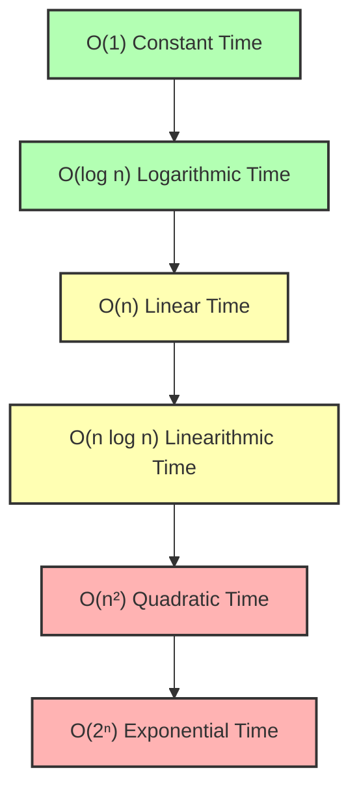

# File 01: Big-O Notation and Time / Space Complexity

## Overview
**Big-O Notation** is the mathematical framework used to classify algorithm efficiency based on how execution time (**Time Complexity**) and memory usage (**Space Complexity**) scale relative to the input size ($n$).

---

## 1. Big-O Complexity Growth Comparison



### Big-O Complexity Matrix

| Complexity | Name | Operations for $n = 1000$ | Example Algorithms / Data Structures |
| :--- | :--- | :--- | :--- |
| **$O(1)$** | Constant | 1 operation | Array indexing, Hash Table lookup |
| **$O(\log n)$** | Logarithmic | ~10 operations | Binary Search, BST Lookup |
| **$O(n)$** | Linear | 1,000 operations | Linear Search, Single Loop iteration |
| **$O(n \log n)$** | Linearithmic | ~10,000 operations | Merge Sort, Quick Sort |
| **$O(n^2)$** | Quadratic | 1,000,000 operations | Bubble Sort, Nested Loops |
| **$O(2^n)$** | Exponential | $10^{301}$ operations | Recursive Fibonacci, Subsets |

---

## 2. Analyzing Code Examples

```javascript
// 1. O(1) Constant Time
function getFirstElement(arr) {
    return arr[0]; // Execution time is independent of array length n
}

// 2. O(n) Linear Time
function findSum(arr) {
    let sum = 0;
    for (let i = 0; i < arr.length; i++) { // Runs n times
        sum += arr[i];
    }
    return sum;
}

// 3. O(n²) Quadratic Time
function printAllPairs(arr) {
    for (let i = 0; i < arr.length; i++) {       // Runs n times
        for (let j = 0; j < arr.length; j++) {   // Runs n times per outer iteration
            console.log(arr[i], arr[j]);         // Total: n * n = n²
        }
    }
}
```

---

## Key Takeaways
1. Big-O analyzes **worst-case asymptotic growth** as input size ($n$) approaches infinity.
2. Drop constant multipliers ($O(2n) \rightarrow O(n)$) and lower-order terms ($O(n^2 + n) \rightarrow O(n^2)$).
3. **Space Complexity** measures auxiliary memory allocated on the call stack and heap during execution.
