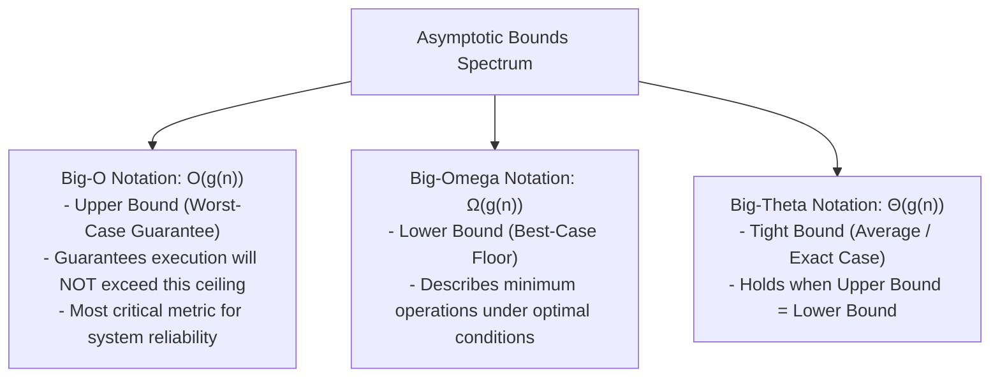
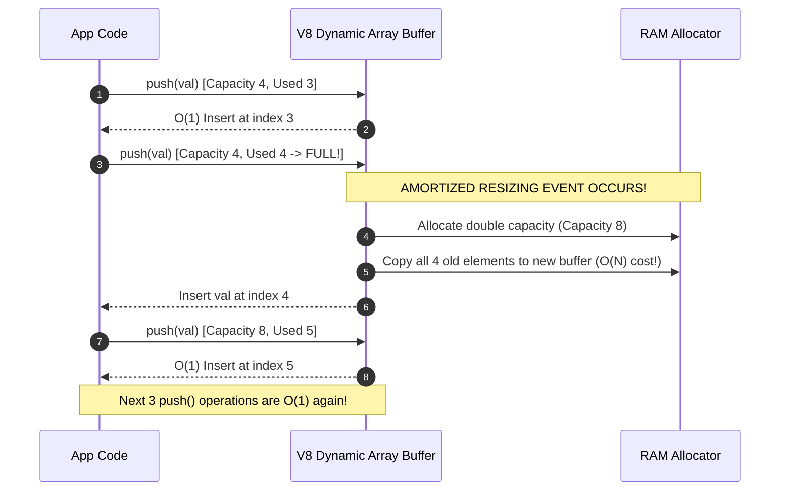

# Module 01: Big-O Notation, Asymptotic Analysis, and Space-Time Trade-offs

## Overview

**Big-O Notation** ($\mathcal{O}$) is the formal mathematical notation used in computer science to describe the limiting behavior of an algorithm as the input size ($n$) approaches infinity.

It quantifies the execution runtime (**Time Complexity**) and memory usage (**Space Complexity**), enabling developers to evaluate algorithmic scalability independently of host hardware, CPU clock speeds, or V8 engine runtime variations.

---

## 1. Asymptotic Notations: Big-$\mathcal{O}$, Big-$\Omega$, and Big-$\Theta$

Algorithm performance is classified under three formal asymptotic bounds:



### Growth Rate Comparison Hierarchy

$$\mathcal{O}(1) < \mathcal{O}(\log n) < \mathcal{O}(n) < \mathcal{O}(n \log n) < \mathcal{O}(n^2) < \mathcal{O}(2^n) < \mathcal{O}(n!)$$


### Big-O Complexity Comparison Matrix

| Notation | Growth Class | Operations for $n = 10,000$ | Memory / Time Behavior | Common Algorithms / Operations |
| :--- | :--- | :--- | :--- | :--- |
| **$\mathcal{O}(1)$** | Constant | 1 operation | Immediate return; independent of input length $n$. | Array indexing, Hash Map get/set, Stack `push`/`pop`. |
| **$\mathcal{O}(\log n)$** | Logarithmic | ~14 operations | Input halved at each step; extremely efficient. | Binary Search, Balanced BST lookup, Sqrt decomposition. |
| **$\mathcal{O}(n)$** | Linear | 10,000 operations | Execution scales proportionally 1:1 with input $n$. | Linear search, Single array pass, String scanning. |
| **$\mathcal{O}(n \log n)$** | Linearithmic | ~132,877 operations | Divide-and-conquer processing across $n$ levels. | Merge Sort, Quick Sort (avg), Heap Sort, TimSort. |
| **$\mathcal{O}(n^2)$** | Quadratic | 100,000,000 operations | Nested iterations over $n \times n$ combinations. | Bubble Sort, Insertion Sort, All pairs comparisons. |
| **$\mathcal{O}(2^n)$** | Exponential | $\approx 2 \times 10^{3010}$ ops | Execution doubles with every single increment of $n$. | Recursive Fibonacci, Generating all subsets/power set. |
| **$\mathcal{O}(n!)$** | Factorial | Uncomputable | Explodes instantly; checks all permutations. | Traveling Salesperson (brute force), N-Queens enumeration. |

---

## 2. Mathematical Rules of Asymptotic Simplification

When computing the Big-O bound of an algorithm, apply two fundamental reduction rules:

### Rule 1: Drop Non-Dominant Terms
As $n \to \infty$, higher-order terms completely dominate total runtime.
$$\mathcal{O}(n^2 + 500n + 10000) \implies \mathcal{O}(n^2)$$

### Rule 2: Drop Constant Multipliers
Hardware speed changes constant factors, but not the growth class curve.
$$\mathcal{O}(35 \cdot n) \implies \mathcal{O}(n)$$

---

## 3. Amortized Time Complexity Analysis

**Amortized Analysis** considers the average time per operation over a sequence of operations, accounting for occasional expensive operations spread over many cheap operations.

**Classic Example: Dynamic Array `push()` Resizing**
In JavaScript, arrays dynamically resize when capacity is reached.



> **Amortized Proof**: Copying $N$ elements costs $\mathcal{O}(N)$, but this cost occurs only once every $N$ insertions. Dividing $\mathcal{O}(N) / N$ yields an **Amortized Time Complexity of $\mathcal{O}(1)$** per `push()`.

---

## 4. Space Complexity: Auxiliary Space vs. Input Space

Space Complexity measures total memory allocated during algorithm execution.

$$\text{Total Space} = \text{Input Space (Memory for input data)} + \text{Auxiliary Space (Temporary memory allocated by algorithm)}$$

### Call Stack Space in Recursion
Recursive functions consume Call Stack frames for each active recursive depth:

```javascript
// Time: O(n) | Space: O(n) due to Call Stack recursion depth of n frames
function recursiveSum(n) {
  if (n <= 0) return 0;
  return n + recursiveSum(n - 1);
}

// Time: O(n) | Space: O(1) Auxiliary Space (Iterative reuse of variables)
function iterativeSum(n) {
  let sum = 0;
  for (let i = 1; i <= n; i++) {
    sum += i;
  }
  return sum;
}
```

---

## Key Production Takeaways

1. **Focus on Worst-Case $\mathcal{O}$ for SLA Reliability**: Always analyze worst-case input scenarios to guarantee your service SLAs under peak load.
2. **Distinguish Auxiliary Space from Input Space**: Modifying data in-place yields $\mathcal{O}(1)$ auxiliary space, whereas instantiating new arrays or recursive call stacks incurs $\mathcal{O}(n)$ auxiliary space.
3. **Beware of Hidden V8 Methods**: Methods like `Array.prototype.unshift()`, `slice()`, `indexOf()`, or string concatenation inside loops run in $\mathcal{O}(n)$ time, turning outer loops into unintended $\mathcal{O}(n^2)$ bottlenecks.
4. **Understand Amortized $\mathcal{O}(1)$**: Dynamic array inserts (`push`) are $\mathcal{O}(1)$ amortized, but occasional buffer allocations cause latency spikes. Pre-allocating arrays when size is known prevents dynamic re-allocations.

