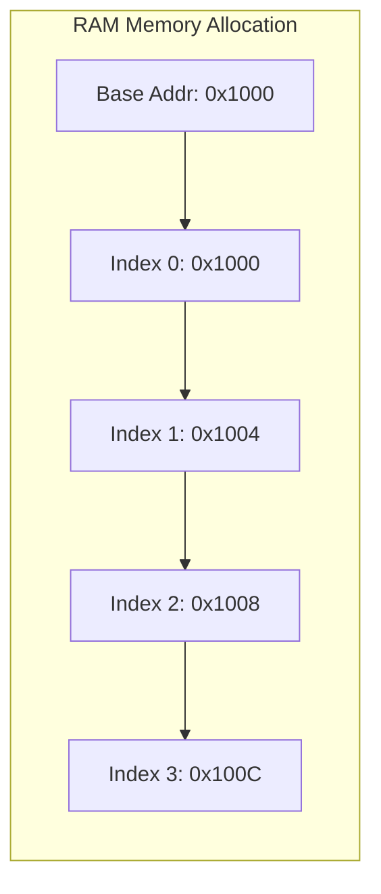
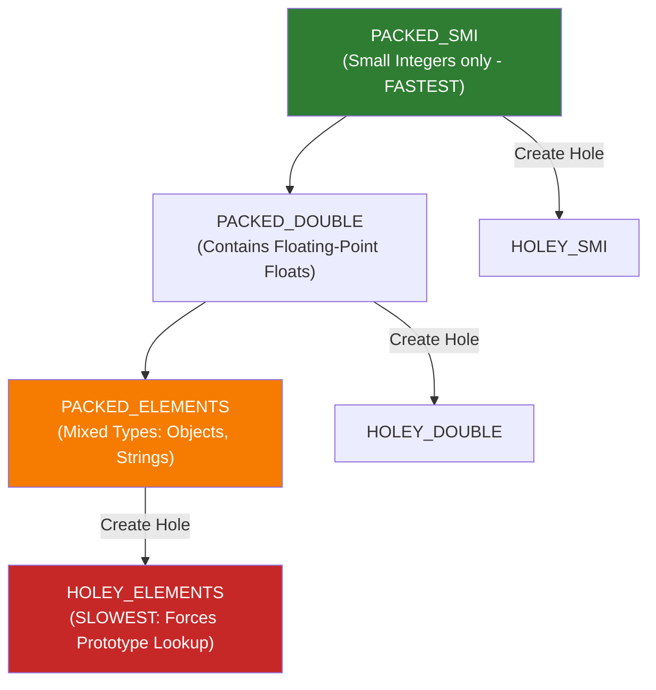

# Module 02: Arrays Deep Dive & Algorithmic Patterns

## Theoretical Overview & V8 Memory Internals

An **Array** is a contiguous block of memory allocated to hold elements sequentially. The core advantage of an array is **$\mathcal{O}(1)$ random access**: given an index $i$, the memory address is calculated instantaneously via simple offset math:

$$\text{Address}(i) = \text{Base Address} + (i \times \text{Element Size in Bytes})$$



### V8 Engine "Element Kinds" Architecture
JavaScript arrays are dynamic object wrappers backed by C++ structures in the V8 engine. V8 classifies arrays into **Element Kinds** based on contained data types and memory density:



1. **PACKED_SMI**: Stores raw 31-bit signed small integers. Memory overhead is minimal, and operations bypass object lookup overhead.
2. **PACKED_DOUBLE**: Stores IEEE 754 64-bit floating-point numbers.
3. **PACKED_ELEMENTS**: Stores mixed types (e.g., numbers, strings, objects). Elements require boxed object pointers.
4. **HOLEY variants**: Occur when indices are missing (e.g., `arr[100] = 5` on an array of length 2). V8 must search up the prototype chain for missing keys.

> [!WARNING]
> **Monomorphic Transition Rule**: V8 element kinds only degrade down the hierarchy (e.g., `PACKED_SMI` $\to$ `PACKED_DOUBLE` $\to$ `PACKED_ELEMENTS` $\to$ `HOLEY`). They **never** upgrade back, even if floating-point elements or holes are subsequently deleted!

```javascript
// GOOD: Pre-allocate and fill to preserve PACKED_SMI
const optimalArray = new Array(100).fill(0); // PACKED_SMI

// BAD: Leaves 100 empty slots (holes)
const badArray = new Array(100); // Marked HOLEY permanently
```

---

## 1. Array Operations Complexity Matrix

| Operation | Method / Syntax | Time Complexity | Space Complexity | Explanation |
| :--- | :--- | :--- | :--- | :--- |
| **Index Access** | `arr[i]` | $\mathcal{O}(1)$ | $\mathcal{O}(1)$ | Immediate direct offset computation. |
| **Push at End** | `arr.push(val)` | $\mathcal{O}(1)$ amortized | $\mathcal{O}(1)$ | Appends element to end of array buffer. |
| **Pop from End** | `arr.pop()` | $\mathcal{O}(1)$ | $\mathcal{O}(1)$ | Removes last element without index shifts. |
| **Unshift at Start**| `arr.unshift(val)`| $\mathcal{O}(n)$ | $\mathcal{O}(1)$ | Re-indexes every single element to the right by +1. |
| **Shift from Start**| `arr.shift()` | $\mathcal{O}(n)$ | $\mathcal{O}(1)$ | Shifts every single element to the left by -1. |
| **Splice** | `arr.splice(i, k)`| $\mathcal{O}(n)$ | $\mathcal{O}(1)$ | Re-indexes all subsequent elements after index $i$. |
| **Linear Search** | `arr.indexOf(x)` | $\mathcal{O}(n)$ | $\mathcal{O}(1)$ | Scans elements sequentially from 0 to $n-1$. |

---

## 2. Core Algorithmic Patterns & Code Walkthroughs

### 1. Two-Pointer Target Sum (`twoSumSorted`)
Given a **sorted array**, find two indices whose elements sum to `target`.
- **Strategy**: Maintain two pointers at the boundaries (`left = 0`, `right = n - 1`). If `sum < target`, increment `left`. If `sum > target`, decrement `right`.
- **Complexity**: Time $\mathcal{O}(n)$, Space $\mathcal{O}(1)$.

```javascript
function twoSumSorted(sortedArr, target) {
  let left = 0, right = sortedArr.length - 1;
  while (left < right) {
    const sum = sortedArr[left] + sortedArr[right];
    if (sum === target) return [left, right];
    else if (sum < target) left++;
    else right--;
  }
  return null;
}
```

### 2. Kadane's Algorithm: Maximum Subarray Sum (`maxSubarraySum`)
Find the contiguous subarray with the largest sum.
- **Strategy**: At index $i$, decide whether to extend the existing subarray (`currentSum + arr[i]`) or start a new subarray fresh from `arr[i]`.
- **Complexity**: Time $\mathcal{O}(n)$, Space $\mathcal{O}(1)$.

```javascript
function maxSubarraySum(arr) {
  let maxSum = arr[0], currentSum = arr[0];
  for (let i = 1; i < arr.length; i++) {
    currentSum = Math.max(arr[i], currentSum + arr[i]);
    maxSum = Math.max(maxSum, currentSum);
  }
  return maxSum;
}
```

### 3. Prefix Sum Array (`buildPrefixSum` & `rangeSum`)
Compute sum of elements between indices `[left, right]` in $\mathcal{O}(1)$ time following an $\mathcal{O}(n)$ pre-processing step.
- **Formula**: $\text{RangeSum}(L, R) = P[R + 1] - P[L]$ where $P[i] = \sum_{k=0}^{i-1} \text{arr}[k]$.

```javascript
function buildPrefixSum(arr) {
  const prefix = new Array(arr.length + 1).fill(0);
  for (let i = 0; i < arr.length; i++) prefix[i + 1] = prefix[i] + arr[i];
  return prefix;
}

function rangeSum(prefix, left, right) {
  return prefix[right + 1] - prefix[left]; // O(1) query
}
```

### 4. Dutch National Flag: 3-Way Partitioning (`dutchNationalFlag`)
Sort an array of `0`s, `1`s, and `2`s in a single pass in-place.
- **Strategy**: Use three pointers (`low`, `mid`, `high`).
  - If `arr[mid] === 0`: Swap `arr[low]` and `arr[mid]`, increment `low` and `mid`.
  - If `arr[mid] === 1`: Increment `mid`.
  - If `arr[mid] === 2`: Swap `arr[mid]` and `arr[high]`, decrement `high`.
- **Complexity**: Time $\mathcal{O}(n)$, Space $\mathcal{O}(1)$.

```javascript
function dutchNationalFlag(arr) {
  let low = 0, mid = 0, high = arr.length - 1;
  while (mid <= high) {
    if (arr[mid] === 0) {
      [arr[low], arr[mid]] = [arr[mid], arr[low]];
      low++; mid++;
    } else if (arr[mid] === 1) {
      mid++;
    } else {
      [arr[mid], arr[high]] = [arr[high], arr[mid]];
      high--;
    }
  }
  return arr;
}
```

### 5. Rotate Array by K Steps via Three Reversals (`rotateArray`)
Rotate an array to the right by $k$ positions in $\mathcal{O}(n)$ time and $\mathcal{O}(1)$ space.
- **Algorithm**:
  1. Reverse the entire array.
  2. Reverse the first $k$ elements.
  3. Reverse the remaining $n - k$ elements.

```javascript
function reverseSection(arr, start, end) {
  while (start < end) {
    [arr[start], arr[end]] = [arr[end], arr[start]];
    start++; end--;
  }
}

function rotateArray(arr, k) {
  const n = arr.length;
  k = k % n;
  if (k === 0) return arr;
  reverseSection(arr, 0, n - 1);
  reverseSection(arr, 0, k - 1);
  reverseSection(arr, k, n - 1);
  return arr;
}
```

---

## 3. Classic Industry Problem Walkthroughs

1. **Move Zeroes to End (`moveZeroes`)**:
   Uses a read-write pointer pair to shift non-zero values forward in $\mathcal{O}(n)$ time and $\mathcal{O}(1)$ extra space, filling remaining trailing slots with zeros.

2. **Find Missing Number (`findMissingNumber`)**:
   Calculates expected sum using the Gaussian formula $S = \frac{n(n+1)}{2}$ and subtracts the actual array sum. Runs in $\mathcal{O}(n)$ time and $\mathcal{O}(1)$ space.

3. **Best Time to Buy and Sell Stock (`maxProfit`)**:
   Tracks minimum buying price encountered so far while calculating maximum potential profit at each step in $\mathcal{O}(n)$ time and $\mathcal{O}(1)$ space.

4. **Sliding Window Max Sum of K Consecutive Elements (`maxSumKConsecutive`)**:
   Maintains a fixed window sum of size $k$. On each step, adds the incoming element `arr[i]` and subtracts the outgoing element `arr[i - k]`, achieving $\mathcal{O}(n)$ runtime.

5. **Remove Duplicates from Sorted Array (`removeDuplicatesSorted`)**:
   Maintains a `write` pointer that overwrites duplicate values in-place in $\mathcal{O}(n)$ time and $\mathcal{O}(1)$ space.

---

## Key Takeaways

1. **Memory Locality**: Index access is $\mathcal{O}(1)$ due to contiguous memory allocation.
2. **Shift Overhead**: `shift()` and `unshift()` incur $\mathcal{O}(n)$ cost due to re-indexing elements; avoid in high-throughput loops.
3. **V8 Performance**: Avoid sparse arrays (holes) and keep data types homogeneous to prevent element kind degradation.
4. **Pattern Mastery**: Two-Pointer, Prefix Sum, Kadane's algorithm, and Sliding Window solve major array challenges in $\mathcal{O}(n)$ optimal time.
