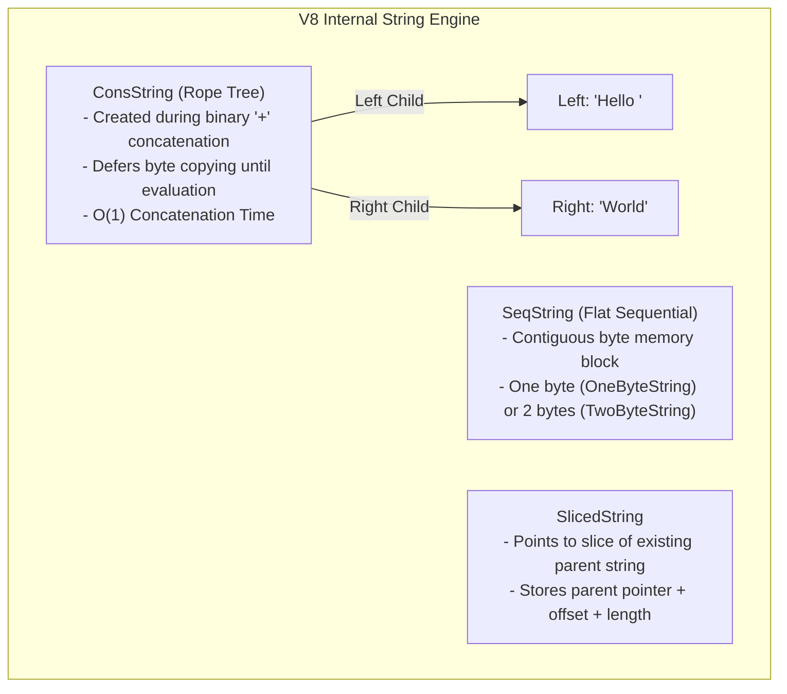

# Module 03: Strings, V8 String Memory Representation, and Pattern Matching (KMP Algorithm)

## Overview

In JavaScript, strings are **primitive, immutable sequences of UTF-16 code units**.

Because strings are immutable, mutating or concatenating strings creates new string memory allocations. To optimize performance, the V8 engine uses specialized internal string structures—such as **ConsStrings (Ropes)** and **SlicedStrings**—to avoid copying underlying byte arrays during concatenation.

---

## 1. V8 Internal String Memory Representations

When concatenating large strings (`str1 + str2`), V8 avoids immediate memory allocation and copying by instantiating internal string representations:



---

## 2. UTF-16 Code Units vs. Unicode Code Points

JavaScript strings use **UTF-16 encoding**, where each code unit is 16 bits (2 bytes).

- **BMP (Basic Multilingual Plane)**: Standard ASCII and common characters take 1 code unit (`length === 1`).
- **Supplementary Planes (Emojis & Symbols)**: Encoded as **Surrogate Pairs** using 2 code units (`length === 2`).

```javascript
const emoji = "😀"; 

console.log(emoji.length); // 2 ! (2 UTF-16 Code Units)
console.log(emoji.charCodeAt(0)); // 55357 (High Surrogate)
console.log(emoji.charCodeAt(1)); // 56832 (Low Surrogate)

// Correct Unicode Code Point Handling (ES6):
console.log(emoji.codePointAt(0)); // 128512 (True Unicode Scalar Value)
console.log([...emoji].length);    // 1 (Spread operator splits by Code Points!)
```

---

## 3. Pattern Matching Algorithms: Naive vs. KMP (Knuth-Morris-Pratt)

### Algorithm Complexity Comparison

| Algorithm | Best Case Time | Worst Case Time | Auxiliary Space | Key Mechanics |
| :--- | :--- | :--- | :--- | :--- |
| **Naive Search** | $\mathcal{O}(n)$ | $\mathcal{O}(n \times m)$ | $\mathcal{O}(1)$ | Checks every position; backtracks main string pointer. |
| **KMP Algorithm** | $\mathcal{O}(n + m)$ | $\mathcal{O}(n + m)$ | $\mathcal{O}(m)$ | Uses Longest Prefix Suffix (LPS) array; **never backtracks** text pointer! |
| **Rabin-Karp** | $\mathcal{O}(n + m)$ | $\mathcal{O}(n \times m)$ | $\mathcal{O}(1)$ | Uses rolling hash function to match pattern hash. |

---

## 4. KMP Algorithm & Longest Prefix Suffix (LPS) Array

The **KMP Algorithm** speeds up pattern matching from $\mathcal{O}(n \times m)$ to $\mathcal{O}(n + m)$ by precomputing a **Longest Proper Prefix which is also a Suffix (LPS)** array for the search pattern.

```mermaid
flowchart TD
    Pattern["Pattern: 'ABABC'"] --> LPSGen[Compute LPS Array]
    LPSGen --> LPSResult["LPS Table: [0, 0, 1, 2, 0]"]
    
    subgraph Text Matching Phase
        TextPointer["Text Pointer (i) Moves Forward ONLY"]
        PatternPointer["Pattern Pointer (j) Fallback via LPS Table"]

        TextPointer --> MatchCheck{Text[i] == Pattern[j]?}
        MatchCheck -- Match --> Advance["i++, j++"]
        MatchCheck -- Mismatch & j > 0 --> Fallback["j = LPS[j - 1]<br/>(Skip redundant comparisons!)"]
        MatchCheck -- Mismatch & j == 0 --> NextChar["i++"]
    end
```

### Complete KMP Implementation Code

```javascript
// Step 1: Precompute LPS (Longest Prefix Suffix) Array
function buildLPSArray(pattern) {
  const m = pattern.length;
  const lps = new Array(m).fill(0);
  let len = 0; // Length of previous longest prefix suffix
  let i = 1;

  while (i < m) {
    if (pattern[i] === pattern[len]) {
      len++;
      lps[i] = len;
      i++;
    } else {
      if (len !== 0) {
        len = lps[len - 1]; // Fallback without advancing i
      } else {
        lps[i] = 0;
        i++;
      }
    }
  }
  return lps;
}

// Step 2: KMP Substring Search Algorithm - O(N + M) Time
function kmpSearch(text, pattern) {
  if (pattern.length === 0) return 0;

  const n = text.length;
  const m = pattern.length;
  const lps = buildLPSArray(pattern);

  let i = 0; // Index for text
  let j = 0; // Index for pattern
  const matches = [];

  while (i < n) {
    if (pattern[j] === text[i]) {
      i++;
      j++;
    }

    if (j === m) {
      matches.push(i - j); // Match found at index (i - j)
      j = lps[j - 1];      // Prepare for next potential match
    } else if (i < n && pattern[j] !== text[i]) {
      if (j !== 0) {
        j = lps[j - 1];    // Smart skip using LPS!
      } else {
        i++;
      }
    }
  }

  return matches;
}

console.log("KMP Match Index:", kmpSearch("ABABDABACDABABCABAB", "ABABC")); // Output: [10]
```

---

## 5. Frequency Counter & Two-Pointer String Patterns

```javascript
// Valid Anagram Check via Frequency Map Array (O(n) Time, O(1) Space)
function isAnagram(s, t) {
  if (s.length !== t.length) return false;

  // Use fixed 26-element array for lowercase ASCII chars
  const charCounts = new Int32Array(26);

  for (let i = 0; i < s.length; i++) {
    charCounts[s.charCodeAt(i) - 97]++;
    charCounts[t.charCodeAt(i) - 97]--;
  }

  for (let i = 0; i < 26; i++) {
    if (charCounts[i] !== 0) return false;
  }

  return true;
}
```

---

## Key Production Takeaways

1. **Avoid Repeated String Concatenation in Loops**: Using `str += char` inside a loop creates $\mathcal{O}(n^2)$ total allocation overhead. Collect strings inside an array and call `.join('')` or use a StringBuilder pattern.
2. **Be Careful with Unicode Emojis**: Methods like `.length`, `.substring()`, and `.charAt()` work on UTF-16 Code Units, splitting surrogate pairs. Use `[...str]` or `String.prototype.codePointAt()` for true Unicode characters.
3. **Use KMP for Substring Searches on Large Texts**: When searching for patterns repeatedly in large text files, KMP guarantees linear $\mathcal{O}(n + m)$ execution without backtracking.
4. **Use Fixed ASCII Frequency Array Maps**: When solving character frequency problems restricted to standard English alphabets, replace `Map` objects with fixed-size `Int32Array(26)` for $10\times$ faster runtime performance.

