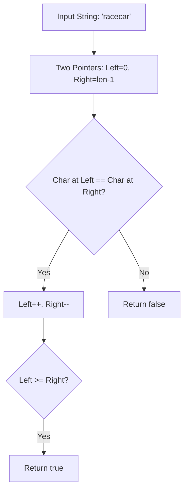

# File 03: Strings and Pattern Matching Algorithms

## Overview
JavaScript strings are immutable sequences of UTF-16 code units. Common string algorithms solve problems involving anagrams, palindromes, substring searching, and frequency counting.

---

## 1. Palindrome & Anagram Processing Flow



---

## 2. String Algorithm Implementation

```javascript
// 1. Valid Anagram Check (Frequency Counter Pattern)
function isAnagram(s, t) {
    if (s.length !== t.length) return false;

    const charMap = {};
    for (const char of s) {
        charMap[char] = (charMap[char] || 0) + 1;
    }

    for (const char of t) {
        if (!charMap[char]) return false;
        charMap[char]--;
    }

    return true;
}

console.log(isAnagram("anagram", "nagaram")); // true

// 2. Valid Palindrome (Two Pointers)
function isPalindrome(s) {
    const cleanStr = s.toLowerCase().replace(/[^a-z0-9]/g, "");
    let left = 0;
    let right = cleanStr.length - 1;

    while (left < right) {
        if (cleanStr[left] !== cleanStr[right]) return false;
        left++;
        right--;
    }
    return true;
}

console.log(isPalindrome("A man, a plan, a canal: Panama")); // true
```

---

## Key Takeaways
1. Strings are **immutable**; string concatenation (`+=`) inside loops creates $O(n^2)$ time overhead.
2. Use **Frequency Counter Maps** for anagram checks ($O(n)$ time).
3. Use **Two-Pointer Traversal** for palindrome verification ($O(n)$ time, $O(1)$ space).
