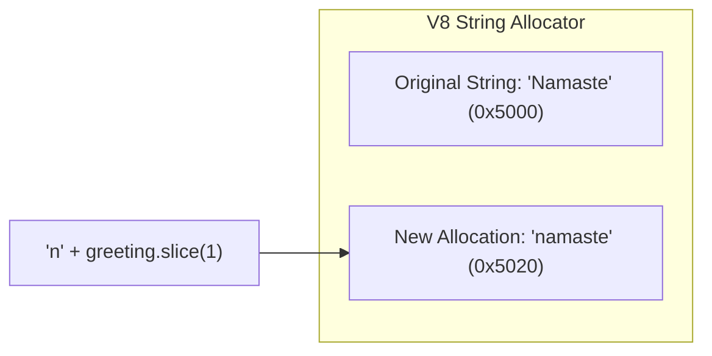
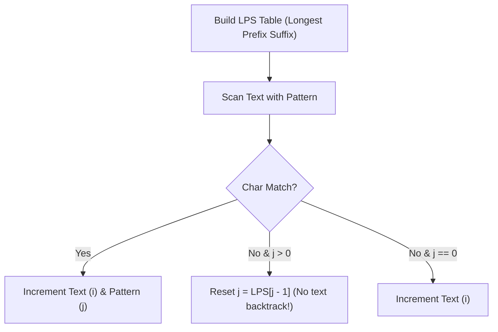

# Module 03: Strings, Internal Storage, and Pattern Matching Algorithms

## Theoretical Overview & JavaScript UTF-16 Encoding

In JavaScript, **Strings are Primitive Immutable Values**. Once a string is created in memory, its characters cannot be modified in-place. Any string operation (concatenation, slicing, case conversion) allocates a **brand new string** in memory.



### Memory & Storage Mechanics
- **UTF-16 Encoding**: JS strings use 16-bit code units. Basic Unicode characters take 2 bytes (1 Code Unit), while surrogate pairs (such as emojis like 🚀) occupy 4 bytes (2 Code Units).
- **Concatenation Trap**: Appending strings inside a loop using `str += char` creates intermediate string objects at each step:

$$\text{Total Copies} = 1 + 2 + 3 + \dots + n = \frac{n(n+1)}{2} = \mathcal{O}(n^2)$$

> [!TIP]
> **Performance Optimization**: Always collect characters in an array and invoke `.join("")`. Array pushing is $\mathcal{O}(1)$ amortized, and `.join("")` performs a single, exact memory buffer allocation of length $n$, executing in **$\mathcal{O}(n)$** overall time.

---

## 1. String Operations Complexity Matrix

| Operation | JavaScript Syntax | Time Complexity | Space Complexity | Why |
| :--- | :--- | :--- | :--- | :--- |
| **Character Access**| `str[i]` | $\mathcal{O}(1)$ | $\mathcal{O}(1)$ | Direct character indexing. |
| **Concatenation** | `a + b` | $\mathcal{O}(n + m)$ | $\mathcal{O}(n + m)$ | Allocates new string of combined length. |
| **Loop Concat** | `str += char` in loop | $\mathcal{O}(n^2)$ | $\mathcal{O}(n^2)$ | Re-allocates growing buffers on each step. |
| **Array Join** | `parts.join("")` | $\mathcal{O}(n)$ | $\mathcal{O}(n)$ | Pre-computes exact target length. |
| **Sub-string Search**| `str.indexOf(sub)` | $\mathcal{O}(n \cdot m)$ | $\mathcal{O}(1)$ | Naive search comparisons (V8 uses Boyer-Moore for long inputs). |
| **Split to Array** | `str.split("")` | $\mathcal{O}(n)$ | $\mathcal{O}(n)$ | Scans string and populates array. |

---

## 2. Core Algorithmic Patterns & Code Walkthroughs

### 1. Palindrome Verification via Two-Pointer (`isPalindrome`)
Verify if a string reads the same forwards and backwards after stripping non-alphanumeric characters.
- **Complexity**: Time $\mathcal{O}(n)$, Space $\mathcal{O}(n)$ for cleaned string.

```javascript
function isPalindrome(str) {
  const cleaned = str.toLowerCase().replace(/[^a-z0-9]/g, "");
  let left = 0, right = cleaned.length - 1;
  while (left < right) {
    if (cleaned[left] !== cleaned[right]) return false;
    left++; right--;
  }
  return true;
}
```

### 2. Anagram Validation via Frequency Map (`areAnagrams`)
Determine if two strings contain identical character counts.
- **Complexity**: Time $\mathcal{O}(n)$, Space $\mathcal{O}(k)$ where $k \le 256$ character set size.

```javascript
function areAnagrams(str1, str2) {
  if (str1.length !== str2.length) return false;
  const freq = new Map();
  for (const c of str1) freq.set(c, (freq.get(c) || 0) + 1);
  for (const c of str2) {
    if (!freq.has(c) || freq.get(c) === 0) return false;
    freq.set(c, freq.get(c) - 1);
  }
  return true;
}
```

### 3. Longest Substring Without Repeating Characters (`longestUniqueSubstring`)
Find the length of the longest substring with unique characters using dynamic Sliding Window.
- **Strategy**: Maintain a dynamic window bounded by `[start, end]` and a Hash Map storing last-seen character indices. When a duplicate is encountered inside the active window, jump `start` forward to `lastSeenIndex + 1`.
- **Complexity**: Time $\mathcal{O}(n)$, Space $\mathcal{O}(\min(n, m))$.

```javascript
function longestUniqueSubstring(str) {
  const charIndex = new Map();
  let maxLen = 0, start = 0;
  for (let end = 0; end < str.length; end++) {
    const char = str[end];
    if (charIndex.has(char) && charIndex.get(char) >= start) {
      start = charIndex.get(char) + 1;
    }
    charIndex.set(char, end);
    maxLen = Math.max(maxLen, end - start + 1);
  }
  return maxLen;
}
```

### 4. Run-Length Encoding String Compression (`compressString`)
Compress adjacent duplicate characters into letter-count pairs (e.g., `"aaabbc"` $\to$ `"a3b2c1"`). If compressed version is not shorter, return the original string.
- **Complexity**: Time $\mathcal{O}(n)$, Space $\mathcal{O}(n)$.

```javascript
function compressString(str) {
  if (str.length <= 1) return str;
  const parts = [];
  let count = 1;
  for (let i = 1; i <= str.length; i++) {
    if (i < str.length && str[i] === str[i - 1]) {
      count++;
    } else {
      parts.push(str[i - 1] + count);
      count = 1;
    }
  }
  const compressed = parts.join("");
  return compressed.length < str.length ? compressed : str;
}
```

### 5. String Rotation Verification (`isRotation`)
Determine if `s2` is a rotation of `s1` in $\mathcal{O}(n)$ time.
- **Trick**: If `s2` is a rotation of `s1`, it will always appear as a substring inside `s1 + s1`.

```javascript
function isRotation(s1, s2) {
  if (s1.length !== s2.length) return false;
  return (s1 + s1).includes(s2);
}
```

---

## 3. Knuth-Morris-Pratt (KMP) Pattern Matching Algorithm

The **KMP Algorithm** searches for target pattern $P$ of length $m$ inside text $T$ of length $n$ in **$\mathcal{O}(n + m)$** time, improving upon naive $\mathcal{O}(n \cdot m)$ matching by eliminating backtracking over text pointer $i$.



### 1. Longest Prefix Suffix (LPS) Array Construction
`LPS[i]` stores the length of the longest proper prefix of `pattern[0...i]` that is also a suffix of `pattern[0...i]`.

```javascript
function buildPrefixTable(pattern) {
  const lps = new Array(pattern.length).fill(0);
  let length = 0, i = 1;
  while (i < pattern.length) {
    if (pattern[i] === pattern[length]) {
      length++;
      lps[i] = length;
      i++;
    } else {
      if (length !== 0) {
        length = lps[length - 1];
      } else {
        lps[i] = 0;
        i++;
      }
    }
  }
  return lps;
}
```

### 2. KMP Search Execution
```javascript
function kmpSearch(text, pattern) {
  if (pattern.length === 0) return [];
  const lps = buildPrefixTable(pattern);
  const matches = [];
  let i = 0, j = 0;
  while (i < text.length) {
    if (text[i] === pattern[j]) { i++; j++; }
    if (j === pattern.length) {
      matches.push(i - j);
      j = lps[j - 1];
    } else if (i < text.length && text[i] !== pattern[j]) {
      if (j !== 0) j = lps[j - 1];
      else i++;
    }
  }
  return matches;
}
```

---

## 4. Advanced Practical Problems

1. **One Edit Distance (`oneEditAway`)**:
   Determines if two strings are within 1 insertion, deletion, or substitution operation in $\mathcal{O}(n)$ time and $\mathcal{O}(1)$ space.

2. **Longest Palindromic Substring (`longestPalindromicSubstring`)**:
   Expands outward around every character (odd center) and character gap (even center) to discover maximum length palindrome in $\mathcal{O}(n^2)$ time and $\mathcal{O}(1)$ space.

3. **Group Anagrams (`groupAnagrams`)**:
   Groups words into bucket arrays using sorted character strings as Hash Map keys in $\mathcal{O}(n \cdot k \log k)$ overall runtime.

---

## Key Takeaways

1. **Immutability Awareness**: Avoid repeated `+=` inside loops; collect components in an array and call `.join("")`.
2. **KMP Pattern Search**: Eliminates redundant comparisons by using the LPS array to achieve $\mathcal{O}(n + m)$ linear time.
3. **Sliding Window Optimization**: Reduces substring checks from $\mathcal{O}(n^2)$ to $\mathcal{O}(n)$ for unique substring queries.
4. **Rotation Double Trick**: Validates string rotations instantaneously via `(s1 + s1).includes(s2)`.
