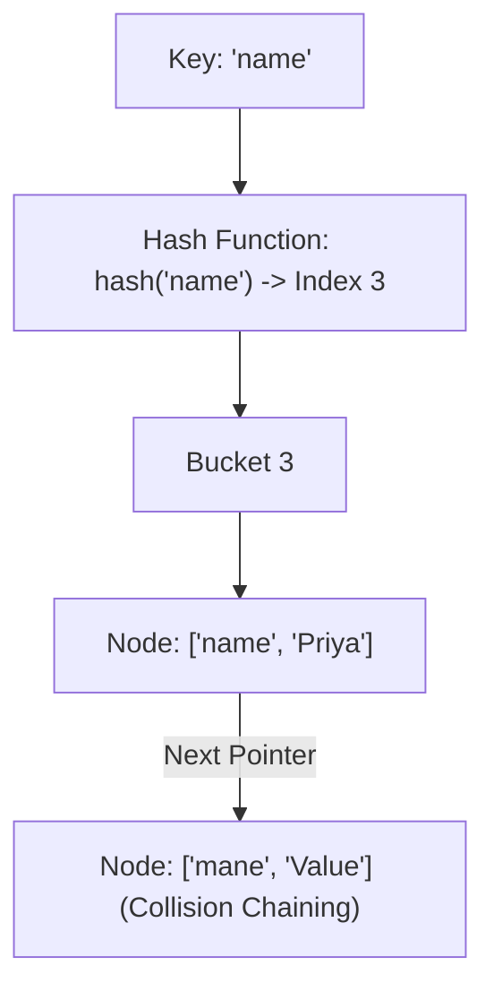

# File 04: Hash Tables and Collision Handling

## Overview
A **Hash Table** (Map) stores key-value pairs, utilizing a **Hash Function** to map string keys to array bucket indices, providing $O(1)$ average time complexity for lookup, insertion, and deletion.

---

## 1. Hash Table Chaining Collision Resolution



---

## 2. Custom Hash Table Implementation with Chaining

```javascript
class HashTable {
    constructor(size = 53) {
        this.buckets = new Array(size);
    }

    _hash(key) {
        let total = 0;
        const WEIRD_PRIME = 31;
        for (let i = 0; i < Math.min(key.length, 100); i++) {
            const char = key[i];
            const value = char.charCodeAt(0) - 96;
            total = (total * WEIRD_PRIME + value) % this.buckets.length;
        }
        return total;
    }

    set(key, value) {
        const index = this._hash(key);
        if (!this.buckets[index]) {
            this.buckets[index] = [];
        }

        // Check if key exists to update value
        for (let pair of this.buckets[index]) {
            if (pair[0] === key) {
                pair[1] = value;
                return;
            }
        }

        // Add new key-value pair
        this.buckets[index].push([key, value]);
    }

    get(key) {
        const index = this._hash(key);
        if (this.buckets[index]) {
            for (let pair of this.buckets[index]) {
                if (pair[0] === key) return pair[1];
            }
        }
        return undefined;
    }
}

const ht = new HashTable();
ht.set("name", "Priya");
ht.set("role", "Developer");

console.log(ht.get("name")); // "Priya"
```

---

## Key Takeaways
1. Hash functions map arbitrary keys to discrete array indices.
2. Collisions are handled via **Separate Chaining** (linked list or array buckets) or **Open Addressing** (linear probing).
3. Average lookup, insertion, and deletion complexity is **$O(1)$**.
