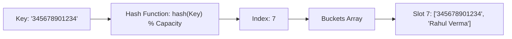
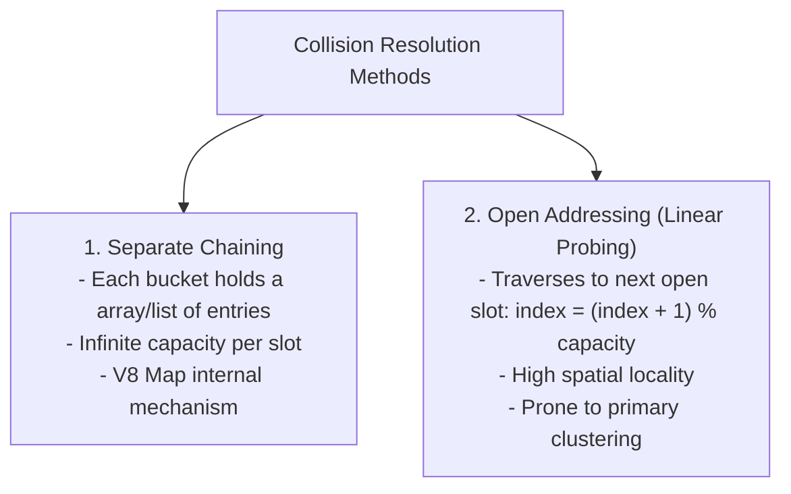

# Module 04: Hash Tables, Collisions, and Map/Set Internals

## Theoretical Overview & Mathematical Foundations

A **Hash Table** (or Hash Map) is a data structure that pairs keys to values using a mathematical **Hash Function**. It provides near-instantaneous **$\mathcal{O}(1)$ average time complexity** for insertion, lookup, and deletion operations regardless of whether the dataset contains 10 elements or 1.4 billion records (such as the Aadhaar identity registry).



### The Hash Function & Prime Multiplier 31
A hash function maps arbitrary keys (strings, objects) to integer indices within fixed capacity bounds $[0, \text{capacity} - 1]$. 

$$\text{Hash}(K) = \left( \sum_{i=0}^{L-1} S[i] \times 31^{L-1-i} \right) \bmod \text{Capacity}$$

The prime multiplier **31** is chosen because:
1. It is an odd prime, reducing hash collisions across ASCII/Unicode distributions.
2. Modern compilers convert $31 \times i$ into efficient bitwise shifts: `(i << 5) - i`.

---

## 1. Collision Resolution Strategies

When two distinct keys yield identical bucket indices ($\text{Hash}(K_1) = \text{Hash}(K_2)$), a **collision** occurs.



### Load Factor & Dynamic Reshashing
The **Load Factor** $\alpha$ measures table saturation:

$$\alpha = \frac{\text{Number of Stored Entries } (N)}{\text{Bucket Array Capacity } (C)}$$

- **Threshold**: When $\alpha > 0.75$, collision rates spike sharply.
- **Reshashing**: The table doubles its array capacity ($C \to 2C$) and re-keys every existing entry. Dynamic resizing takes **$\mathcal{O}(N)$** time, amortized to **$\mathcal{O}(1)$** per insert.

---

## 2. Code Implementation: Chaining vs Linear Probing

### Separate Chaining Implementation (`HashTable`)
```javascript
class HashTable {
  constructor(initialSize = 16) {
    this.buckets = new Array(initialSize).fill(null).map(() => []);
    this.size = 0;
    this.capacity = initialSize;
  }

  _hash(key) {
    let hash = 0;
    const str = String(key);
    for (let i = 0; i < str.length; i++)
      hash = (hash * 31 + str.charCodeAt(i)) % this.capacity;
    return hash;
  }

  set(key, value) {
    if (this.size / this.capacity > 0.75) this._resize();
    const bucket = this.buckets[this._hash(key)];
    for (let i = 0; i < bucket.length; i++) {
      if (bucket[i][0] === key) { bucket[i][1] = value; return; }
    }
    bucket.push([key, value]);
    this.size++;
  }

  get(key) {
    const bucket = this.buckets[this._hash(key)];
    for (const [k, v] of bucket) if (k === key) return v;
    return undefined;
  }

  delete(key) {
    const bucket = this.buckets[this._hash(key)];
    for (let i = 0; i < bucket.length; i++) {
      if (bucket[i][0] === key) { bucket.splice(i, 1); this.size--; return true; }
    }
    return false;
  }

  _resize() {
    const old = this.buckets;
    this.capacity *= 2;
    this.buckets = new Array(this.capacity).fill(null).map(() => []);
    this.size = 0;
    for (const bucket of old)
      for (const [key, value] of bucket) this.set(key, value);
  }
}
```

### Open Addressing Linear Probing (`HashTableLinearProbe`)
```javascript
class HashTableLinearProbe {
  constructor(size = 16) {
    this.capacity = size;
    this.keys = new Array(size).fill(null);
    this.values = new Array(size).fill(null);
    this.size = 0;
  }

  set(key, value) {
    let index = this._hash(key);
    while (this.keys[index] !== null && this.keys[index] !== key)
      index = (index + 1) % this.capacity;
    if (this.keys[index] === null) this.size++;
    this.keys[index] = key;
    this.values[index] = value;
  }
}
```

---

## 3. JavaScript `Map` vs `Object`

| Feature | Plain Object `{}` | ES6 `Map` |
| :--- | :--- | :--- |
| **Allowed Key Types** | Strings and Symbols only (coerces numbers to strings). | **Any type** (Functions, Objects, Primitives). |
| **Key Ordering** | Complex (numeric first, then creation order). | **Guaranteed exact insertion order**. |
| **Size Determination**| $\mathcal{O}(n)$ manual key count: `Object.keys(obj).length`. | **$\mathcal{O}(1)$** property `.size`. |
| **Prototype Security** | Inherits `Object.prototype` (prone to Prototype Pollution). | Pure map container; free of inherited prototype keys. |
| **Performance** | Optimized for small static records. | Optimized for frequent addition, lookup, and deletion. |

### ES6 `Set` Operations
A `Set` is a Hash Table containing only unique keys.
- **Union**: `new Set([...setA, ...setB])`
- **Intersection**: `new Set([...setA].filter(x => setB.has(x)))`
- **Difference**: `new Set([...setA].filter(x => !setB.has(x)))`

---

## 4. Classic Algorithmic Problems & Solutions

### 1. Two-Sum via Complement Lookup (`twoSum`)
Find indices of two numbers that sum to `target`.
- **Strategy**: As we iterate, check if `target - nums[i]` exists in the Hash Map.
- **Complexity**: Time $\mathcal{O}(n)$, Space $\mathcal{O}(n)$.

```javascript
function twoSum(nums, target) {
  const seen = new Map();
  for (let i = 0; i < nums.length; i++) {
    const complement = target - nums[i];
    if (seen.has(complement)) return [seen.get(complement), i];
    seen.set(nums[i], i);
  }
  return null;
}
```

### 2. Subarray Sum Equals K (`subarraySumK`)
Count contiguous subarrays whose elements sum to $k$.
- **Formula**: Prefix sum identity $\text{PrefixSum}[j] - \text{PrefixSum}[i] = k$.
- **Complexity**: Time $\mathcal{O}(n)$, Space $\mathcal{O}(n)$.

```javascript
function subarraySumK(nums, k) {
  const prefixCount = new Map([[0, 1]]);
  let currentSum = 0, count = 0;
  for (const num of nums) {
    currentSum += num;
    if (prefixCount.has(currentSum - k)) {
      count += prefixCount.get(currentSum - k);
    }
    prefixCount.set(currentSum, (prefixCount.get(currentSum) || 0) + 1);
  }
  return count;
}
```

### 3. Longest Consecutive Sequence (`longestConsecutive`)
Find the length of the longest consecutive elements sequence in an unsorted array.
- **Strategy**: Store numbers in a `Set`. Only initiate counting when `!set.has(num - 1)` (i.e., `num` is the absolute start of a sequence).
- **Complexity**: Time $\mathcal{O}(n)$, Space $\mathcal{O}(n)$.

```javascript
function longestConsecutive(nums) {
  const numSet = new Set(nums);
  let maxLen = 0;
  for (const num of numSet) {
    if (!numSet.has(num - 1)) {
      let cur = num, len = 1;
      while (numSet.has(cur + 1)) { cur++; len++; }
      maxLen = Math.max(maxLen, len);
    }
  }
  return maxLen;
}
```

### 4. LRU Cache via Map Insertion Order (`LRUCache`)
Implement Least Recently Used Cache with $\mathcal{O}(1)$ `get` and `put`.
- **Mechanics**: JavaScript `Map` iterates keys in insertion order. When an element is accessed or updated, `delete(key)` and re-`set(key, value)` moves it to the back (most recently used).

```javascript
class LRUCache {
  constructor(capacity) {
    this.capacity = capacity;
    this.cache = new Map();
  }
  get(key) {
    if (!this.cache.has(key)) return -1;
    const val = this.cache.get(key);
    this.cache.delete(key);
    this.cache.set(key, val);
    return val;
  }
  put(key, value) {
    if (this.cache.has(key)) this.cache.delete(key);
    else if (this.cache.size >= this.capacity) {
      const lruKey = this.cache.keys().next().value;
      this.cache.delete(lruKey);
    }
    this.cache.set(key, value);
  }
}
```

---

## Key Takeaways

1. **$\mathcal{O}(1)$ Average Performance**: Hash Tables convert key strings into indices for instant lookups.
2. **Collision Handling**: Separate Chaining handles collisions via linked buckets; Open Addressing probes adjacent slots.
3. **Reshashing**: Load factor exceeding 0.75 triggers an $\mathcal{O}(n)$ capacity double and rehash operation.
4. **Prefer ES6 `Map` and `Set`**: Offers prototype safety, arbitrary key support, and guaranteed $\mathcal{O}(1)$ `.size`.
