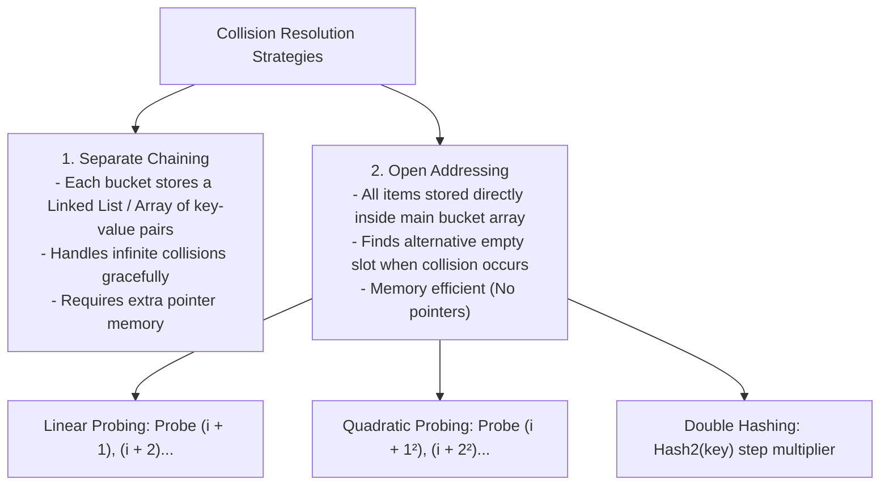

# Module 04: Hash Tables, Collision Resolution Strategies, and V8 `Map` / `Set` Internals

## Overview

A **Hash Table** (or Hash Map) is a foundational data structure offering **$\mathcal{O}(1)$ average time complexity** for insertion, lookup, and deletion.

It transforms arbitrary keys (strings, numbers, objects) into discrete integer array indices via a **Deterministic Hash Function**. When two keys hash to the same bucket index (**Hash Collision**), resolution techniques like **Separate Chaining** or **Open Addressing** maintain structure integrity.

---

## 1. Hash Table Collision Resolution Strategies



### Chaining vs. Open Addressing Architecture

```mermaid
graph TD
    subgraph Separate Chaining (Linked List Buckets)
        Bucket0["Index 0"] --> Null0[null]
        Bucket1["Index 1"] --> NodeA1["['cat': 10]"] --> NodeA2["['act': 42] (Collision Chaining)"]
        Bucket2["Index 2"] --> NodeB1["['dog': 99]"]
    end

    subgraph Open Addressing (Linear Probing)
        Slot0["[0]: null"]
        Slot1["[1]: ['cat': 10]"]
        Slot2["[2]: ['act': 42] (Probed to next open slot!)"]
        Slot3["[3]: ['dog': 99]"]
    end
```

---

## 2. Load Factor ($\alpha$) and Dynamic Rehashing

The **Load Factor ($\alpha$)** represents the ratio of occupied entries to total bucket array capacity:

$$\alpha = \frac{\text{Number of Stored Key-Value Pairs } (N)}{\text{Total Bucket Capacity } (K)}$$

- **Threshold Guard**: When $\alpha > 0.75$, collisions increase rapidly, causing operations to degrade from $\mathcal{O}(1)$ toward $\mathcal{O}(N)$.
- **Dynamic Resizing**: When the load factor threshold is breached, the hash table allocates a new array of **$2\times$ capacity** and recalculates hash indices for all existing elements (**Rehashing**).

---

## 3. V8 Engine `Map` and `Set` Internals: Ordered Hash Table

In standard JavaScript objects (`{}`), keys are converted to strings, and key enumeration order can be unpredictable.

ES6 **`Map`** and **`Set`** preserve **insertion order** during iteration. V8 implements `Map` using a **Deterministic Ordered HashTable** composed of two flat arrays:

1. **HashTable Index Bucket Array**: Maps hash codes to data array entry indices.
2. **Data Storage Array**: Sequential array of entries preserving insertion order `[Key, Value]`.

---

## 4. Custom Hash Table Implementation with Chaining & Dynamic Resizing

```javascript
class HighPerformanceHashTable {
  constructor(initialCapacity = 16, loadFactorLimit = 0.75) {
    this.buckets = new Array(initialCapacity);
    this.size = 0;
    this.capacity = initialCapacity;
    this.loadFactorLimit = loadFactorLimit;
  }

  // Polynomial Rolling Hash Function (DJB2 Variant)
  _hash(key) {
    const keyStr = String(key);
    let hash = 5381;

    for (let i = 0; i < keyStr.length; i++) {
      hash = (hash * 33) ^ keyStr.charCodeAt(i);
    }

    return (hash >>> 0) % this.capacity; // Unsigned bitwise right shift
  }

  set(key, value) {
    // Check if dynamic resize is required before inserting
    if (this.size / this.capacity >= this.loadFactorLimit) {
      this._resize(this.capacity * 2);
    }

    const index = this._hash(key);
    if (!this.buckets[index]) {
      this.buckets[index] = [];
    }

    const bucket = this.buckets[index];

    // Update value if key already exists
    for (let i = 0; i < bucket.length; i++) {
      if (bucket[i][0] === key) {
        bucket[i][1] = value;
        return;
      }
    }

    // Insert new pair
    bucket.push([key, value]);
    this.size++;
  }

  get(key) {
    const index = this._hash(key);
    const bucket = this.buckets[index];

    if (bucket) {
      for (let i = 0; i < bucket.length; i++) {
        if (bucket[i][0] === key) return bucket[i][1];
      }
    }

    return undefined; // Key not found
  }

  delete(key) {
    const index = this._hash(key);
    const bucket = this.buckets[index];

    if (bucket) {
      for (let i = 0; i < bucket.length; i++) {
        if (bucket[i][0] === key) {
          bucket.splice(i, 1);
          this.size--;
          return true;
        }
      }
    }

    return false;
  }

  // Dynamic Array Resizing & Rehashing
  _resize(newCapacity) {
    const oldBuckets = this.buckets;
    this.capacity = newCapacity;
    this.buckets = new Array(newCapacity);
    this.size = 0;

    for (const bucket of oldBuckets) {
      if (bucket) {
        for (const [key, value] of bucket) {
          this.set(key, value); // Rehash every existing key into double-sized table
        }
      }
    }
  }
}
```

---

## 5. Complexity Comparison Matrix

| Operations | Average Case | Worst Case (All Collisions) | Notes |
| :--- | :--- | :--- | :--- |
| **Search / Lookup** | $\mathcal{O}(1)$ | $\mathcal{O}(N)$ | Worst case occurs if all keys hash to the same bucket index. |
| **Insertion** | $\mathcal{O}(1)$ amortized | $\mathcal{O}(N)$ | Amortized $\mathcal{O}(1)$ accounting for $2\times$ array rehashing. |
| **Deletion** | $\mathcal{O}(1)$ | $\mathcal{O}(N)$ | Locates bucket and removes element link. |
| **Space Complexity**| $\mathcal{O}(N)$ | $\mathcal{O}(N)$ | Linear space proportional to stored key-value entries. |

---

## Key Production Takeaways

1. **Use ES6 `Map` over Plain Objects (`{}`) for Dynamic Key Sets**: `Map` supports keys of any type (objects, functions, numbers), maintains insertion order, and offers optimized $\mathcal{O}(1)$ JIT performance.
2. **Prevent Hash Collision Attacks**: Adversaries can craft malicious inputs that all hash to index 0, turning an $\mathcal{O}(1)$ API server into an $\mathcal{O}(N^2)$ DoS target. Modern runtimes use randomized seed hashing.
3. **Set Initial Capacities when Size is Known**: Pre-allocating bucket array capacity avoids expensive dynamic $2\times$ rehashing iterations during massive data ingestion.
4. **Use `WeakMap` for Garbage-Collection Friendly Object Metadata**: When associating metadata with object keys without preventing GC cleanup, use `WeakMap` to avoid memory leaks.

