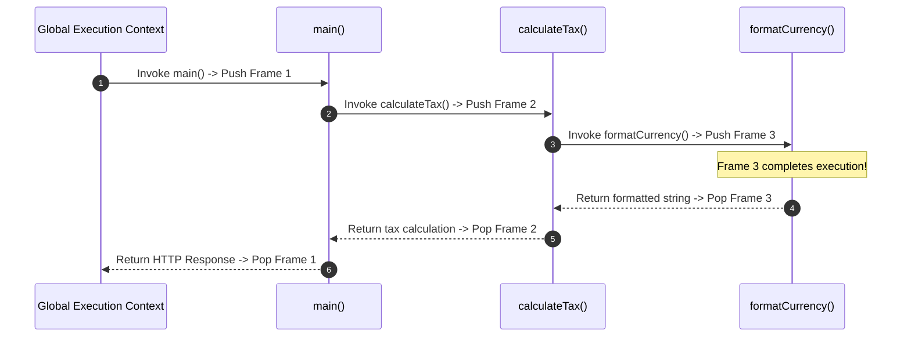
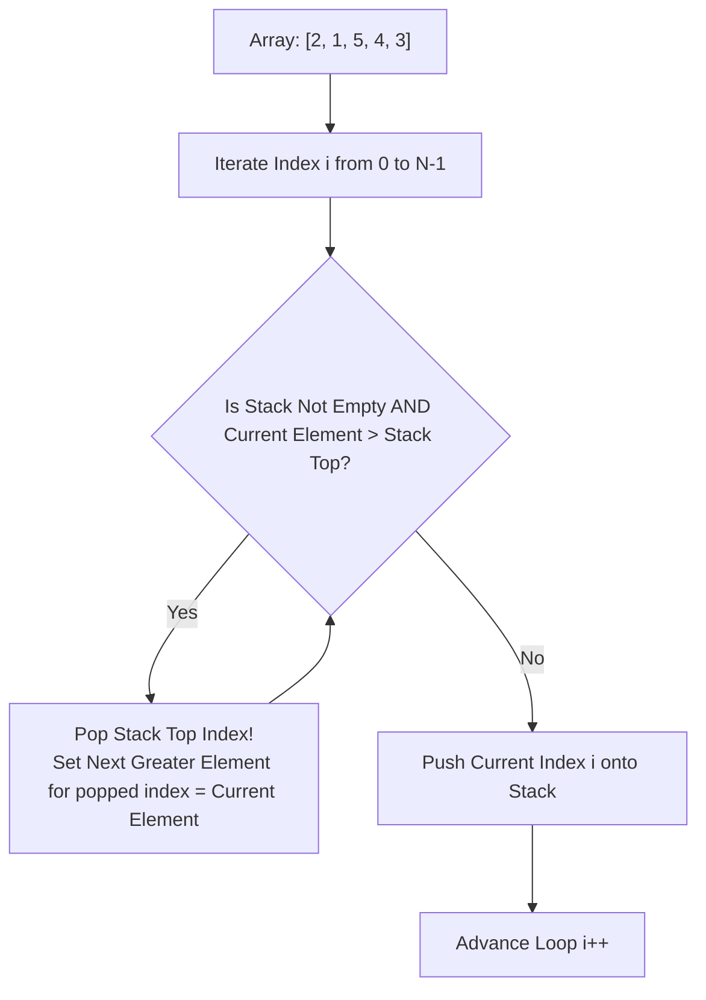

# Module 05: Stacks, Call Stack Execution Context, and Monotonic Stack Pattern

## Overview

A **Stack** is a linear data structure governed strictly by the **LIFO (Last-In, First-Out)** behavioral contract. The last element added to the stack is guaranteed to be the first element removed.

In JavaScript, the V8 runtime relies on an internal **Call Stack** to track synchronous function execution contexts. In algorithm design, stacks excel at tracking nested operations, reversing sequences, evaluating mathematical expressions (Infix/Postfix), and solving range boundary problems via **Monotonic Stacks**.

---

## 1. Stack Data Structure Mechanics & Memory Representations

```mermaid
flowchart TD
    subgraph Array Backed Stack
        ArrayMem["[Item 1, Item 2, Item 3]"]
        TopPointer["top = length - 1"]
        ArrayMem -->|push() / pop() at array end| TopPointer
    end

    subgraph Linked List Backed Stack
        HeadNode["Head Node (Top)"] --> Node2["Node 2"] --> Node1["Node 1 (Bottom)"] --> NullPtr[null]
        HeadNode -->|push() / pop() at Head| Ops["O(1) Strict Operation Guarantee"]
    end
```

### Array Stack vs. Linked List Stack Comparison

| Feature | Array-Based Stack (`Array.prototype.push/pop`) | Linked List Stack (`SinglyLinkedList`) |
| :--- | :--- | :--- |
| **Time Complexity** | $\mathcal{O}(1)$ amortized per push/pop | **Strict $\mathcal{O}(1)$** deterministic |
| **Memory Overhead** | Contiguous RAM block; low pointer overhead | High (Extra `next` pointer object per node) |
| **Cache Locality** | **Excellent** (Contiguous CPU cache hits) | Poor (Dispersed heap memory pointers) |
| **Resizing Delay** | Occasional $2\times$ vector array reallocation delay | Zero resizing delay |

---

## 2. V8 Call Stack & Recursion Depth Mechanics

The V8 runtime allocates a fixed **Call Stack Space** (typically 10,000 frames or ~1 MB).



> [!WARNING]
> **Stack Overflow (`RangeError: Maximum call stack size exceeded`)**: Occurs when recursive calls lack a valid base case, exhausting available Call Stack frames.

---

## 3. Algorithmic Pattern: Monotonic Stack

A **Monotonic Stack** maintains its elements in strictly increasing or decreasing order. It solves "Next Greater Element" or "Range Boundary" problems in **$\mathcal{O}(N)$ time** (down from $\mathcal{O}(N^2)$ brute-force).

### Monotonic Increasing Stack Algorithm (Next Greater Element)



### Monotonic Stack Code Implementation (Next Greater Element)

```javascript
// Solves Next Greater Element in O(N) Time and O(N) Auxiliary Space
function nextGreaterElement(nums) {
  const n = nums.length;
  const result = new Int32Array(n).fill(-1);
  const stack = []; // Stores indices

  for (let i = 0; i < n; i++) {
    const currentVal = nums[i];

    // Maintain monotonic decreasing stack
    while (stack.length > 0 && nums[stack[stack.length - 1]] < currentVal) {
      const poppedIndex = stack.pop();
      result[poppedIndex] = currentVal; // Current element is next greater!
    }

    stack.push(i);
  }

  return Array.from(result);
}

console.log(nextGreaterElement([2, 1, 5, 4, 3])); // Output: [5, 5, -1, -1, -1]
```

---

## 4. Expression Parsing: Infix to Postfix (Shunting Yard Algorithm)

Stacks power compiler expression parsers (e.g. converting `(A + B) * C` to Reverse Polish Notation `A B + C *`):

```javascript
// Valid Parentheses Matching Pattern - O(N) Time, O(N) Space
function isValidParentheses(s) {
  const stack = [];
  const matchingMap = { ")": "(", "}": "{", "]": "[" };

  for (let i = 0; i < s.length; i++) {
    const char = s[i];

    if (char === "(" || char === "{" || char === "[") {
      stack.push(char);
    } else if (matchingMap[char]) {
      if (stack.length === 0 || stack.pop() !== matchingMap[char]) {
        return false; // Mismatched or empty stack!
      }
    }
  }

  return stack.length === 0;
}

console.log(isValidParentheses("{[()]}")); // true
console.log(isValidParentheses("{[(])}")); // false
```

---

## Key Production Takeaways

1. **Use Monotonic Stacks to Reduce $\mathcal{O}(N^2)$ to $\mathcal{O}(N)$**: Whenever a problem asks for the "next greater element", "previous smaller element", or "largest rectangle in histogram", use a monotonic stack.
2. **Prefer Array `.push()` / `.pop()` for Stack Operations**: Array `.push()` and `.pop()` operate exclusively at the end of the array in $\mathcal{O}(1)$ time without incurring pointer allocation overhead.
3. **Guard Against Call Stack Overflows in Recursion**: For deep recursion ($n > 10,000$), replace recursion with an explicit array stack inside an iterative loop to avoid `Maximum call stack size exceeded` errors.
4. **Use Stacks for Undo/Redo and Backtracking History**: Stacks are the natural data structure for managing browser navigation history (`window.history.back()`), nested modal popups, and state rollback mechanisms.

