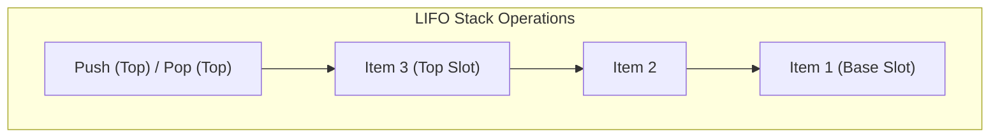
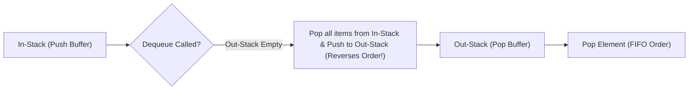

# Module 05: Stacks, LIFO Principle, and Monotonic Stack Patterns

## Theoretical Overview & Structural Mechanics

A **Stack** is a linear data structure adhering to the **LIFO (Last In, First Out)** principle. The last element added (pushed) to the stack is the first element removed (popped).



### Real-World Engineering Analogies
1. **App View Navigation**: In mobile applications (e.g., PhonePe), moving from `Home` $\to$ `Send Money` $\to$ `Confirm` pushes views onto the navigation stack. Tapping "Back" pops the current view to reveal the previous screen.
2. **JavaScript Call Stack**: Every function execution pushes a frame onto V8's call stack. Returning from a function pops its frame off the stack.

---

## 1. Stack Operations & Complexity Matrix

| Operation | Description | Time Complexity | Space Complexity |
| :--- | :--- | :--- | :--- |
| **Push** | Appends an element to the top of the stack. | $\mathcal{O}(1)$ amortized | $\mathcal{O}(1)$ |
| **Pop** | Removes and returns the top element. | $\mathcal{O}(1)$ | $\mathcal{O}(1)$ |
| **Peek / Top** | Inspects top element without removal. | $\mathcal{O}(1)$ | $\mathcal{O}(1)$ |
| **isEmpty** | Checks if stack contains zero elements. | $\mathcal{O}(1)$ | $\mathcal{O}(1)$ |

### Array-Based vs Linked-List-Based Implementation
- **Array-Based (`StackArray`)**: Utilizes `.push()` and `.pop()` on JS arrays. Provides excellent CPU cache locality. Amortized $\mathcal{O}(1)$ push.
- **Linked-List-Based**: Node allocation guarantees strict $\mathcal{O}(1)$ worst-case push time without dynamic resizing events, at the cost of additional pointer memory overhead.

---

## 2. Fundamental Code Implementations

```javascript
class StackArray {
  constructor() { this.items = []; }
  push(item) { this.items.push(item); return this; }
  pop() {
    if (this.isEmpty()) throw new Error("Stack Underflow");
    return this.items.pop();
  }
  peek() { return this.isEmpty() ? undefined : this.items[this.items.length - 1]; }
  isEmpty() { return this.items.length === 0; }
  size() { return this.items.length; }
}
```

---

## 3. Classic Algorithmic Problems & Solutions

### 1. Valid Parentheses Matching (`isValidParentheses`)
Verify if bracket delimiters `()`, `[]`, `{}` are closed in valid LIFO order.
- **Strategy**: Push opening brackets onto the stack. When a closing bracket is encountered, pop the top element and verify if it matches the required opening bracket type.
- **Complexity**: Time $\mathcal{O}(n)$, Space $\mathcal{O}(n)$.

```javascript
function isValidParentheses(str) {
  const stack = [];
  const match = { ")": "(", "]": "[", "}": "{" };
  for (const char of str) {
    if ("([{".includes(char)) {
      stack.push(char);
    } else if (")]}".includes(char)) {
      if (stack.length === 0 || stack.pop() !== match[char]) return false;
    }
  }
  return stack.length === 0;
}
```

### 2. Reverse Polish Notation (Postfix) Evaluation (`evalRPN`)
Evaluate arithmetic expressions in Reverse Polish Notation (e.g., `["2", "3", "+", "4", "*"]`).
- **Strategy**: Push numbers onto the stack. When an operator is encountered, pop the top two numbers ($b$, then $a$), compute $a \text{ op } b$, and push the result back onto the stack.
- **Complexity**: Time $\mathcal{O}(n)$, Space $\mathcal{O}(n)$.

```javascript
function evalRPN(tokens) {
  const stack = [];
  for (const token of tokens) {
    if (["+", "-", "*", "/"].includes(token)) {
      const b = stack.pop(), a = stack.pop();
      switch (token) {
        case "+": stack.push(a + b); break;
        case "-": stack.push(a - b); break;
        case "*": stack.push(a * b); break;
        case "/": stack.push(Math.trunc(a / b)); break;
      }
    } else {
      stack.push(Number(token));
    }
  }
  return stack[0];
}
```

### 3. Min Stack with $\mathcal{O}(1)$ Minimum Retrieval (`MinStack`)
Design a stack supporting `push`, `pop`, `top`, and `getMin()` in $\mathcal{O}(1)$ time.
- **Strategy**: Maintain an auxiliary `minStack` tracking the minimum value seen up to each stack height.

```javascript
class MinStack {
  constructor() { this.stack = []; this.minStack = []; }
  push(val) {
    this.stack.push(val);
    if (this.minStack.length === 0 || val <= this.minStack[this.minStack.length - 1]) {
      this.minStack.push(val);
    }
  }
  pop() {
    const val = this.stack.pop();
    if (val === this.minStack[this.minStack.length - 1]) this.minStack.pop();
    return val;
  }
  top() { return this.stack[this.stack.length - 1]; }
  getMin() { return this.minStack[this.minStack.length - 1]; }
}
```

### 4. Monotonic Stack: Next Greater Element (`nextGreaterElement`)
Find the next element greater than `arr[i]` for each index in an array.
- **Monotonic Property**: Maintain a monotonically decreasing stack of indices. When an incoming element is greater than the stack's top index element, pop the index and record the answer.
- **Complexity**: Time $\mathcal{O}(n)$ (each index pushed and popped at most once), Space $\mathcal{O}(n)$.

```javascript
function nextGreaterElement(arr) {
  const result = new Array(arr.length).fill(-1);
  const stack = [];
  for (let i = 0; i < arr.length; i++) {
    while (stack.length > 0 && arr[i] > arr[stack[stack.length - 1]]) {
      result[stack.pop()] = arr[i];
    }
    stack.push(i);
  }
  return result;
}
```

### 5. Daily Temperatures (`dailyTemperatures`)
Calculate how many days to wait until a warmer temperature occurs.
- **Strategy**: Monotonic stack variation recording the difference in array indices `i - prevIndex`.

```javascript
function dailyTemperatures(temps) {
  const result = new Array(temps.length).fill(0);
  const stack = [];
  for (let i = 0; i < temps.length; i++) {
    while (stack.length > 0 && temps[i] > temps[stack[stack.length - 1]]) {
      const prev = stack.pop();
      result[prev] = i - prev;
    }
    stack.push(i);
  }
  return result;
}
```

---

## 4. Advanced Two-Stack Architecture Patterns



### 1. Queue Using Two Stacks (`QueueFromStacks`)
- `inStack` accepts incoming `enqueue` pushes.
- `outStack` serves `dequeue` pops. When `outStack` is empty, all elements are moved from `inStack` to `outStack` (reversing their order to establish FIFO sequence).
- **Amortized Complexity**: Dequeue is **Amortized $\mathcal{O}(1)$**.

### 2. Browser History Navigation (`BrowserHistory`)
- `backStack` stores backward navigation history.
- `forwardStack` stores forward navigation history. Visiting a new URL flushes `forwardStack`.

---

## Key Takeaways

1. **LIFO Core**: Access is strictly limited to the top element ($\mathcal{O}(1)$ push/pop).
2. **Monotonic Stack Pattern**: Essential pattern for solving "next greater element" or "distance to next target" in optimal $\mathcal{O}(n)$ time instead of $\mathcal{O}(n^2)$ nested loops.
3. **Auxiliary Tracking**: Maintain secondary stacks (`minStack`) to provide $\mathcal{O}(1)$ metadata access without altering main data structures.
4. **State Machine Simulation**: Stacks simulate recursive call trees, browser history, and expression parsing state machines.
