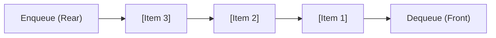

# File 06: Queues and Monotonic Deques

## Overview
A **Queue** is a linear data structure following the **FIFO (First In, First Out)** principle. Elements are added (**enqueue**) at the rear and removed (**dequeue**) from the front.

---

## 1. Queue FIFO & Priority Queue Architecture



---

## 2. Queue & Circular Queue Implementation

```javascript
// Efficient O(1) Queue using Linked List / Object Map
class Queue {
    constructor() {
        this.items = {};
        this.head = 0;
        this.tail = 0;
    }

    enqueue(element) {
        this.items[this.tail] = element;
        this.tail++;
    }

    dequeue() {
        if (this.isEmpty()) return null;
        const item = this.items[this.head];
        delete this.items[this.head];
        this.head++;
        return item;
    }

    peek() {
        return this.items[this.head];
    }

    isEmpty() {
        return this.tail - this.head === 0;
    }

    size() {
        return this.tail - this.head;
    }
}

const queue = new Queue();
queue.enqueue("Customer 1");
queue.enqueue("Customer 2");
console.log(queue.dequeue()); // "Customer 1" (FIFO)
```

---

## Key Takeaways
1. Queues follow **FIFO (First In, First Out)** order.
2. Avoid using `Array.prototype.shift()` for queues as it takes $O(n)$ time due to array re-indexing; use an object hash map or pointer pointers for **$O(1)$ dequeue**.
3. Essential for task scheduling, Event Loops, and Breadth-First Search (BFS) graph traversals.
