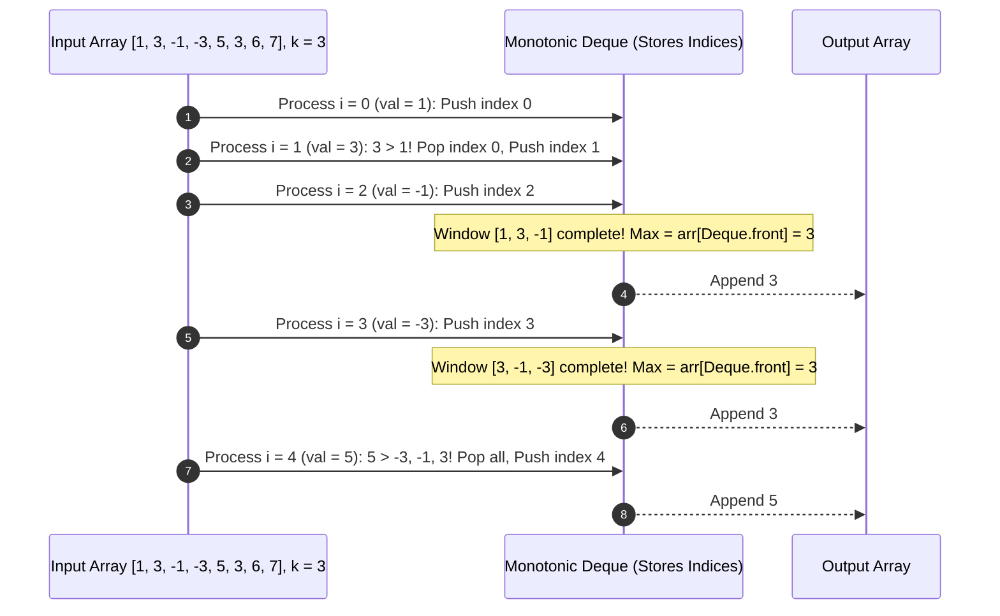

# Module 06: Queues, Circular Ring Buffers, and Monotonic Deques

## Overview

A **Queue** is a linear data structure governed by the **FIFO (First-In, First-Out)** behavioral principle. The first element enqueued into the structure is guaranteed to be the first element dequeued.

In Node.js and browser runtimes, queues drive the **Event Loop** (Microtask Queue vs Macrotask Queue). In algorithm design, queues power **Breadth-First Search (BFS)** graph traversals, fixed-capacity **Circular Ring Buffers**, and **Monotonic Deques** for sliding window calculations.

---

## 1. Queue Architectures: Array vs. Circular Ring Buffer vs. Deque

```mermaid
flowchart TD
    subgraph Standard FIFO Queue
        Enq["enqueue(val) at Rear"] --> RearPtr["[Item 3, Item 2, Item 1]"] --> Deq["dequeue() at Front"]
    end

    subgraph Circular Ring Buffer
        Ring["Fixed Array Buffer [0..K-1]"]
        Head["head = (head + 1) % K"]
        Tail["tail = (tail + 1) % K"]
        Ring --> Head
        Ring --> Tail
    end

    subgraph Double-Ended Queue (Deque)
        FrontOps["pushFront() / popFront()"] <--> DoubleEnd["[Front <-> Node 1 <-> Node 2 <-> Rear]"] <--> RearOps["pushBack() / popBack()"]
    end
```

### Queue Implementation Performance Comparison

| Implementation Strategy | Enqueue Time | Dequeue Time | Space Overhead | Notes |
| :--- | :--- | :--- | :--- | :--- |
| **`Array.prototype.shift()`** | $\mathcal{O}(1)$ | **$\mathcal{O}(N)$** | Low | **DO NOT USE**: `shift()` re-indexes all $N$ elements in memory. |
| **Object Hash Pointer (`head`/`tail`)** | $\mathcal{O}(1)$ | $\mathcal{O}(1)$ | Medium | Keys accumulate; requires `delete` object property operations. |
| **Doubly Linked List** | $\mathcal{O}(1)$ | $\mathcal{O}(1)$ | High | Pointer object memory overhead. |
| **Circular Ring Buffer** | $\mathcal{O}(1)$ | $\mathcal{O}(1)$ | **Zero GC** | Best performance; pre-allocated fixed memory array. |

---

## 2. Circular Ring Buffer Implementation Code

A **Circular Queue** reuses freed slots at the front of a fixed-size array using modulo arithmetic:

```javascript
class CircularQueue {
  constructor(capacity) {
    this.buffer = new Array(capacity);
    this.capacity = capacity;
    this.head = 0;
    this.tail = 0;
    this.size = 0;
  }

  enqueue(element) {
    if (this.isFull()) {
      throw new Error("Queue Overflow: Circular Ring Buffer is full!");
    }

    this.buffer[this.tail] = element;
    this.tail = (this.tail + 1) % this.capacity; // Modulo wrap-around
    this.size++;
    return true;
  }

  dequeue() {
    if (this.isEmpty()) return null;

    const item = this.buffer[this.head];
    this.buffer[this.head] = undefined; // Garbage collection hint
    this.head = (this.head + 1) % this.capacity; // Modulo wrap-around
    this.size--;
    return item;
  }

  peek() {
    if (this.isEmpty()) return null;
    return this.buffer[this.head];
  }

  isEmpty() { return this.size === 0; }
  isFull() { return this.size === this.capacity; }
}
```

---

## 3. Algorithmic Pattern: Monotonic Deque (Sliding Window Maximum)

A **Monotonic Deque** maintains indices of elements in strictly decreasing value order, solving the **Sliding Window Maximum** problem in **$\mathcal{O}(N)$ time**.



### Sliding Window Maximum Code Implementation

```javascript
// Solves Sliding Window Maximum in O(N) Time and O(K) Space using Monotonic Deque
function maxSlidingWindow(nums, k) {
  const n = nums.length;
  if (n === 0 || k === 0) return [];

  const result = [];
  const deque = []; // Stores array indices

  for (let i = 0; i < n; i++) {
    // 1. Remove indices that fall outside current sliding window [i - k + 1, i]
    if (deque.length > 0 && deque[0] <= i - k) {
      deque.shift();
    }

    // 2. Maintain Monotonic Decreasing Order: Remove smaller values from back
    while (deque.length > 0 && nums[deque[deque.length - 1]] <= nums[i]) {
      deque.pop();
    }

    // 3. Push current element index
    deque.push(i);

    // 4. Append max element (front of deque) to result once window reaches size k
    if (i >= k - 1) {
      result.push(nums[deque[0]]);
    }
  }

  return result;
}

console.log(maxSlidingWindow([1, 3, -1, -3, 5, 3, 6, 7], 3)); // Output: [3, 3, 5, 5, 6, 7]
```

---

## Key Production Takeaways

1. **NEVER Use `Array.prototype.shift()` for Queues**: `shift()` shifts every single array item left, converting an $\mathcal{O}(1)$ operation into $\mathcal{O}(N)$ linear decay.
2. **Use Circular Ring Buffers for High-Throughput I/O**: For streaming buffers or network packet handlers, use a circular array buffer to eliminate V8 garbage collection churn.
3. **Use Queues for Breadth-First Search (BFS)**: BFS algorithms rely on queues to explore graph levels in shortest-path order.
4. **Master the Monotonic Deque for Sliding Window Max/Min**: When asked for running maximums or minimums over dynamic sliding intervals, a monotonic deque delivers optimal $\mathcal{O}(N)$ runtime.

