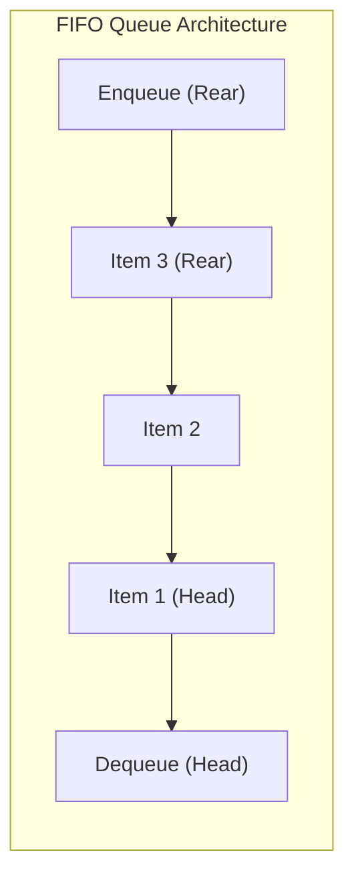

# Module 06: Queues, Circular Buffers, Deques, and Priority Queues

## Theoretical Overview & Structural Mechanics

A **Queue** is a linear data structure following the **FIFO (First In, First Out)** principle. The first element added (enqueued) to the queue is the first element removed (dequeued).



### Real-World Engineering Analogies
1. **Ola Ride Dispatch Engine**: Incoming passenger ride requests are placed in a FIFO queue. Drivers are assigned to the oldest request in the queue first.
2. **Web Server Request Queue**: Node.js Event Loop and HTTP connection pools use FIFO queues to process incoming requests fairly.

---

## 1. Queue Variations Complexity Comparison Matrix

| Data Structure | Enqueue / Insert | Dequeue / Delete | Peek / Front | Memory Allocation | Best Use Case |
| :--- | :--- | :--- | :--- | :--- | :--- |
| **Array Queue** | $\mathcal{O}(1)$ amortized | **$\mathcal{O}(n)$** (Flawed) | $\mathcal{O}(1)$ | Dynamic Array | Simple prototypes, tiny $n$. |
| **Linked-List Queue** | $\mathcal{O}(1)$ | $\mathcal{O}(1)$ | $\mathcal{O}(1)$ | Dynamic Nodes | General-purpose FIFO queue. |
| **Circular Queue** | $\mathcal{O}(1)$ | $\mathcal{O}(1)$ | $\mathcal{O}(1)$ | Fixed Array Buffer | High-throughput bounded ring buffers. |
| **Deque (Double-Ended)** | $\mathcal{O}(1)$ (Both ends) | $\mathcal{O}(1)$ (Both ends) | $\mathcal{O}(1)$ | Doubly-Linked List | Sliding Window Maximum, Monotonic Queue. |
| **Array Priority Queue** | $\mathcal{O}(1)$ | **$\mathcal{O}(n)$** scan | $\mathcal{O}(n)$ | Dynamic Array | Tiny priority queues ($n \le 50$). |
| **Heap Priority Queue** | $\mathcal{O}(\log n)$ | $\mathcal{O}(\log n)$ | $\mathcal{O}(1)$ | Binary Heap Array | Dijkstra's algorithm, Task Schedulers. |

> [!WARNING]
> **The JS Array Shift Flaw**: In JavaScript, invoking `.shift()` on an array removes `arr[0]` and forces V8 to re-index all remaining elements leftward by -1, making array dequeue an **$\mathcal{O}(n)$ bottleneck**. Always use a `LinkedListQueue` or pointer-based structure for high-performance queues.

---

## 2. Core Code Implementations

### 1. Optimal Linked-List Queue (`LinkedListQueue`)
Achieves $\mathcal{O}(1)$ time for both `enqueue` and `dequeue` by maintaining `head` and `tail` node pointers.

```javascript
class QueueNode {
  constructor(value) { this.value = value; this.next = null; }
}

class LinkedListQueue {
  constructor() { this.head = null; this.tail = null; this._size = 0; }

  enqueue(value) {
    const node = new QueueNode(value);
    if (this.isEmpty()) { this.head = node; this.tail = node; }
    else { this.tail.next = node; this.tail = node; }
    this._size++;
  }

  dequeue() {
    if (this.isEmpty()) return undefined;
    const val = this.head.value;
    this.head = this.head.next;
    if (!this.head) this.tail = null;
    this._size--;
    return val;
  }

  front() { return this.isEmpty() ? undefined : this.head.value; }
  isEmpty() { return this._size === 0; }
  size() { return this._size; }
}
```

### 2. Circular Buffer Queue (`CircularQueue`)
Uses modulo pointer arithmetic `index = (index + 1) % capacity` on a pre-allocated array of fixed capacity to eliminate garbage collection allocations.

```javascript
class CircularQueue {
  constructor(capacity) {
    this.capacity = capacity;
    this.items = new Array(capacity);
    this.headIdx = 0; this.tailIdx = 0; this._size = 0;
  }

  enqueue(value) {
    if (this.isFull()) return false;
    this.items[this.tailIdx] = value;
    this.tailIdx = (this.tailIdx + 1) % this.capacity;
    this._size++; return true;
  }

  dequeue() {
    if (this.isEmpty()) return undefined;
    const val = this.items[this.headIdx];
    this.headIdx = (this.headIdx + 1) % this.capacity;
    this._size--; return val;
  }

  isFull() { return this._size === this.capacity; }
  isEmpty() { return this._size === 0; }
}
```

### 3. Double-Ended Queue (`Deque`)
Supports insertion and removal from both front and rear boundaries in $\mathcal{O}(1)$ time using a Doubly Linked List.

```javascript
class DequeNode {
  constructor(value) { this.value = value; this.next = null; this.prev = null; }
}

class Deque {
  constructor() { this.head = null; this.tail = null; this._size = 0; }

  addFront(value) {
    const node = new DequeNode(value);
    if (this.isEmpty()) { this.head = node; this.tail = node; }
    else { node.next = this.head; this.head.prev = node; this.head = node; }
    this._size++;
  }

  addRear(value) {
    const node = new DequeNode(value);
    if (this.isEmpty()) { this.head = node; this.tail = node; }
    else { node.prev = this.tail; this.tail.next = node; this.tail = node; }
    this._size++;
  }

  removeFront() {
    if (this.isEmpty()) return undefined;
    const val = this.head.value;
    this.head = this.head.next;
    this.head ? (this.head.prev = null) : (this.tail = null);
    this._size--; return val;
  }

  removeRear() {
    if (this.isEmpty()) return undefined;
    const val = this.tail.value;
    this.tail = this.tail.prev;
    this.tail ? (this.tail.next = null) : (this.head = null);
    this._size--; return val;
  }

  isEmpty() { return this._size === 0; }
}
```

---

## 3. Practical Algorithmic Applications

### 1. Generating Binary Numbers 1 to N (`generateBinaryNumbers`)
Generate binary representations from 1 to $N$ in string form using BFS Queue expansion.
- **Strategy**: Enqueue `"1"`. On each step, dequeue string `curr`, record it, and enqueue `curr + "0"` and `curr + "1"`.
- **Complexity**: Time $\mathcal{O}(n)$, Space $\mathcal{O}(n)$.

```javascript
function generateBinaryNumbers(n) {
  const result = [], queue = new LinkedListQueue();
  queue.enqueue("1");
  for (let i = 0; i < n; i++) {
    const curr = queue.dequeue();
    result.push(curr);
    queue.enqueue(curr + "0");
    queue.enqueue(curr + "1");
  }
  return result;
}
```

### 2. First Non-Repeating Character in Data Stream (`firstNonRepeating`)
Find the first unique character in a stream as characters arrive in real-time.
- **Strategy**: Combine a Queue with a character frequency map. Pop front elements whose frequency count exceeds 1.
- **Complexity**: Time $\mathcal{O}(n)$, Space $\mathcal{O}(k)$.

```javascript
function firstNonRepeating(stream) {
  const freq = {}, queue = new ArrayQueue(), results = [];
  for (const ch of stream) {
    freq[ch] = (freq[ch] || 0) + 1;
    queue.enqueue(ch);
    while (!queue.isEmpty() && freq[queue.front()] > 1) queue.dequeue();
    results.push(queue.isEmpty() ? null : queue.front());
  }
  return results;
}
```

### 3. Ring Buffer Log Telemetry (`RingBuffer`)
A circular ring buffer that continuously overwrites the oldest element when full. Ideal for CCTV video feeds, logging buffers, and high-frequency metric collection.

```javascript
class RingBuffer {
  constructor(cap) {
    this.cap = cap; this.items = new Array(cap).fill(null);
    this.writeIdx = 0; this._count = 0;
  }
  write(value) {
    this.items[this.writeIdx] = value;
    this.writeIdx = (this.writeIdx + 1) % this.cap;
    this._count++;
  }
  readAll() {
    if (this._count < this.cap) return this.items.slice(0, this._count);
    const r = [];
    for (let i = 0; i < this.cap; i++) r.push(this.items[(this.writeIdx + i) % this.cap]);
    return r;
  }
}
```

### 4. Graph Breadth-First Search (`bfsPreview`)
Breadth-First Search visits nodes level-by-level using a FIFO queue.

```javascript
function bfsPreview(graph, start) {
  const visited = new Set(), queue = new LinkedListQueue(), order = [];
  queue.enqueue(start); visited.add(start);
  while (!queue.isEmpty()) {
    const node = queue.dequeue();
    order.push(node);
    for (const neighbor of (graph[node] || [])) {
      if (!visited.has(neighbor)) {
        visited.add(neighbor);
        queue.enqueue(neighbor);
      }
    }
  }
  return order;
}
```

---

## Key Takeaways

1. **Avoid JS Array `.shift()`**: Shift operates in $\mathcal{O}(n)$ time. Use Linked-List Queue for true $\mathcal{O}(1)$ operations.
2. **Circular Buffer**: Perfect for fixed capacity streams, eliminating dynamic memory reallocation.
3. **Deques**: Generalize stacks and queues, powering Sliding Window Maximum algorithms.
4. **BFS Traversal Engine**: Queues power Breadth-First Search, network packet routers, and task job runners.
