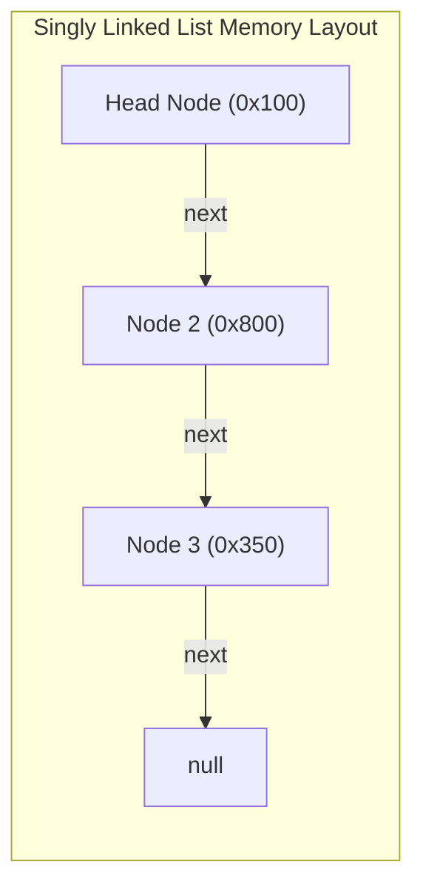

# Module 07: Linked Lists — Singly, Doubly, and Pointer Manipulation Techniques

## Theoretical Overview & Node Pointer Architecture

A **Linked List** is a linear data structure where elements (nodes) are stored non-contiguously in memory. Each node consists of a **Data Value** and one or more **Pointers (References)** to adjacent nodes.



### Real-World Engineering Analogy: Spotify Playlist
In Spotify, a custom playlist represents a Linked List. Adding or removing a track does not require shifting elements across an array buffer; it simply requires re-linking node pointers (`prev.next = newTrack; newTrack.next = curr`).

---

## 1. Array vs Linked List Architecture Comparison

| Metric | Array | Singly Linked List (SLL) | Doubly Linked List (DLL) |
| :--- | :--- | :--- | :--- |
| **Random Access** | $\mathcal{O}(1)$ instantaneous | $\mathcal{O}(n)$ sequential traversal | $\mathcal{O}(n)$ sequential traversal |
| **Insert / Delete at Head** | $\mathcal{O}(n)$ shift | **$\mathcal{O}(1)$** | **$\mathcal{O}(1)$** |
| **Insert / Delete at Tail** | $\mathcal{O}(1)$ amortized | $\mathcal{O}(n)$ (or $\mathcal{O}(1)$ with tail pointer) | **$\mathcal{O}(1)$** |
| **Delete Arbitrary Node** | $\mathcal{O}(n)$ shift | $\mathcal{O}(1)$ if node pre-given | **$\mathcal{O}(1)$** if node pre-given |
| **Memory Locality** | High CPU Cache hits | Low (Cache misses) | Low (Cache misses + 2x Pointers) |

---

## 2. Core Code Implementations

### 1. Singly Linked List (`SinglyLinkedList`)
```javascript
class SLLNode {
  constructor(value) { this.value = value; this.next = null; }
}

class SinglyLinkedList {
  constructor() { this.head = null; this._size = 0; }

  append(value) {
    const node = new SLLNode(value);
    if (!this.head) { this.head = node; }
    else { let c = this.head; while (c.next) c = c.next; c.next = node; }
    this._size++; return this;
  }

  prepend(value) {
    const node = new SLLNode(value);
    node.next = this.head;
    this.head = node;
    this._size++; return this;
  }

  removeAt(index) {
    if (index < 0 || index >= this._size) throw new RangeError("Out of bounds");
    let val;
    if (index === 0) { val = this.head.value; this.head = this.head.next; }
    else {
      let c = this.head;
      for (let i = 0; i < index - 1; i++) c = c.next;
      val = c.next.value;
      c.next = c.next.next;
    }
    this._size--; return val;
  }
}
```

### 2. Doubly Linked List (`DoublyLinkedList`)
Node features both `.next` and `.prev` references, enabling $\mathcal{O}(1)$ `removeLast()`.

```javascript
class DLLNode {
  constructor(value) { this.value = value; this.next = null; this.prev = null; }
}

class DoublyLinkedList {
  constructor() { this.head = null; this.tail = null; this._size = 0; }

  append(value) {
    const node = new DLLNode(value);
    if (!this.head) { this.head = node; this.tail = node; }
    else { node.prev = this.tail; this.tail.next = node; this.tail = node; }
    this._size++; return this;
  }

  removeLast() {
    if (!this.tail) return undefined;
    const val = this.tail.value;
    if (this.head === this.tail) { this.head = null; this.tail = null; }
    else { this.tail = this.tail.prev; this.tail.next = null; }
    this._size--; return val;
  }
}
```

---

## 3. Essential Pointer Manipulation Patterns

### 1. Reversing a Linked List (`reverseLinkedList`)
Flip `next` pointers in-place using `prev`, `curr`, and `next` pointers.
- **Complexity**: Time $\mathcal{O}(n)$, Space $\mathcal{O}(1)$.

```javascript
function reverseLinkedList(head) {
  let prev = null, curr = head;
  while (curr !== null) {
    const next = curr.next;
    curr.next = prev;
    prev = curr;
    curr = next;
  }
  return prev; // New head pointer
}
```

### 2. Cycle Detection via Floyd's Algorithm (`hasCycle`)
Detect cyclic loops using Fast & Slow Pointers (Tortoise and Hare).
- **Strategy**: Move `slow` by 1 step and `fast` by 2 steps. If a loop exists, `fast` and `slow` will inevitably collide inside the cycle.
- **Complexity**: Time $\mathcal{O}(n)$, Space $\mathcal{O}(1)$.

```javascript
function hasCycle(head) {
  let slow = head, fast = head;
  while (fast && fast.next) {
    slow = slow.next;
    fast = fast.next.next;
    if (slow === fast) return true;
  }
  return false;
}
```

### 3. Finding Middle Node (`findMiddle`)
Find the center node of a Linked List in a single pass.
- **Strategy**: When `fast` pointer reaches the end of the list (moving at $2x$ speed), `slow` pointer (moving at $1x$ speed) rests at the exact mid-point.

```javascript
function findMiddle(head) {
  let slow = head, fast = head;
  while (fast && fast.next) {
    slow = slow.next;
    fast = fast.next.next;
  }
  return slow.value;
}
```

### 4. Merge Two Sorted Lists (`mergeSortedLists`)
Merge two sorted linked lists into a single sorted list using a Dummy Head node.
- **Complexity**: Time $\mathcal{O}(n + m)$, Space $\mathcal{O}(1)$.

```javascript
function mergeSortedLists(h1, h2) {
  const dummy = new SLLNode(0);
  let curr = dummy;
  while (h1 && h2) {
    if (h1.value <= h2.value) { curr.next = h1; h1 = h1.next; }
    else { curr.next = h2; h2 = h2.next; }
    curr = curr.next;
  }
  curr.next = h1 || h2;
  return dummy.next;
}
```

### 5. Remove N-th Node From End (`removeNthFromEnd`)
Remove the $N$-th node from the end of a list in a single pass.
- **Strategy**: Advance `fast` pointer $N + 1$ steps ahead of `slow`. Advance both pointers together until `fast` reaches `null`. `slow.next` will point directly to the target node for deletion.

```javascript
function removeNthFromEnd(head, n) {
  const dummy = new SLLNode(0);
  dummy.next = head;
  let fast = dummy, slow = dummy;
  for (let i = 0; i <= n; i++) fast = fast.next;
  while (fast) { fast = fast.next; slow = slow.next; }
  slow.next = slow.next.next;
  return dummy.next;
}
```

---

## Key Takeaways

1. **Pointer Rewiring**: Insertion and deletion occur in $\mathcal{O}(1)$ time without shifting elements when pointer references are established.
2. **Dummy Head Technique**: Simplifies edge case handling for head node mutations.
3. **Fast & Slow Pointers**: Detects cycles and discovers mid-points in a single $\mathcal{O}(n)$ pass.
4. **Foundation for Graph/Tree Structures**: Pointer mechanics directly translate to Binary Tree nodes and Graph adjacency lists.
