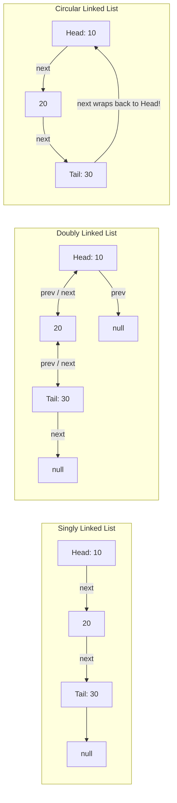
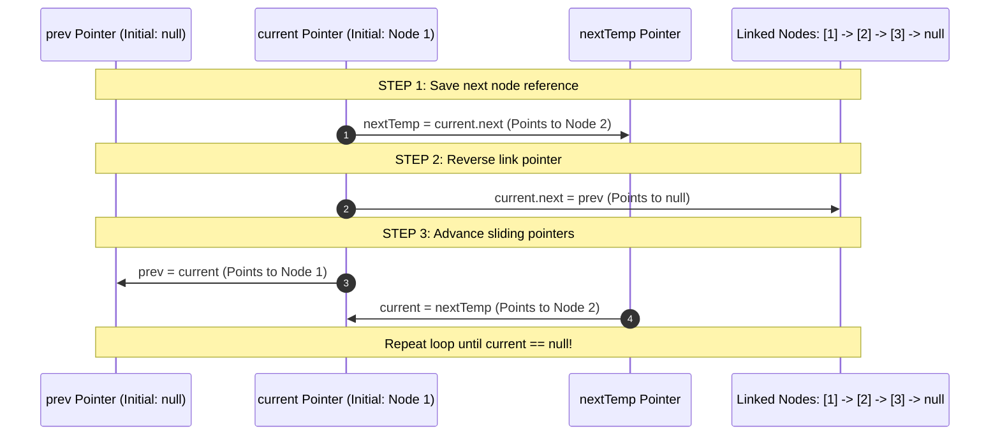
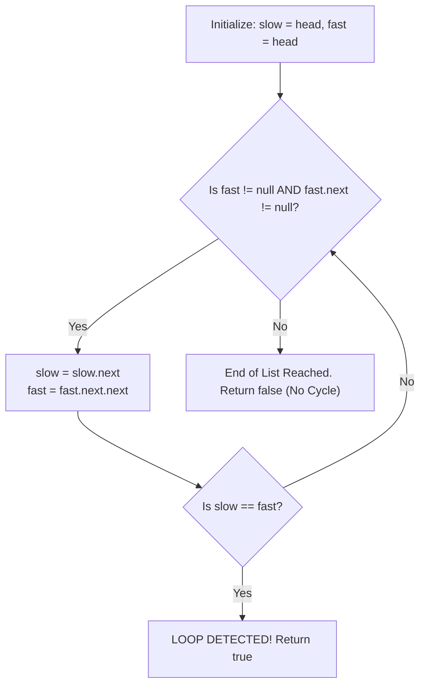

# Module 07: Linked Lists — Pointer Mechanics, In-Place Reversal, and Cycle Detection

## Overview

A **Linked List** is a linear data structure consisting of discrete node objects allocated dynamically across the heap. Each node stores a data payload and one or more pointer references (`next`, `prev`) to adjacent nodes.

Unlike arrays, linked lists do not store elements in contiguous RAM blocks. This trades direct index lookup ($\mathcal{O}(1)$ array access) for **instant $\mathcal{O}(1)$ head/tail insertions and deletions** without array re-indexing.

---

## 1. Linked List Variations & Memory Representations



### Array vs. Linked List Performance Comparison Matrix

| Operations / Characteristics | Dynamic Array (`Array`) | Singly Linked List | Doubly Linked List |
| :--- | :--- | :--- | :--- |
| **Index Lookup (`get(i)`)** | **$\mathcal{O}(1)$ Constant** | $\mathcal{O}(N)$ Traversal | $\mathcal{O}(N)$ Traversal |
| **Prepend (`unshift` / Head)**| $\mathcal{O}(N)$ Re-indexing | **$\mathcal{O}(1)$ Pointer Update** | **$\mathcal{O}(1)$ Pointer Update** |
| **Append (`push` / Tail)** | $\mathcal{O}(1)$ amortized | **$\mathcal{O}(1)$ (with tail pointer)** | **$\mathcal{O}(1)$** |
| **Arbitrary Insertion/Deletion**| $\mathcal{O}(N)$ Memmove Copy | $\mathcal{O}(1)$ (once node located) | $\mathcal{O}(1)$ (once node located) |
| **Cache Locality** | **High** (Contiguous RAM) | Poor (Dispersed Heap Nodes) | Poor (Dispersed Heap Nodes) |
| **Memory Overhead** | Minimal (Raw values) | Medium (1 pointer per node) | High (2 pointers per node) |

---

## 2. In-Place Linked List Reversal (3-Pointers Pattern)

Reversing a linked list in $\mathcal{O}(1)$ auxiliary space requires managing three sliding pointer references: **`prev`**, **`current`**, and **`nextTemp`**.



---

## 3. Floyd's Cycle Detection Algorithm (Fast & Slow Pointers)

To detect if a linked list contains a cycle (loop) in $\mathcal{O}(N)$ time and $\mathcal{O}(1)$ auxiliary space, use **Floyd's Tortoise and Hare Algorithm**:

- **Slow Pointer (`tortoise`)**: Advances 1 step at a time.
- **Fast Pointer (`hare`)**: Advances 2 steps at a time.
- **Mathematical Guarantee**: If a loop exists, the fast pointer will eventually catch up and collide with the slow pointer inside the loop.



---

## 4. Production Linked List Implementation Code

```javascript
class ListNode {
  constructor(val, next = null) {
    this.val = val;
    this.next = next;
  }
}

class SinglyLinkedList {
  constructor() {
    this.head = null;
    this.tail = null;
    this.size = 0;
  }

  // O(1) Prepend
  prepend(val) {
    const newNode = new ListNode(val, this.head);
    this.head = newNode;
    if (!this.tail) this.tail = newNode;
    this.size++;
  }

  // O(1) Append
  append(val) {
    const newNode = new ListNode(val);
    if (!this.head) {
      this.head = newNode;
      this.tail = newNode;
    } else {
      this.tail.next = newNode;
      this.tail = newNode;
    }
    this.size++;
  }

  // O(N) Time, O(1) Auxiliary Space In-Place Reversal
  reverse() {
    let prev = null;
    let current = this.head;
    this.tail = this.head; // Old head becomes new tail

    while (current !== null) {
      const nextTemp = current.next; // 1. Save next reference
      current.next = prev;          // 2. Reverse pointer direction
      prev = current;               // 3. Move prev forward
      current = nextTemp;           // 4. Move current forward
    }

    this.head = prev; // Set new head
  }

  // O(N) Time, O(1) Space Floyd's Cycle Detection
  hasCycle() {
    let slow = this.head;
    let fast = this.head;

    while (fast !== null && fast.next !== null) {
      slow = slow.next;
      fast = fast.next.next;

      if (slow === fast) {
        return true; // Collision detected! Loop exists.
      }
    }

    return false;
  }
}

// Verification
const list = new SinglyLinkedList();
list.append(10);
list.append(20);
list.append(30);

list.reverse();
console.log("Reversed Head Value:", list.head.val); // 30
console.log("Has Cycle?", list.hasCycle());         // false
```

---

## Key Production Takeaways

1. **Use Linked Lists when High-Volume Head Insertions are Required**: If your system requires frequent $\mathcal{O}(1)$ prepend operations without dynamic array re-indexing, prefer linked lists.
2. **Always Guard Against Null Pointer Exceptions**: Always check `current !== null` and `current.next !== null` when traversing linked list pointers to avoid `TypeError: Cannot read property 'next' of null`.
3. **Use Dummy Head Nodes for Simplified Code**: Creating a temporary dummy sentinel node (`const dummy = new ListNode(0); dummy.next = head;`) eliminates edge-case logic when inserting or deleting the head node.
4. **Use Floyd's Algorithm for $\mathcal{O}(1)$ Space Cycle Detection**: Detecting cycles via Hash Sets requires $\mathcal{O}(N)$ memory. Floyd's Fast & Slow pointer approach delivers $\mathcal{O}(1)$ space efficiency.

