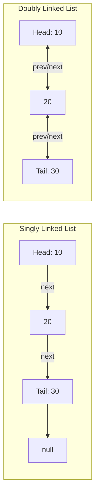

# File 07: Linked Lists (Singly and Doubly)

## Overview
A **Linked List** is a linear collection of data nodes where each node contains a value and a pointer reference (`next`, and optionally `prev`) to the adjacent node in memory.

---

## 1. Singly vs Doubly Linked List Architecture



---

## 2. Singly Linked List Implementation & Reversal

```javascript
class Node {
    constructor(val) {
        this.val = val;
        this.next = null;
    }
}

class SinglyLinkedList {
    constructor() {
        this.head = null;
        this.tail = null;
        this.length = 0;
    }

    append(val) {
        const newNode = new Node(val);
        if (!this.head) {
            this.head = newNode;
            this.tail = newNode;
        } else {
            this.tail.next = newNode;
            this.tail = newNode;
        }
        this.length++;
        return this;
    }

    // Classic Algorithm: Reverse Linked List In-Place
    reverse() {
        let prev = null;
        let current = this.head;
        this.tail = this.head;

        while (current !== null) {
            let nextTemp = current.next;
            current.next = prev; // Reverse pointer
            prev = current;
            current = nextTemp;
        }

        this.head = prev;
        return this;
    }
}

const list = new SinglyLinkedList();
list.append(10).append(20).append(30);
list.reverse();
console.log("Reversed Head Value:", list.head.val); // 30
```

---

## Key Takeaways
1. Insertions and deletions at the head execute in **$O(1)$ Constant Time**.
2. Element lookup by index requires **$O(n)$ Linear Time** sequential traversal.
3. In-place linked list reversal swaps `.next` pointers using **three pointers** (`prev`, `current`, `next`).
