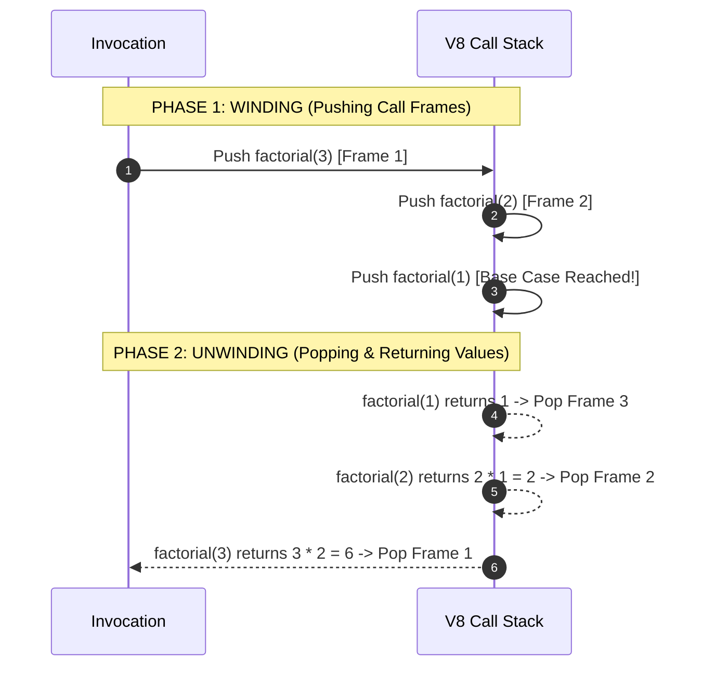

# Module 08: Recursion, V8 Call Stack Mechanics, and Memoization Optimization

## Overview

**Recursion** is an algorithmic technique where a function solves a complex problem by calling itself with progressively smaller sub-problems until reaching a trivial **Base Case**.

Understanding recursion requires mastering **Call Stack Frame Mechanics**, understanding the memory cost of recursive stack depth, and recognizing when naive exponential branching ($\mathcal{O}(2^N)$) must be optimized via **Memoization** ($\mathcal{O}(N)$).

---

## 1. Call Stack Frame Lifecycle in Recursion

Every active function invocation pushes a **Call Stack Frame** containing local variables, parameters, and the return execution address onto the V8 Call Stack.



---

## 2. Naive Tree Recursion vs. Memoized Pruning

Calculating Fibonacci numbers naively (`fib(n) = fib(n-1) + fib(n-2)`) creates an exponential **Binary Recursion Tree** of $\mathcal{O}(2^N)$ time complexity.

```mermaid
graph TD
    subgraph Naive Fibonacci Tree: O(2ⁿ) Exponential Explosion
        F5["fib(5)"] --> F4["fib(4)"]
        F5 --> F3_1["fib(3)"]

        F4 --> F3_2["fib(3) - REDUNDANT!"]
        F4 --> F2_1["fib(2) - REDUNDANT!"]

        F3_1 --> F2_2["fib(2)"]
        F3_1 --> F1_1["fib(1)"]
    end

    subgraph Memoized Tree: O(N) Linear Time Pruning
        MF5["fib(5)"] --> MF4["fib(4)"]
        MF4 --> MF3["fib(3)"]
        MF3 --> MF2["fib(2)"]
        MF2 --> MF1["fib(1)"]

        MF4 -.->|O(1) Memo Lookup| CachedF2["fib(2) (Cached!)"]
        MF5 -.->|O(1) Memo Lookup| CachedF3["fib(3) (Cached!)"]
    end
```

---

## 3. Tail Call Optimization (TCO)

A recursive call is in **Tail Position** if the recursive call is the *final operation* executed before returning. In theory, JIT engines can reuse the existing call frame instead of pushing a new frame (**Tail Call Optimization**):

```javascript
// Non-Tail Recursive Factorial (Must retain stack frame to perform multiplication AFTER return!)
function standardFactorial(n) {
  if (n <= 1) return 1;
  return n * standardFactorial(n - 1); // Multiplication occurs AFTER recursive return
}

// Tail-Recursive Factorial (Accumulator passed in parameter)
function tailRecursiveFactorial(n, accumulator = 1) {
  if (n <= 1) return accumulator;
  return tailRecursiveFactorial(n - 1, n * accumulator); // Tail position!
}
```

---

## 4. Production Memoized & Iterative Code Implementations

```javascript
// 1. Fibonacci with Hash Map Memoization - O(N) Time, O(N) Auxiliary Space
function fibMemoized(n, memo = new Map()) {
  if (memo.has(n)) return memo.get(n); // O(1) Cache hit!
  if (n <= 0) return 0;
  if (n === 1) return 1;

  const result = fibMemoized(n - 1, memo) + fibMemoized(n - 2, memo);
  memo.set(n, result);
  return result;
}

console.log("Fibonacci(50) Memoized:", fibMemoized(50)); // 12586269025 (Calculated instantly!)

// 2. Iterative Dynamic Programming (Bottom-Up) - O(N) Time, O(1) Space
function fibIterative(n) {
  if (n <= 0) return 0;
  if (n === 1) return 1;

  let prevPrev = 0;
  let prev = 1;
  let current = 0;

  for (let i = 2; i <= n; i++) {
    current = prev + prevPrev;
    prevPrev = prev;
    prev = current;
  }

  return current;
}

console.log("Fibonacci(50) Iterative:", fibIterative(50)); // 12586269025
```

---

## 5. Recursion vs. Iteration Complexity Trade-offs

| Characteristic | Recursive Solution | Iterative Solution |
| :--- | :--- | :--- |
| **Code Expressiveness** | Clean, concise for trees/graphs/backtracking | Requires explicit stack management |
| **Call Stack Memory** | $\mathcal{O}(N)$ Call Stack frame space overhead | $\mathcal{O}(1)$ Constant Auxiliary Space |
| **Execution Overhead** | Function invocation frame setup/teardown cost | Faster raw loop CPU clock cycles |
| **Overflow Vulnerability**| Risk of `Maximum call stack size exceeded` | **Zero Risk** of stack overflow |

---

## Key Production Takeaways

1. **Every Recursive Function MUST Have a Base Case**: Ensure the base case evaluates before any recursive invocation to avoid infinite loops and call stack overflows.
2. **Watch Out for Exponential $\mathcal{O}(2^N)$ Tree Recursion**: If recursive calls overlap, use **Memoization** (Top-Down DP) or converts the algorithm to **Iteration** (Bottom-Up DP).
3. **Be Cautious of V8 Call Stack Limits**: Node.js caps stack frames at ~10,000 depth. For deep problem inputs ($N > 10,000$), replace recursion with an explicit iterative array stack.
4. **Pass Accumulators for Tail-Call Optimizable Logic**: Structure recursive functions with accumulator parameters to enable tail recursion cleanups where supported.

