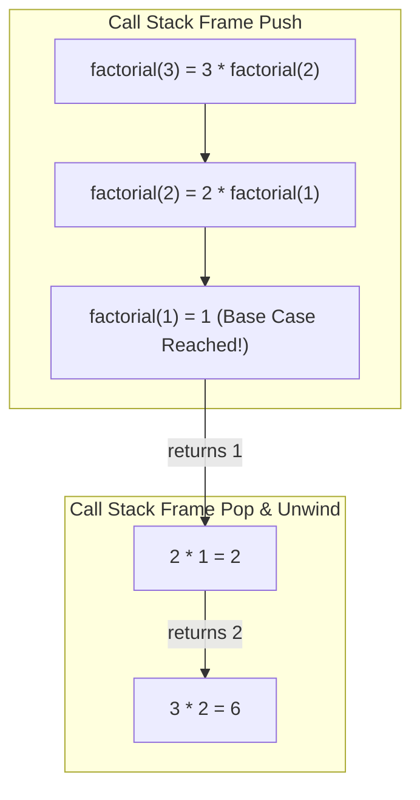

# File 08: Recursion and Call Stack Mechanics

## Overview
**Recursion** is a technique where a function solves a problem by calling itself with smaller sub-problems. Every recursive function requires a valid **Base Case** to stop recursion and prevent Call Stack Overflow (`RangeError: Maximum call stack size exceeded`).

---

## 1. Call Stack Recursion Execution



---

## 2. Recursive Algorithms & Tail Call Optimization

```javascript
// 1. Classic Factorial Recursion
function factorial(n) {
    if (n <= 1) return 1; // Base Case
    return n * factorial(n - 1); // Recursive Call
}

console.log(factorial(5)); // 120

// 2. Fibonacci with Memoization (Prevents O(2^n) exponential explosion)
function fibMemo(n, memo = {}) {
    if (n in memo) return memo[n];
    if (n <= 1) return n;

    memo[n] = fibMemo(n - 1, memo) + fibMemo(n - 2, memo);
    return memo[n];
}

console.log(fibMemo(50)); // 12586269025 (Calculated in O(n) time!)
```

---

## Key Takeaways
1. Every recursive function **MUST** have a **Base Case** to stop execution.
2. Unbounded recursion causes a **Call Stack Overflow**.
3. Use **Memoization** to optimize overlapping recursive sub-problems from $O(2^n)$ to $O(n)$ time.
