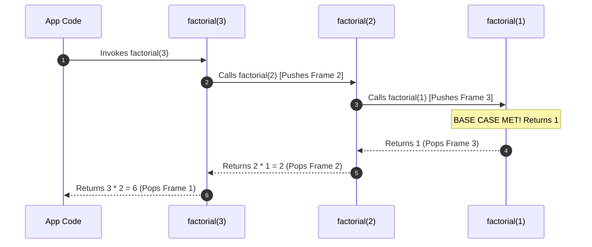

# Module 08: Recursion, Divide-and-Conquer, and Backtracking Patterns

## Theoretical Overview & Call Stack Mechanics

**Recursion** occurs when a function calls itself to solve a smaller instance of the same problem. Every recursive algorithm relies on two indispensable components:

1. **Base Case**: The termination condition that stops further recursion and returns a explicit value.
2. **Recursive Step**: The self-referential call that reduces the input size, moving closer to the base case.



### The Call Stack & Stack Overflow
In JavaScript V8, each function call pushes a **Stack Frame** containing local variables and return addresses onto RAM.
- **Stack Limit**: Node.js allocates a maximum stack depth of roughly **10,000 to 15,000 frames**.
- **Overflow Event**: Omitting a base case results in infinite recursion, throwing `RangeError: Maximum call stack size exceeded`.

---

## 1. Recursion Complexity & Optimization Spectrum

| Pattern / Algorithm | Recursion Tree Shape | Time Complexity | Space Complexity (Stack Depth) | Optimization Strategy |
| :--- | :--- | :--- | :--- | :--- |
| **Linear Recursion (`factorial`)** | Single Line Chain | $\mathcal{O}(n)$ | $\mathcal{O}(n)$ stack | Convert to iterative loop ($\mathcal{O}(1)$ space). |
| **Naive Tree Recursion (`fibNaive`)**| Binary Branch Tree | $\mathcal{O}(2^n)$ exponential | $\mathcal{O}(n)$ stack depth | **Memoization** / Dynamic Programming ($\mathcal{O}(n)$ time). |
| **Divide & Conquer (`power(x, n)`)**| Halving Tree | $\mathcal{O}(\log n)$ logarithmic | $\mathcal{O}(\log n)$ stack | Exponentiation by squaring. |
| **Backtracking (`generateSubsets`)** | Binary Decision Tree | $\mathcal{O}(2^n)$ exponential | $\mathcal{O}(n)$ call depth | Prune unpromising branches. |

---

## 2. Core Code Implementations & Walkthroughs

### 1. Linear Recursion: Factorial (`factorial`)
```javascript
function factorial(n) {
  if (n <= 1) return 1; // Base case
  return n * factorial(n - 1); // Recursive step
}
```

### 2. Fibonacci: Naive vs Memoized vs Iterative
- **Naive $\mathcal{O}(2^n)$**: Overlapping sub-problems are computed repeatedly.
- **Memoized $\mathcal{O}(n)$**: Top-down Dynamic Programming storing results in `memo`.
- **Iterative $\mathcal{O}(n)$ time, $\mathcal{O}(1)$ space**: Bottom-up variable swapping.

```javascript
// Memoized Top-Down DP: O(n) Time, O(n) Space
function fibMemo(n, memo = {}) {
  if (n in memo) return memo[n];
  if (n <= 0) return 0;
  if (n === 1) return 1;
  memo[n] = fibMemo(n - 1, memo) + fibMemo(n - 2, memo);
  return memo[n];
}
```

### 3. Logarithmic Exponentiation (`power(x, n)`)
Compute $x^n$ in **$\mathcal{O}(\log n)$** time by halving the exponent at each recursive step.

$$\text{power}(x, n) = \begin{cases} 1 & \text{if } n = 0 \\ \frac{1}{\text{power}(x, -n)} & \text{if } n < 0 \\ (\text{power}(x, n/2))^2 & \text{if } n \text{ is even} \\ x \times \text{power}(x, n - 1) & \text{if } n \text{ is odd} \end{cases}$$

```javascript
function power(x, n) {
  if (n === 0) return 1;
  if (n < 0) return 1 / power(x, -n);
  if (n % 2 === 0) {
    const half = power(x, n / 2);
    return half * half;
  }
  return x * power(x, n - 1);
}
```

### 4. Recursive Nested Array Flattening (`flatten`)
Traverse and flatten arbitrarily nested arrays using recursive type checking.

```javascript
function flatten(arr) {
  const result = [];
  for (const item of arr) {
    if (Array.isArray(item)) result.push(...flatten(item));
    else result.push(item);
  }
  return result;
}
```

### 5. Nested Object Key Counting (`countKeys`)
Recursively traverse JSON objects or DOM nodes to calculate total property keys.

```javascript
function countKeys(obj) {
  let count = 0;
  for (const key in obj) {
    count++;
    if (typeof obj[key] === "object" && obj[key] !== null && !Array.isArray(obj[key])) {
      count += countKeys(obj[key]);
    }
  }
  return count;
}
```

---

## 3. Divide-and-Conquer & Backtracking Patterns

### 1. Tower of Hanoi (`towerOfHanoi`)
Move $n$ disks from source peg `from` to destination peg `to` using auxiliary peg `aux`.
- **Recurrence**: $T(n) = 2T(n-1) + 1 \implies \mathcal{O}(2^n)$ total disk moves.

```javascript
function towerOfHanoi(n, from, to, aux, moves = []) {
  if (n === 0) return moves;
  towerOfHanoi(n - 1, from, aux, to, moves);
  moves.push(`Disk ${n}: ${from} -> ${to}`);
  towerOfHanoi(n - 1, aux, to, from, moves);
  return moves;
}
```

### 2. Generating All Subsets / Power Set (`generateSubsets`)
Generate all $2^n$ combinations of an array using binary decision tree backtracking (Include vs Exclude choices).

```javascript
function generateSubsets(arr) {
  const result = [];
  function backtrack(index, current) {
    if (index === arr.length) { result.push([...current]); return; }
    backtrack(index + 1, current); // Exclude option
    current.push(arr[index]);
    backtrack(index + 1, current); // Include option
    current.pop();                 // Backtrack (undo choice)
  }
  backtrack(0, []);
  return result;
}
```

### 3. IRCTC Route Finder via Graph Backtracking (`findAllRoutes`)
Find all simple paths between source and destination in a directed graph.

```javascript
function findAllRoutes(graph, start, end, path = [], all = []) {
  path.push(start);
  if (start === end) all.push([...path]);
  else {
    for (const nb of (graph[start] || [])) {
      if (!path.includes(nb)) findAllRoutes(graph, nb, end, path, all);
    }
  }
  path.pop(); // Undo step
  return all;
}
```

---

## Key Takeaways

1. **Base Case Mandatory**: Always verify that a valid base case exists to prevent call stack overflow.
2. **Memoization**: Converts exponential $\mathcal{O}(2^n)$ recursive trees into optimal $\mathcal{O}(n)$ linear runtime by caching sub-problem results.
3. **Divide-and-Conquer**: Reduces search space exponentially (e.g., $\mathcal{O}(\log n)$ power function).
4. **Backtracking Blueprint**: Push choice $\to$ Recursively explore $\to$ Pop choice to restore state.
