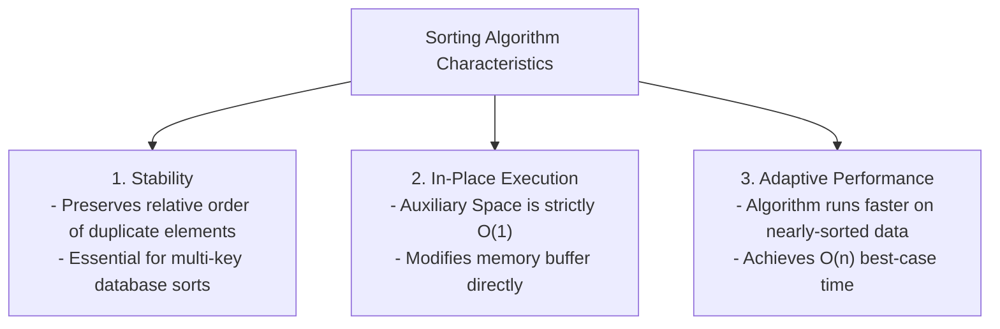

# Module 09: Basic Sorting Algorithms & Algorithmic Trade-offs

## Theoretical Overview & Core Sorting Attributes

Sorting is the algorithmic re-ordering of elements according to a defined comparison relationship ($\le, \ge$). 



### Real-World Engineering Context: Flipkart Catalog Sorting
For a small product carousel (20 items), simpler $\mathcal{O}(n^2)$ algorithms like **Insertion Sort** out-perform complex divide-and-conquer algorithms due to zero recursion stack and low function call overhead. For full product search results (500,000 items), optimal $\mathcal{O}(n \log n)$ algorithms are mandatory.

---

## 1. Algorithm Complexity & Attribute Matrix

| Algorithm | Best Case Time | Average Case Time | Worst Case Time | Space Complexity | Stability | Adaptive | Key Advantage |
| :--- | :--- | :--- | :--- | :--- | :--- | :--- | :--- |
| **Bubble Sort** | **$\mathcal{O}(n)$** | $\mathcal{O}(n^2)$ | $\mathcal{O}(n^2)$ | $\mathcal{O}(1)$ in-place | **Yes** | **Yes** | Early exit flag detects sorted input. |
| **Selection Sort** | $\mathcal{O}(n^2)$ | $\mathcal{O}(n^2)$ | $\mathcal{O}(n^2)$ | $\mathcal{O}(1)$ in-place | **No** | **No** | **$\mathcal{O}(n)$ total swaps** (ideal for high-cost writes). |
| **Insertion Sort** | **$\mathcal{O}(n)$** | $\mathcal{O}(n^2)$ | $\mathcal{O}(n^2)$ | $\mathcal{O}(1)$ in-place | **Yes** | **Yes** | Ideal for small arrays ($n < 32$) and online streams. |
| **JS `Array.prototype.sort`**| **$\mathcal{O}(n)$** | **$\mathcal{O}(n \log n)$**| **$\mathcal{O}(n \log n)$**| $\mathcal{O}(n)$ | **Yes** | **Yes** | Production hybrid TimSort engine. |

---

## 2. Code Implementations & Mechanics Walkthrough

### 1. Bubble Sort with Early Exit (`bubbleSort`)
Compares adjacent pairs $[a_j, a_{j+1}]$ and swaps them if out of order. At the end of pass $i$, the largest unsorted element "bubbles up" to index $n - 1 - i$.
- **Early-Exit Optimization**: If a pass completes with zero swaps (`swapped === false`), the array is already sorted, terminating execution in **$\mathcal{O}(n)$** time.

```javascript
function bubbleSort(arr) {
  const a = [...arr], n = a.length;
  for (let i = 0; i < n - 1; i++) {
    let swapped = false;
    for (let j = 0; j < n - 1 - i; j++) {
      if (a[j] > a[j + 1]) {
        [a[j], a[j + 1]] = [a[j + 1], a[j]];
        swapped = true;
      }
    }
    if (!swapped) break; // Early exit on sorted input
  }
  return a;
}
```

### 2. Selection Sort (`selectionSort`)
Divides the array into sorted and unsorted regions. Repeatedly finds the minimum element in the unsorted region and swaps it to position $i$.
- **Why Selection Sort is Unstable**: Swapping the minimum element across duplicate keys alters their original relative order (e.g., sorting `[3a, 3b, 1]` swaps `3a` with `1`, resulting in `[1, 3b, 3a]`).

```javascript
function selectionSort(arr) {
  const a = [...arr], n = a.length;
  for (let i = 0; i < n - 1; i++) {
    let minIdx = i;
    for (let j = i + 1; j < n; j++) {
      if (a[j] < a[minIdx]) minIdx = j;
    }
    if (minIdx !== i) [a[i], a[minIdx]] = [a[minIdx], a[i]];
  }
  return a;
}
```

### 3. Insertion Sort (`insertionSort`)
Iterates through elements, inserting `arr[i]` into its correct position inside the sorted prefix `arr[0...i-1]` by shifting larger elements rightward.
- **Rummy Cards Analogy**: Simulates arranging playing cards held in hand.
- **TimSort Foundation**: Used as the base sub-algorithm inside V8's TimSort for array partitions of size $n \le 32$.

```javascript
function insertionSort(arr) {
  const a = [...arr], n = a.length;
  for (let i = 1; i < n; i++) {
    const key = a[i];
    let j = i - 1;
    while (j >= 0 && a[j] > key) {
      a[j + 1] = a[j]; // Shift right
      j--;
    }
    a[j + 1] = key;
  }
  return a;
}
```

---

## 3. Practical JavaScript `Array.prototype.sort()` Gotchas

### 1. Lexicographic Default Trap
Without an explicit comparator callback, JavaScript converts array elements to strings and performs Unicode code-point comparison:

```javascript
const numbers = [10, 9, 80, 3, 21];

// BAD: Default sort converts to strings ["10", "21", "3", "80", "9"]
console.log(numbers.sort()); // Output: [10, 21, 3, 80, 9]

// GOOD: Pass explicit numeric comparator function
console.log(numbers.sort((a, b) => a - b)); // Output: [3, 9, 10, 21, 80]
```

### 2. Multi-Key Composite Sorting
Sort products by rating descending, breaking ties by price ascending:

```javascript
const products = [
  { name: "iPhone 15", price: 79999, rating: 4.5 },
  { name: "Samsung S24", price: 69999, rating: 4.7 },
  { name: "OnePlus 12", price: 49999, rating: 4.6 },
  { name: "Pixel 8", price: 59999, rating: 4.8 },
];

const sorted = [...products].sort((a, b) => {
  if (b.rating !== a.rating) return b.rating - a.rating; // Primary: Rating Descending
  return a.price - b.price;                              // Secondary: Price Ascending
});
```

---

## 4. Algorithm Selection Decision Guide

```mermaid
flowchart TD
    Start[Sorting Problem] --> SizeCheck{Is Input Size n < 32?}
    SizeCheck -->|Yes| CheckOrder{Is Array Nearly Sorted?}
    CheckOrder -->|Yes| UseInsert[Use Insertion Sort - O(n) Best Case]
    CheckOrder -->|No| UseInsert
    
    SizeCheck -->|No| WriteCheck{Are Memory Writes Extremely Expensive?}
    WriteCheck -->|Yes| UseSelect[Use Selection Sort - Exactly O(n) Swaps]
    WriteCheck -->|No| UseV8Sort[Use Built-in JS sort - TimSort Engine]
```

---

## Key Takeaways

1. **Bubble Sort**: Simple, stable, adaptive with early exit flag ($\mathcal{O}(n)$ best case).
2. **Selection Sort**: Unstable, but guarantees a maximum of **$n-1$ memory swaps** (useful for EEPROM / Flash memory writes).
3. **Insertion Sort**: Best choice for small datasets ($n < 32$) and online data streams; powers TimSort base cases.
4. **V8 `sort()` Rule**: Always supply `(a, b) => a - b` comparator callbacks for numerical sorting.
