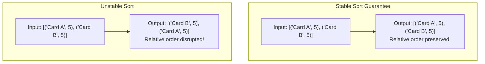
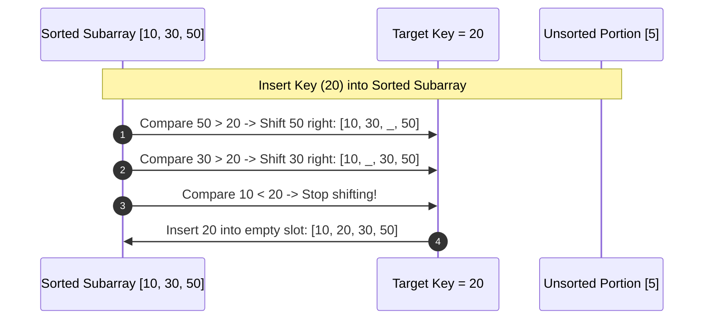

# Module 09: Elementary Sorting Algorithms — Bubble, Selection, and Insertion Sort

## Overview

Elementary sorting algorithms—**Bubble Sort**, **Selection Sort**, and **Insertion Sort**—operate via comparison-based passes over input arrays with $\mathcal{O}(N^2)$ average and worst-case time complexity.

Despite their quadratic scaling, understanding their mechanics is essential: **Insertion Sort** outperforms complex $\mathcal{O}(N \log N)$ algorithms on small datasets ($N \le 16$) or nearly-sorted data, serving as the base-case sorting engine in production hybrid algorithms like **Timsort** and **IntroSort**.

---

## 1. Algorithm Stability and Comparison Matrix

### Definition of Sorting Stability
A sorting algorithm is **Stable** if it guarantees that two items with equal keys maintain their original relative order after sorting.



### Elementary Sorting Algorithms Matrix

| Algorithm | Best-Case Time | Average-Case Time | Worst-Case Time | Auxiliary Space | Max Swaps | Stable? | Best Used For |
| :--- | :--- | :--- | :--- | :--- | :--- | :--- | :--- |
| **Bubble Sort** | $\mathcal{O}(N)$ (Optimized) | $\mathcal{O}(N^2)$ | $\mathcal{O}(N^2)$ | $\mathcal{O}(1)$ | $\mathcal{O}(N^2)$ | **Yes** | Educational concepts. |
| **Selection Sort** | $\mathcal{O}(N^2)$ | $\mathcal{O}(N^2)$ | $\mathcal{O}(N^2)$ | $\mathcal{O}(1)$ | **$\mathcal{O}(N)$** | **No** | Minimizing physical memory writes. |
| **Insertion Sort** | **$\mathcal{O}(N)$** | $\mathcal{O}(N^2)$ | $\mathcal{O}(N^2)$ | $\mathcal{O}(1)$ | $\mathcal{O}(N^2)$ | **Yes** | Small ($N \le 16$) or nearly-sorted datasets. |

---

## 2. Algorithm Mechanics Visualizations

### Bubble Sort Pass Mechanism
Repeatedly compares adjacent pairs `arr[j]` and `arr[j+1]`, "bubbling" the largest unsorted element to the right end of the array.

```mermaid
flowchart TD
    BubblePass[Outer Loop Pass i from N-1 down to 1] --> InitSwap[Set swapped = false]
    InitSwap --> InnerLoop[Inner Loop j from 0 to i-1]

    InnerLoop --> CheckAdj{Is arr[j] > arr[j+1]?}
    CheckAdj -- Yes --> SwapPair[Swap arr[j] and arr[j+1]<br/>Set swapped = true]
    CheckAdj -- No --> SkipSwap[No Swap]

    SwapPair --> InnerNext[Advance j++]
    SkipSwap --> InnerNext

    InnerNext --> CheckInnerDone{Inner Loop Complete?}
    CheckInnerDone -- No --> InnerLoop
    CheckInnerDone -- Yes --> CheckEarlyExit{Is swapped == false?}

    CheckEarlyExit -- Yes --> ArraySorted[EARLY EXIT: Array is already fully sorted!]
    CheckEarlyExit -- No --> OuterNext[Decrement i--]
```

---

### Insertion Sort Mechanism
Maintains a sorted sub-array on the left. Takes the next unsorted element and shifts larger elements to the right to insert it into its correct sorted slot.



---

## 3. Production Elementary Sorting Implementations

```javascript
// 1. Optimized Bubble Sort with Early Exit - O(N²) Worst, O(N) Best
function bubbleSort(arr) {
  const n = arr.length;
  let swapped;

  for (let i = n - 1; i > 0; i--) {
    swapped = false;
    for (let j = 0; j < i; j++) {
      if (arr[j] > arr[j + 1]) {
        // Swap adjacent elements
        const temp = arr[j];
        arr[j] = arr[j + 1];
        arr[j + 1] = temp;
        swapped = true;
      }
    }
    // If no swaps occurred during entire pass, array is already sorted!
    if (!swapped) break;
  }
  return arr;
}

// 2. Selection Sort - O(N²) Comparisons, O(N) Swaps (Minimizes Array Writes)
function selectionSort(arr) {
  const n = arr.length;

  for (let i = 0; i < n - 1; i++) {
    let minIndex = i;
    for (let j = i + 1; j < n; j++) {
      if (arr[j] < arr[minIndex]) {
        minIndex = j;
      }
    }
    // Perform at most N swaps total
    if (minIndex !== i) {
      const temp = arr[i];
      arr[i] = arr[minIndex];
      arr[minIndex] = temp;
    }
  }
  return arr;
}

// 3. Insertion Sort - O(N) Best Case for Nearly-Sorted Data
function insertionSort(arr) {
  const n = arr.length;

  for (let i = 1; i < n; i++) {
    const currentKey = arr[i];
    let j = i - 1;

    // Shift elements of arr[0..i-1] that are greater than currentKey
    while (j >= 0 && arr[j] > currentKey) {
      arr[j + 1] = arr[j]; // Right shift
      j--;
    }
    arr[j + 1] = currentKey; // Place key in correct sorted position
  }
  return arr;
}

console.log("Insertion Sort Result:", insertionSort([64, 34, 25, 12, 22, 11, 90]));
```

---

## Key Production Takeaways

1. **Use Insertion Sort for Nearly-Sorted or Small Arrays**: Insertion Sort achieves $\mathcal{O}(N)$ linear time when data is mostly sorted and minimal overhead on small arrays ($N \le 16$).
2. **Understand Selection Sort Swap Minimization**: Selection Sort makes $\mathcal{O}(N^2)$ comparisons but strictly at most $\mathcal{O}(N)$ swaps. Useful when writing to memory is exceptionally expensive (e.g. Flash EEPROM).
3. **Preserve Stability When Required**: When sorting multi-field data (e.g. sorting user records by First Name, then by Last Name), use stable algorithms (Insertion Sort, Merge Sort, Timsort) to avoid corrupting previous sort passes.
4. **Avoid Naive Bubble Sort in Production**: Bubble Sort makes $\mathcal{O}(N^2)$ comparisons AND $\mathcal{O}(N^2)$ swaps, making it the least efficient elementary sort.

