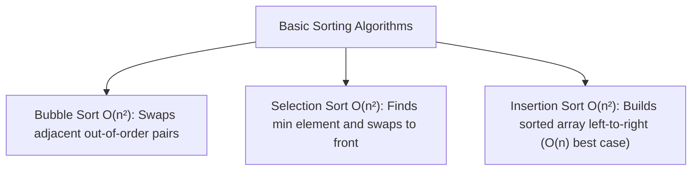

# File 09: Basic Sorting Algorithms (Bubble, Selection, Insertion)

## Overview
Basic sorting algorithms (**Bubble Sort**, **Selection Sort**, **Insertion Sort**) sort elements with quadratic $O(n^2)$ time complexity. They are useful for small datasets or nearly-sorted data arrays.

---

## 1. Basic Sorting Comparisons



### Basic Sorting Complexity Matrix

| Algorithm | Best Time | Average Time | Worst Time | Auxiliary Space | Stable? |
| :--- | :--- | :--- | :--- | :--- | :--- |
| **Bubble Sort** | $O(n)$ | $O(n^2)$ | $O(n^2)$ | $O(1)$ | Yes |
| **Selection Sort** | $O(n^2)$ | $O(n^2)$ | $O(n^2)$ | $O(1)$ | No |
| **Insertion Sort** | $O(n)$ | $O(n^2)$ | $O(n^2)$ | $O(1)$ | Yes |

---

## 2. Basic Sorting Implementation

```javascript
// 1. Optimized Bubble Sort
function bubbleSort(arr) {
    let swapped;
    for (let i = arr.length; i > 0; i--) {
        swapped = false;
        for (let j = 0; j < i - 1; j++) {
            if (arr[j] > arr[j + 1]) {
                [arr[j], arr[j + 1]] = [arr[j + 1], arr[j]]; // Swap
                swapped = true;
            }
        }
        if (!swapped) break; // Array is already sorted!
    }
    return arr;
}

// 2. Insertion Sort (Fast for nearly-sorted data)
function insertionSort(arr) {
    for (let i = 1; i < arr.length; i++) {
        let currentVal = arr[i];
        let j = i - 1;
        while (j >= 0 && arr[j] > currentVal) {
            arr[j + 1] = arr[j]; // Shift element right
            j--;
        }
        arr[j + 1] = currentVal;
    }
    return arr;
}

console.log(bubbleSort([64, 34, 25, 12, 22, 11, 90]));
```

---

## Key Takeaways
1. Basic sorting algorithms run in **$O(n^2)$ Average Time**.
2. **Insertion Sort** is exceptionally fast ($O(n)$) for nearly-sorted input data.
3. **Bubble Sort** and **Insertion Sort** are **stable** (preserve relative order of duplicate elements).
