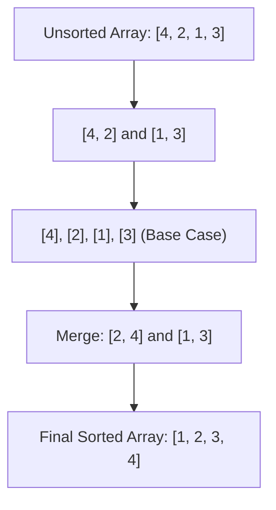

# File 10: Advanced Sorting Algorithms (Merge, Quick, Radix)

## Overview
Advanced sorting algorithms (**Merge Sort**, **Quick Sort**, **Radix Sort**) achieve linearithmic $O(n \log n)$ or linear $O(n)$ time complexity using Divide and Conquer techniques or non-comparative bucket sorting.

---

## 1. Divide and Conquer Merge Sort Flow



---

## 2. Merge Sort & Quick Sort Implementation

```javascript
// 1. Merge Sort (Divide & Conquer - Guaranteed O(n log n))
function mergeSort(arr) {
    if (arr.length <= 1) return arr; // Base Case

    const mid = Math.floor(arr.length / 2);
    const left = mergeSort(arr.slice(0, mid));
    const right = mergeSort(arr.slice(mid));

    return merge(left, right);
}

function merge(left, right) {
    let result = [];
    let l = 0, r = 0;

    while (l < left.length && r < right.length) {
        if (left[l] < right[r]) {
            result.push(left[l++]);
        } else {
            result.push(right[r++]);
        }
    }

    return result.concat(left.slice(l)).concat(right.slice(r));
}

console.log(mergeSort([10, -1, 2, 5, 0, 9])); // [-1, 0, 2, 5, 9, 10]
```

---

## Key Takeaways
1. **Merge Sort** guarantees **$O(n \log n)$** time in all cases (requires $O(n)$ extra space).
2. **Quick Sort** sorts in-place ($O(\log n)$ space) with average $O(n \log n)$ time.
3. Native JavaScript `Array.prototype.sort()` uses **Timsort** (hybrid Merge/Insertion Sort).
