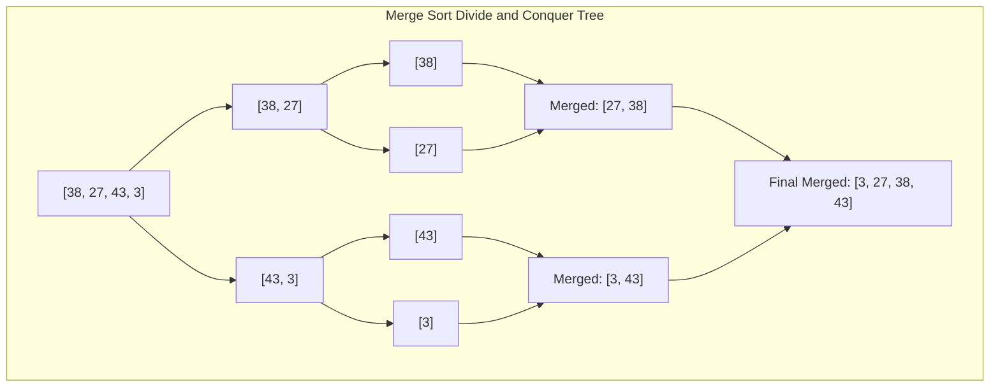

# Module 10: Advanced Sorting Algorithms — Merge Sort, Quick Sort, & Linear Sorts

## Theoretical Overview & Comparison Lower Bound Proof

Comparison-based sorting algorithms determine order exclusively by evaluating pairwise element relationships ($a_i \le a_j$).

### Mathematical Lower Bound Proof: $\Omega(n \log n)$
Any decision tree sorting $n$ distinct elements must contain at least $n!$ leaf nodes (representing all possible input permutations). The minimum height $h$ of a binary tree with $n!$ leaves is:

$$2^h \ge n! \implies h \ge \log_2(n!)$$

Applying Stirling's Approximation ($\log_2(n!) \approx n \log_2 n - n \log_2 e$):

$$h = \Omega(n \log n)$$

> [!IMPORTANT]
> **The $\Omega(n \log n)$ Ceiling**: No comparison-based sort can ever run faster than $\Omega(n \log n)$ in the worst case. To achieve linear **$\mathcal{O}(n)$** runtime, an algorithm must utilize non-comparison mechanisms (such as integer key distribution in Counting Sort or Radix Sort).

---

## 1. Advanced Sorting Matrix

| Algorithm | Best Case Time | Average Case Time | Worst Case Time | Space Complexity | Stability | Type | Best Use Case |
| :--- | :--- | :--- | :--- | :--- | :--- | :--- | :--- |
| **Merge Sort** | $\mathcal{O}(n \log n)$ | $\mathcal{O}(n \log n)$ | $\mathcal{O}(n \log n)$ | $\mathcal{O}(n)$ | **Yes** | Comparison | Guaranteed $\mathcal{O}(n \log n)$, Linked Lists. |
| **Quick Sort** | $\mathcal{O}(n \log n)$ | $\mathcal{O}(n \log n)$ | $\mathcal{O}(n^2)$ | $\mathcal{O}(\log n)$ stack| **No** | Comparison | Fast in-memory array sorting. |
| **Counting Sort**| **$\mathcal{O}(n + k)$**| **$\mathcal{O}(n + k)$**| **$\mathcal{O}(n + k)$**| $\mathcal{O}(n + k)$ | **Yes** | Non-Comparison| Integers within a small bounded range $k \le n$. |
| **Radix Sort** | **$\mathcal{O}(d(n+k))$**| **$\mathcal{O}(d(n+k))$**| **$\mathcal{O}(d(n+k))$**| $\mathcal{O}(n + k)$ | **Yes** | Non-Comparison| Fixed-digit integers or strings. |

---

## 2. Advanced Comparison Sorts Walkthrough



### 1. Merge Sort (`mergeSort`)
Splits the array into equal halves, recursively sorts each half, and merges the sorted sub-arrays using two pointers.
- **Complexity**: Time $\mathcal{O}(n \log n)$ across all cases, Space $\mathcal{O}(n)$.
- **Stability**: **Stable** (preserves equality order by preferring `left[i] <= right[j]`).

```javascript
function merge(left, right) {
  const result = [];
  let i = 0, j = 0;
  while (i < left.length && j < right.length) {
    if (left[i] <= right[j]) { result.push(left[i]); i++; }
    else { result.push(right[j]); j++; }
  }
  while (i < left.length) { result.push(left[i]); i++; }
  while (j < right.length) { result.push(right[j]); j++; }
  return result;
}

function mergeSort(arr) {
  if (arr.length <= 1) return arr;
  const mid = Math.floor(arr.length / 2);
  return merge(mergeSort(arr.slice(0, mid)), mergeSort(arr.slice(mid)));
}
```

### 2. Quick Sort with Randomized Pivot (`quickSort` & `lomutoPartition`)
Partitions the array around a pivot element such that all elements $\le \text{pivot}$ lie to the left, and elements $> \text{pivot}$ lie to the right.
- **Random Pivot Strategy**: Selecting a random pivot index eliminates the worst-case $\mathcal{O}(n^2)$ behavior on pre-sorted input arrays.
- **Complexity**: Time $\mathcal{O}(n \log n)$ average, Space $\mathcal{O}(\log n)$ call stack.

```javascript
function lomutoPartition(arr, low, high) {
  const pivot = arr[high];
  let i = low;
  for (let j = low; j < high; j++) {
    if (arr[j] <= pivot) {
      [arr[i], arr[j]] = [arr[j], arr[i]];
      i++;
    }
  }
  [arr[i], arr[high]] = [arr[high], arr[i]];
  return i;
}

function quickSort(arr, low = 0, high = arr.length - 1) {
  if (low < high) {
    const ri = low + Math.floor(Math.random() * (high - low + 1));
    [arr[ri], arr[high]] = [arr[high], arr[ri]]; // Swap random pivot to end
    const pi = lomutoPartition(arr, low, high);
    quickSort(arr, low, pi - 1);
    quickSort(arr, pi + 1, high);
  }
  return arr;
}
```

---

## 3. Non-Comparison Linear Sorts ($\mathcal{O}(n)$)

### 1. Counting Sort (`countingSort`)
Counts occurrences of each key within a integer range $[min, max]$, computes prefix sums to determine exact output positions, and places elements stably into an output buffer.
- **Complexity**: Time $\mathcal{O}(n + k)$, Space $\mathcal{O}(n + k)$.

```javascript
function countingSort(arr) {
  if (arr.length <= 1) return arr;
  const max = Math.max(...arr), min = Math.min(...arr);
  const range = max - min + 1;

  const count = new Array(range).fill(0);
  for (const num of arr) count[num - min]++;
  for (let i = 1; i < range; i++) count[i] += count[i - 1];

  const output = new Array(arr.length);
  for (let i = arr.length - 1; i >= 0; i--) {
    output[count[arr[i] - min] - 1] = arr[i];
    count[arr[i] - min]--;
  }
  return output;
}
```

### 2. Radix Sort (`radixSort`)
Sorts numbers digit-by-digit from Least Significant Digit (LSD) to Most Significant Digit (MSD) using Counting Sort as a stable sub-pass.
- **Complexity**: Time $\mathcal{O}(d \cdot (n + k))$, Space $\mathcal{O}(n + k)$ where $d$ is number of digits.

```javascript
function radixSort(arr) {
  if (arr.length <= 1) return arr;
  const result = [...arr];
  const max = Math.max(...result);
  const digits = Math.floor(Math.log10(max)) + 1;

  let exp = 1;
  for (let d = 0; d < digits; d++) {
    const count = new Array(10).fill(0);
    const output = new Array(result.length);

    for (const num of result) count[Math.floor(num / exp) % 10]++;
    for (let i = 1; i < 10; i++) count[i] += count[i - 1];
    for (let i = result.length - 1; i >= 0; i--) {
      const digit = Math.floor(result[i] / exp) % 10;
      output[count[digit] - 1] = result[i];
      count[digit]--;
    }
    for (let i = 0; i < result.length; i++) result[i] = output[i];
    exp *= 10;
  }
  return result;
}
```

---

## 4. Specialized Sorting Variants

### Merge Sort on Singly Linked List (`sortLinkedList`)
On linked lists, Merge Sort operates in **$\mathcal{O}(n \log n)$ time and $\mathcal{O}(1)$ auxiliary space** because sub-list merging requires only re-pointing node references (no array buffer allocation needed).

```javascript
function sortLinkedList(head) {
  if (!head || !head.next) return head;
  let slow = head, fast = head.next;
  while (fast && fast.next) { slow = slow.next; fast = fast.next.next; }
  const right = slow.next; slow.next = null;
  return mergeLLists(sortLinkedList(head), sortLinkedList(right));
}

function mergeLLists(l1, l2) {
  const dummy = new ListNode(0); let c = dummy;
  while (l1 && l2) {
    if (l1.val <= l2.val) { c.next = l1; l1 = l1.next; }
    else { c.next = l2; l2 = l2.next; }
    c = c.next;
  }
  c.next = l1 || l2;
  return dummy.next;
}
```

---

## Key Takeaways

1. **Comparison Bound**: All comparison-based sorting algorithms have a theoretical performance limit of $\Omega(n \log n)$.
2. **Merge Sort**: Guaranteed $\mathcal{O}(n \log n)$ runtime, stable, ideal for linked list sorting ($\mathcal{O}(1)$ extra space).
3. **Quick Sort**: Extremely fast in practice, in-place, but requires randomized pivots to prevent worst-case $\mathcal{O}(n^2)$ scenarios.
4. **Counting & Radix Sort**: Beat $\mathcal{O}(n \log n)$ by processing integer ranges/digits directly in $\mathcal{O}(n)$ linear time.
