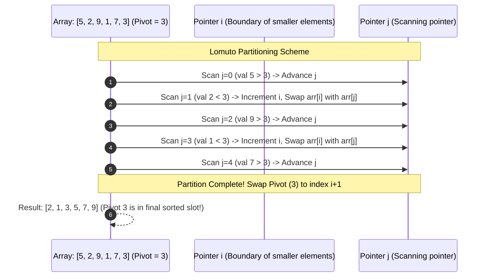

# Module 10: Advanced Sorting Algorithms — Merge Sort, Quick Sort, Timsort, and Radix Sort

## Overview

Advanced sorting algorithms achieve **$\mathcal{O}(N \log N)$ linearithmic time complexity** by leveraging the **Divide-and-Conquer** paradigm, or **$\mathcal{O}(N \cdot k)$ linear time** using non-comparison digit bucket operations.

V8's `Array.prototype.sort()` uses **Timsort** (a hybrid algorithm combining Merge Sort and Insertion Sort), providing optimal real-world performance, stability, and adaptive scaling.

---

## 1. Advanced Sorting Complexity & Mechanics Comparison

| Algorithm | Best-Case | Average-Case | Worst-Case | Auxiliary Space | Stable? | Primary Paradigm |
| :--- | :--- | :--- | :--- | :--- | :--- | :--- |
| **Merge Sort** | $\mathcal{O}(N \log N)$ | $\mathcal{O}(N \log N)$ | $\mathcal{O}(N \log N)$ | $\mathcal{O}(N)$ | **Yes** | Divide and Conquer (Out-of-place). |
| **Quick Sort** | $\mathcal{O}(N \log N)$ | $\mathcal{O}(N \log N)$ | $\mathcal{O}(N^2)$ | $\mathcal{O}(\log N)$ | **No** | Divide and Conquer (In-place partitioning). |
| **Timsort** | **$\mathcal{O}(N)$** | $\mathcal{O}(N \log N)$ | $\mathcal{O}(N \log N)$ | $\mathcal{O}(N)$ | **Yes** | Hybrid Merge/Insertion Sort (Used by V8 engine). |
| **Radix Sort** | $\mathcal{O}(N \cdot k)$ | $\mathcal{O}(N \cdot k)$ | $\mathcal{O}(N \cdot k)$ | $\mathcal{O}(N + k)$ | **Yes** | Non-comparison Digit Bucket Distribution. |

---

## 2. Merge Sort Architecture (Divide & Conquer)

Merge Sort recursively divides the array in half until single-element sub-arrays remain (Base Case), then merges sorted sub-arrays back together.

```mermaid
flowchart TD
    subgraph DIVIDE PHASE: O(log N) Levels
        Root["Unsorted Input: [38, 27, 43, 3, 9, 82, 10]"] --> L1["Left: [38, 27, 43]"]
        Root --> R1["Right: [3, 9, 82, 10]"]

        L1 --> L2_1["[38]"]
        L1 --> L2_2["[27, 43]"]

        R1 --> R2_1["[3, 9]"]
        R1 --> R2_2["[82, 10]"]
    end

    subgraph CONQUER / MERGE PHASE: O(N) Work per Level
        L2_2 --> MergeL2["Merged: [27, 38, 43]"]
        R2_1 --> MergeR2_1["Merged: [3, 9]"]
        R2_2 --> MergeR2_2["Merged: [10, 82]"]

        MergeR2_1 --> MergeR1["Merged Right: [3, 9, 10, 82]"]
        MergeR2_2 --> MergeR1

        MergeL2 --> FinalMerge["FINAL SORTED ARRAY:<br/>[3, 9, 10, 27, 38, 43, 82]"]
        MergeR1 --> FinalMerge
    end
```

---

## 3. Quick Sort Architecture & Partitioning

Quick Sort picks a **Pivot** element and partitions the array into two sub-arrays: elements smaller than the pivot on the left, and elements greater than the pivot on the right.



> [!WARNING]
> **Quick Sort Worst-Case Danger**: If the pivot selection strategy naively picks the first or last element on an **already-sorted array**, Quick Sort degrades to $\mathcal{O}(N^2)$ quadratic time. Always use **Median-of-Three** or **Randomized Pivot** selection.

---

## 4. Production Code Implementations

```javascript
// 1. Stable Merge Sort - Guaranteed O(N log N) Time, O(N) Auxiliary Space
function mergeSort(arr) {
  if (arr.length <= 1) return arr; // Base case

  const mid = Math.floor(arr.length / 2);
  const left = mergeSort(arr.slice(0, mid));
  const right = mergeSort(arr.slice(mid));

  return merge(left, right);
}

function merge(left, right) {
  const result = [];
  let l = 0;
  let r = 0;

  // Merge two sorted sub-arrays in O(N) time
  while (l < left.length && r < right.length) {
    if (left[l] <= right[r]) { // <= preserves stability!
      result.push(left[l++]);
    } else {
      result.push(right[r++]);
    }
  }

  // Append remaining items
  while (l < left.length) result.push(left[l++]);
  while (r < right.length) result.push(right[r++]);

  return result;
}

// 2. In-Place Quick Sort with Randomized Pivot - O(N log N) Average, O(log N) Space
function quickSort(arr, low = 0, high = arr.length - 1) {
  if (low < high) {
    const pivotIndex = partition(arr, low, high);
    quickSort(arr, low, pivotIndex - 1);  // Recursively sort left partition
    quickSort(arr, pivotIndex + 1, high); // Recursively sort right partition
  }
  return arr;
}

function partition(arr, low, high) {
  // Pick random pivot to prevent O(N²) worst-case on sorted arrays
  const randomPivotIdx = low + Math.floor(Math.random() * (high - low + 1));
  [arr[randomPivotIdx], arr[high]] = [arr[high], arr[randomPivotIdx]];

  const pivot = arr[high];
  let i = low - 1;

  for (let j = low; j < high; j++) {
    if (arr[j] <= pivot) {
      i++;
      [arr[i], arr[j]] = [arr[j], arr[i]];
    }
  }

  [arr[i + 1], arr[high]] = [arr[high], arr[i + 1]];
  return i + 1;
}

console.log("Merge Sort Result:", mergeSort([38, 27, 43, 3, 9, 82, 10]));
console.log("Quick Sort Result:", quickSort([38, 27, 43, 3, 9, 82, 10]));
```

---

## 5. Modern V8 `Array.prototype.sort()` Mechanics (Timsort)

In Node.js and Chrome V8, `Array.prototype.sort()` uses **Timsort**:
1. Scans array for small, already-sorted chunks (**Runs**).
2. Uses **Insertion Sort** to build runs up to a minimum size (MinRun = 32).
3. Merges runs using a modified **Merge Sort** with binary search galloping mode.
4. Guarantees **$\mathcal{O}(N \log N)$ worst-case time** and **$\mathcal{O}(N)$ best-case linear time** on pre-sorted data.

---

## Key Production Takeaways

1. **Use `Array.prototype.sort()` in JS Applications**: V8's native C++ Timsort implementation outperforms pure JS custom sorting functions due to JIT machine code generation.
2. **Always Pass a Custom Comparator Function**: Standard `arr.sort()` converts elements to strings before sorting! `[10, 2, 5].sort()` returns `[10, 2, 5]`. Pass `(a, b) => a - b` for numeric sorting.
3. **Use Merge Sort when Guaranteed $\mathcal{O}(N \log N)$ and Stability are Mandatory**: If memory is not a constraint and stable execution is required, Merge Sort delivers consistent linearithmic speed.
4. **Use Quick Sort to Minimize Memory Overhead**: Quick Sort operates in-place with $\mathcal{O}(\log N)$ stack space, making it ideal for systems with tight memory limits.

