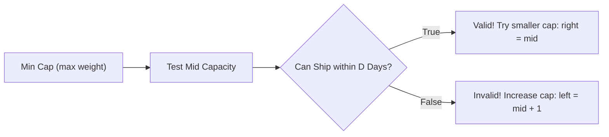

# Module 11: Searching Algorithms, Binary Search Patterns, and Search-on-Answer

## Theoretical Overview & Search Mechanics

Searching is the process of locating a specific target element within a dataset or finding an optimal parameter value that satisfies a monotonic condition function.

```mermaid
flowchart TD
    SearchStrategy[Searching Strategy Selection] --> ConditionUnsorted{Is Data Unsorted?}
    ConditionUnsorted -->|Yes| CheckFrequency{Is Query Single or Frequent?}
    CheckFrequency -->|Single Query| Linear[Linear Search: O(n)]
    CheckFrequency -->|Frequent Queries| HashStore[Convert to Set / Hash Map: O(1) Lookup]
    
    ConditionUnsorted -->|No - Data Sorted| SpaceSplit[Binary Search Spectrum: O(log n)]
    SpaceSplit --> ExactVal[Exact Value Search]
    SpaceSplit --> Bounds[First / Last Bound Search]
    SpaceSplit --> Rotated[Rotated Sorted Array Search]
    SpaceSplit --> Parametric[Binary Search on Answer Space]
```

### Real-World Engineering Analogy: Amazon Product Listing Search
When searching across 200,000,000 product items:
- **Linear Search**: Requires up to 200,000,000 comparisons (taking seconds to minutes under peak server load).
- **Binary Search**: Requires at most $\lceil \log_2(200,000,000) \rceil = 28$ comparisons, returning results in microseconds.

---

## 1. Search Algorithms Complexity Matrix

| Algorithm / Pattern | Prerequisite | Time Complexity | Space Complexity | Best Use Case |
| :--- | :--- | :--- | :--- | :--- |
| **Linear Search** | Unsorted Data | $\mathcal{O}(n)$ | $\mathcal{O}(1)$ | Single pass over small or unsorted arrays. |
| **Binary Search** | **Sorted Data** | $\mathcal{O}(\log n)$ | $\mathcal{O}(1)$ | Large ordered arrays, numeric range lookups. |
| **First/Last Occurrence**| Sorted with Dupes | $\mathcal{O}(\log n)$ | $\mathcal{O}(1)$ | Bound searching (e.g., lower/upper bounds). |
| **Rotated Array Search**| Single-pivot Shift| $\mathcal{O}(\log n)$ | $\mathcal{O}(1)$ | Circularly shifted sorted arrays. |
| **Peak Element Search**| Peak Monotonicity| $\mathcal{O}(\log n)$ | $\mathcal{O}(1)$ | Unimodal mountain arrays. |
| **2D Matrix Search** | Sorted Rows & Cols| $\mathcal{O}(m + n)$ | $\mathcal{O}(1)$ | Grid matrices sorted along both axes. |
| **Binary Search on Answer**| Monotonic Predicate| $\mathcal{O}(n \log(\text{range}))$| $\mathcal{O}(1)$ | Capacity optimization, min/max objective tuning. |
| **Hash Set Lookup** | Hashable Keys | $\mathcal{O}(1)$ avg | $\mathcal{O}(n)$ | High-frequency membership checks (`Set.has`). |

---

## 2. Core Code Implementations & Walkthroughs

### 1. Standard Binary Search (`binarySearch`)
- **Overflow-Safe Midpoint**: Always compute `mid` using `left + Math.floor((right - left) / 2)` to avoid integer overflow in fixed-width languages (e.g., C++/Java).

```javascript
function binarySearch(arr, target) {
  let left = 0, right = arr.length - 1;
  while (left <= right) {
    const mid = left + Math.floor((right - left) / 2);
    if (arr[mid] === target) return mid;
    else if (arr[mid] < target) left = mid + 1;
    else right = mid - 1;
  }
  return -1;
}
```

### 2. First & Last Occurrence Bounds (`findFirstOccurrence` & `findLastOccurrence`)
Find the exact lower or upper boundary index of a repeated target value in a sorted array.

```javascript
function findFirstOccurrence(arr, target) {
  let left = 0, right = arr.length - 1, result = -1;
  while (left <= right) {
    const mid = left + Math.floor((right - left) / 2);
    if (arr[mid] === target) { result = mid; right = mid - 1; } // Continue left search
    else if (arr[mid] < target) left = mid + 1;
    else right = mid - 1;
  }
  return result;
}

function findLastOccurrence(arr, target) {
  let left = 0, right = arr.length - 1, result = -1;
  while (left <= right) {
    const mid = left + Math.floor((right - left) / 2);
    if (arr[mid] === target) { result = mid; left = mid + 1; } // Continue right search
    else if (arr[mid] < target) left = mid + 1;
    else right = mid - 1;
  }
  return result;
}
```

### 3. Search in Rotated Sorted Array (`searchRotated`)
Search for a target value in a sorted array that has been rotated around an unknown pivot.
- **Strategy**: Compare `arr[left]` with `arr[mid]` to identify which half is strictly sorted, then test if target resides within that sorted range.

```javascript
function searchRotated(arr, target) {
  let left = 0, right = arr.length - 1;
  while (left <= right) {
    const mid = left + Math.floor((right - left) / 2);
    if (arr[mid] === target) return mid;

    if (arr[left] <= arr[mid]) { // Left half sorted
      if (arr[left] <= target && target < arr[mid]) right = mid - 1;
      else left = mid + 1;
    } else { // Right half sorted
      if (arr[mid] < target && target <= arr[right]) left = mid + 1;
      else right = mid - 1;
    }
  }
  return -1;
}
```

### 4. Peak Element Search (`findPeakElement`)
Find a peak index where `arr[i] > arr[i-1]` and `arr[i] > arr[i+1]`.
- **Strategy**: If `arr[mid] < arr[mid + 1]`, an ascending slope exists to the right, guaranteeing a peak in `[mid + 1, right]`.

```javascript
function findPeakElement(arr) {
  let left = 0, right = arr.length - 1;
  while (left < right) {
    const mid = left + Math.floor((right - left) / 2);
    if (arr[mid] < arr[mid + 1]) left = mid + 1;
    else right = mid;
  }
  return left;
}
```

### 5. 2D Sorted Matrix Search (`searchMatrix`)
Search for a target value in an $m \times n$ matrix where each row and column is sorted in ascending order.
- **Strategy**: Start at the **top-right corner** `(row = 0, col = n - 1)`. If cell $> target$, decrement `col`. If cell $< target$, increment `row`. Runs in **$\mathcal{O}(m + n)$** time.

```javascript
function searchMatrix(matrix, target) {
  if (matrix.length === 0) return [-1, -1];
  let row = 0, col = matrix[0].length - 1;
  while (row < matrix.length && col >= 0) {
    if (matrix[row][col] === target) return [row, col];
    else if (matrix[row][col] > target) col--;
    else row++;
  }
  return [-1, -1];
}
```

---

## 3. Advanced Binary Search on Answer Space

When an objective function follows a **monotonic boolean truth boundary** ($\text{false}, \text{false}, \dots, \text{true}, \text{true}$), Binary Search can find the optimal parameter value.



### Capacity to Ship Packages Within D Days (`shipWithinDays`)
- **Search Boundaries**: `left = max(weights)`, `right = sum(weights)`.

```javascript
function shipWithinDays(weights, days) {
  let left = Math.max(...weights);
  let right = weights.reduce((sum, w) => sum + w, 0);

  while (left < right) {
    const mid = left + Math.floor((right - left) / 2);
    if (canShip(weights, days, mid)) right = mid;
    else left = mid + 1;
  }
  return left;
}

function canShip(weights, days, capacity) {
  let daysNeeded = 1, currentLoad = 0;
  for (const weight of weights) {
    if (currentLoad + weight > capacity) {
      daysNeeded++;
      currentLoad = 0;
    }
    currentLoad += weight;
  }
  return daysNeeded <= days;
}
```

---

## Key Takeaways

1. **Halving Principle**: Binary search cuts search space by 50% each step, requiring only $\mathcal{O}(\log n)$ steps.
2. **Always Use Overflow-Safe Midpoint**: `left + Math.floor((right - left) / 2)`.
3. **Rotated Search**: Always identify which half of the array is sorted before narrowing boundaries.
4. **Parametric Search**: Binary search on answer space solves minimum/maximum capacity optimization problems in $\mathcal{O}(n \log(\text{range}))$ time.
