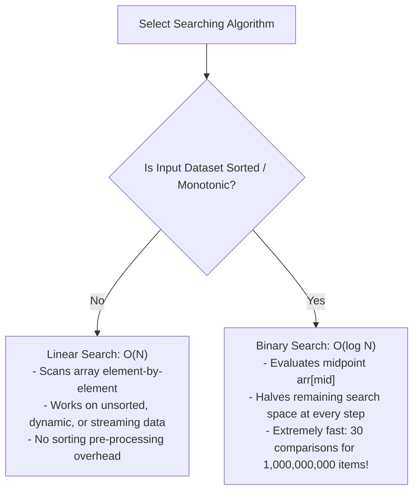
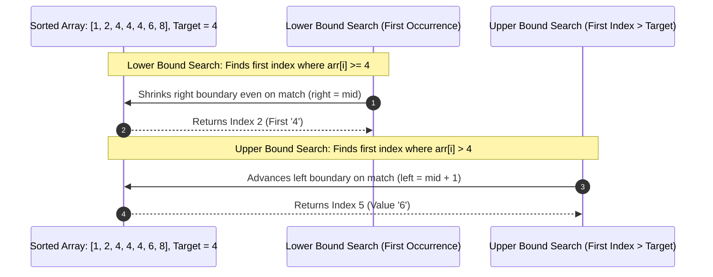

# Module 11: Searching Algorithms, Lower/Upper Bounds, and Binary Search on Answer Space

## Overview

Searching algorithms locate target values or optimal thresholds within datasets. While **Linear Search** scans unsorted collections in $\mathcal{O}(N)$ time, **Binary Search** reduces search spaces logarithmically in **$\mathcal{O}(\log N)$ time** by repeatedly halving candidate boundaries on sorted or monotonic inputs.

Binary Search extends beyond array index lookup into solving continuous optimization problems via **Binary Search on Answer Space**.

---

## 1. Linear vs. Binary Search Paradigm Comparison



### Search Complexity Comparison

| Algorithm | Pre-Condition | Best Case | Average Case | Worst Case | Auxiliary Space |
| :--- | :--- | :--- | :--- | :--- | :--- |
| **Linear Search** | Unsorted Array | $\mathcal{O}(1)$ | $\mathcal{O}(N)$ | $\mathcal{O}(N)$ | $\mathcal{O}(1)$ |
| **Binary Search** | **Sorted Array** | $\mathcal{O}(1)$ | $\mathcal{O}(\log N)$ | $\mathcal{O}(\log N)$ | $\mathcal{O}(1)$ |
| **Lower/Upper Bound** | **Sorted Array** | $\mathcal{O}(1)$ | $\mathcal{O}(\log N)$ | $\mathcal{O}(\log N)$ | $\mathcal{O}(1)$ |
| **Binary Search on Answer**| Monotonic Predicate | $\mathcal{O}(1)$ | $\mathcal{O}(\log(\text{Range}) \cdot f(x))$ | $\mathcal{O}(\log(\text{Range}) \cdot f(x))$ | $\mathcal{O}(1)$ |

---

## 2. Integer Overflow Guard & Midpoint Calculation

When calculating `mid`, naively writing `(left + right) / 2` risks integer overflow in languages with fixed integer limits if `left + right` exceeds maximum integer values ($2^{31} - 1$).

```javascript
// SAFE MIDPOINT CALCULATION PATTERNS:
// Option 1: Bitwise Unsigned Right Shift (Fastest in V8)
const mid = (left + right) >>> 1;

// Option 2: Math floor subtraction offset
const mid = left + Math.floor((right - left) / 2);
```

---

## 3. Binary Search Variations: Lower Bound vs. Upper Bound



---

## 4. Advanced Pattern: Binary Search on Answer Space

Binary Search can be applied to non-array optimization problems whenever a decision function $f(x)$ is **monotonic** (i.e. evaluates to `false, false, false, true, true, true` across candidate values $x$).

```mermaid
flowchart LR
    CandidateSpace["Search Space: [MinCandidate ... MaxCandidate]"] --> MidVal["Evaluate Candidate x = mid"]
    MidVal --> FeasibleCheck{Is Feasible f(x) == true?}

    FeasibleCheck -- Yes (Valid) --> TrySmaller["Save x as valid answer!<br/>Try smaller candidate: right = mid - 1"]
    FeasibleCheck -- No (Invalid) --> TryLarger["Candidate x too small!<br/>Try larger candidate: left = mid + 1"]
```

---

## 5. Production Implementations

```javascript
// 1. Standard Binary Search - O(log N) Time, O(1) Space
function binarySearch(arr, target) {
  let left = 0;
  let right = arr.length - 1;

  while (left <= right) {
    const mid = (left + right) >>> 1; // Safe bitwise midpoint

    if (arr[mid] === target) {
      return mid; // Found target!
    } else if (arr[mid] < target) {
      left = mid + 1; // Target in right half
    } else {
      right = mid - 1; // Target in left half
    }
  }

  return -1; // Target not present
}

// 2. Lower Bound Binary Search (First occurrence index or insertion slot)
function lowerBound(arr, target) {
  let left = 0;
  let right = arr.length;

  while (left < right) {
    const mid = (left + right) >>> 1;
    if (arr[mid] >= target) {
      right = mid; // Narrow right boundary
    } else {
      left = mid + 1;
    }
  }

  return left; // First index where arr[left] >= target
}

// 3. Binary Search on Answer: Koko Eating Bananas (LeetCode 875)
function minEatingSpeed(piles, h) {
  let left = 1;
  let right = Math.max(...piles);
  let result = right;

  // Feasibility Check Function - O(N) Time
  function canEatAllInTime(speed) {
    let hoursSpent = 0;
    for (const pile of piles) {
      hoursSpent += Math.ceil(pile / speed);
    }
    return hoursSpent <= h;
  }

  // Binary Search on Speed Answer Space - O(N log(MaxPile)) Time
  while (left <= right) {
    const speed = (left + right) >>> 1;

    if (canEatAllInTime(speed)) {
      result = speed;      // Valid speed found, try to find smaller speed
      right = speed - 1;
    } else {
      left = speed + 1;     // Speed too slow, increase speed
    }
  }

  return result;
}

console.log("Binary Search Index:", binarySearch([2, 5, 8, 12, 16, 23, 38], 23)); // 5
console.log("Lower Bound Index  :", lowerBound([1, 2, 4, 4, 4, 6, 8], 4));         // 2
console.log("Min Eating Speed  :", minEatingSpeed([3, 6, 7, 11], 8));             // 4
```

---

## Key Production Takeaways

1. **Verify Sorted Array Pre-Condition**: Never attempt Binary Search on unsorted data without sorting first. Sorting costs $\mathcal{O}(N \log N)$, so only sort if performing multiple queries ($Q > \log N$).
2. **Use `(left + right) >>> 1` for Safe Midpoint Calculation**: Avoid integer overflow bugs by using bitwise right shift for midpoint computation.
3. **Master Lower Bound Template for Duplicates**: When arrays contain duplicate items, use the `right = mid` condition to find the first/last matching index cleanly.
4. **Identify Monotonic Predicates for Binary Search on Answer**: When asked to "find the minimum capacity/speed/rate to satisfy a condition", check if the problem space is monotonic and apply Binary Search over the answer range.

