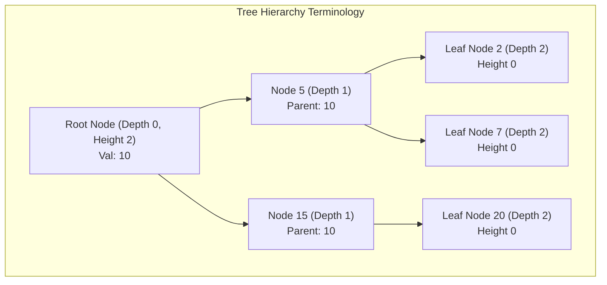
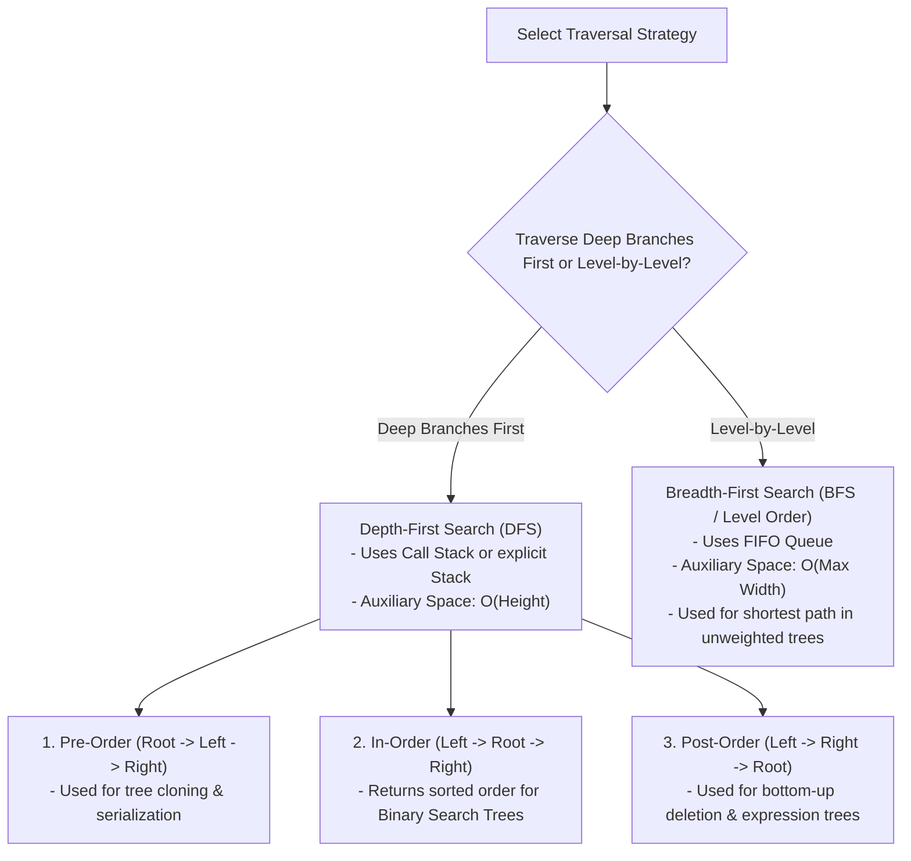

# Module 12: Tree Structures, Hierarchical Terminology, and Traversal Strategies

## Overview

A **Tree** is an acyclic, non-linear hierarchical data structure composed of nodes connected by directed edges. A tree has a single designated **Root Node** at top and branches outward into subtrees.

Trees power database indexing (B-Trees, LSM-Trees), filesystem directories, the HTML DOM, and compiler ASTs. Tree traversal strategies fall into two primary categories: **Depth-First Search (DFS)** and **Breadth-First Search (BFS)**.

---

## 1. Tree Terminology & Structural Properties



### Core Tree Concepts Reference

- **Root**: The topmost node in a tree with no parent pointers.
- **Child / Parent**: A node directly connected below another node is its child; the upper node is its parent.
- **Leaf Node**: A node with zero children (`left === null` and `right === null`).
- **Depth**: The number of edges from the root to target node.
- **Height**: The number of edges on the longest path from target node down to a leaf.
- **Subtree**: A tree consisting of a node and all its descendants.

---

## 2. Traversal Strategies Comparison



### Traversal Complexity Matrix

| Traversal Strategy | Visiting Sequence | Primary Use Case | Time Complexity | Auxiliary Space (Balanced Tree) | Auxiliary Space (Degenerate Line Tree) |
| :--- | :--- | :--- | :--- | :--- | :--- |
| **DFS Pre-Order** | Root $\to$ Left $\to$ Right | Cloning trees, Prefix expressions. | $\mathcal{O}(N)$ | $\mathcal{O}(\log N)$ | $\mathcal{O}(N)$ |
| **DFS In-Order** | Left $\to$ Root $\to$ Right | Sorted traversal of BSTs. | $\mathcal{O}(N)$ | $\mathcal{O}(\log N)$ | $\mathcal{O}(N)$ |
| **DFS Post-Order**| Left $\to$ Right $\to$ Root | Deleting nodes, Postfix evaluation. | $\mathcal{O}(N)$ | $\mathcal{O}(\log N)$ | $\mathcal{O}(N)$ |
| **BFS Level-Order**| Level-by-Level Top-to-Bottom | Shortest path, Nearest neighbor. | $\mathcal{O}(N)$ | $\mathcal{O}(W)$ ($W = \text{max width}$) | $\mathcal{O}(1)$ |

---

## 3. Production Tree Traversal Implementations

```javascript
class TreeNode {
  constructor(val, left = null, right = null) {
    this.val = val;
    this.left = left;
    this.right = right;
  }
}

// 1. Recursive DFS In-Order Traversal (Left -> Root -> Right)
function dfsInOrder(root, result = []) {
  if (!root) return result;

  if (root.left) dfsInOrder(root.left, result);
  result.push(root.val);
  if (root.right) dfsInOrder(root.right, result);

  return result;
}

// 2. Iterative DFS In-Order Traversal (Explicit Stack - No Call Stack Overflow)
function dfsInOrderIterative(root) {
  const result = [];
  const stack = [];
  let current = root;

  while (current !== null || stack.length > 0) {
    // Reach leftmost node of current node
    while (current !== null) {
      stack.push(current);
      current = current.left;
    }

    // Pop and process node
    current = stack.pop();
    result.push(current.val);

    // Shift to right child
    current = current.right;
  }

  return result;
}

// 3. BFS Level-Order Traversal using Queue - O(N) Time, O(W) Space
function bfsLevelOrder(root) {
  if (!root) return [];

  const result = [];
  const queue = [root];

  while (queue.length > 0) {
    const levelSize = queue.length;
    const currentLevel = [];

    for (let i = 0; i < levelSize; i++) {
      const node = queue.shift(); // Dequeue
      currentLevel.push(node.val);

      if (node.left) queue.push(node.left);
      if (node.right) queue.push(node.right);
    }

    result.push(currentLevel); // Groups nodes by levels
  }

  return result;
}

// Construction of Sample Binary Tree:
//        10
//       /  \
//      5   15
//     / \
//    2   7
const root = new TreeNode(10);
root.left = new TreeNode(5, new TreeNode(2), new TreeNode(7));
root.right = new TreeNode(15);

console.log("DFS In-Order (Recursive):", dfsInOrder(root));          // [2, 5, 7, 10, 15]
console.log("DFS In-Order (Iterative):", dfsInOrderIterative(root)); // [2, 5, 7, 10, 15]
console.log("BFS Level Order         :", bfsLevelOrder(root));       // [[10], [5, 15], [2, 7]]
```

---

## Key Production Takeaways

1. **Use DFS In-Order to Validate or Read Sorted Binary Search Trees**: Traversing a BST with DFS In-Order visits nodes in strictly ascending numerical order.
2. **Use BFS for Level-by-Level Processing & Shortest Path**: Use BFS when you need to calculate tree depth, find nearest leaf nodes, or group elements level by level.
3. **Use Iterative DFS for Deep Trees**: If a tree height exceeds 10,000 nodes, recursive DFS will crash with `Maximum call stack size exceeded`. Use an explicit array stack for safety.
4. **Distinguish Time vs. Space Invariant**: Both DFS and BFS visit all $N$ nodes in $\mathcal{O}(N)$ time. However, DFS uses $\mathcal{O}(H)$ memory ($H = \text{height}$), whereas BFS uses $\mathcal{O}(W)$ memory ($W = \text{maximum level width}$).

