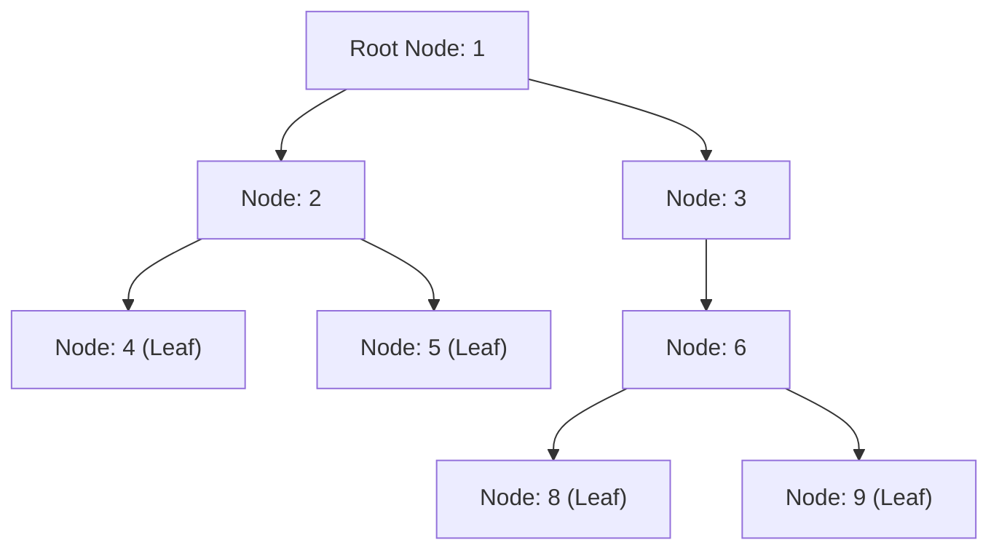

# Module 12: Binary Trees, Depth-First & Breadth-First Traversals

## Theoretical Overview & Structural Hierarchy

A **Binary Tree** is a non-linear hierarchical data structure in which each node contains a value reference and at most two child pointers (`left` and `right`).



### Key Terminology
- **Root**: Topmost node without a parent (`value = 1`).
- **Leaf**: A node with zero children (`left === null` and `right === null`).
- **Height**: The number of edges along the longest path from a node to a leaf (Height of root = 3).
- **Depth**: The number of edges from the root to a target node (Depth of node 8 = 3).
- **Balanced Tree**: A binary tree where the heights of the left and right subtrees of every node differ by at most 1.

---

## 1. Traversal Classification Matrix

All four traversals visit every node in **$\mathcal{O}(n)$ time** and consume **$\mathcal{O}(h)$ auxiliary space** (where $h$ is tree height).

| Traversal Strategy | Order Sequence | Primary Use Case | Iterative Stack / Queue |
| :--- | :--- | :--- | :--- |
| **In-order DFS** | Left $\to$ Root $\to$ Right | Yields elements in sorted order for BSTs. | Explicit LIFO Call Stack. |
| **Pre-order DFS** | Root $\to$ Left $\to$ Right | Copying, cloning, and serializing trees. | Explicit LIFO Call Stack. |
| **Post-order DFS** | Left $\to$ Right $\to$ Root | Bottom-up evaluation, deleting tree nodes. | Double Stack / Last-visited pointer. |
| **Level-order BFS** | Level-by-level (Top to Bottom)| Shortest path, level grouping, printing trees. | FIFO Queue (`shift`/`push`). |

---

## 2. Traversal Implementations (Recursive & Iterative)

```javascript
class TreeNode {
  constructor(value) {
    this.value = value;
    this.left = null;
    this.right = null;
  }
}
```

### 1. In-order Traversal (L $\to$ Root $\to$ R)
```javascript
// Recursive: O(n) Time, O(h) Space
function inorderRecursive(node, result = []) {
  if (node === null) return result;
  inorderRecursive(node.left, result);
  result.push(node.value);
  inorderRecursive(node.right, result);
  return result;
}

// Iterative using Stack: O(n) Time, O(h) Space
function inorderIterative(root) {
  const result = [], stack = [];
  let current = root;
  while (current !== null || stack.length > 0) {
    while (current !== null) { stack.push(current); current = current.left; }
    current = stack.pop();
    result.push(current.value);
    current = current.right;
  }
  return result;
}
```

### 2. Pre-order Traversal (Root $\to$ L $\to$ R)
```javascript
// Recursive
function preorderRecursive(node, result = []) {
  if (node === null) return result;
  result.push(node.value);
  preorderRecursive(node.left, result);
  preorderRecursive(node.right, result);
  return result;
}

// Iterative using Stack
function preorderIterative(root) {
  if (root === null) return [];
  const result = [], stack = [root];
  while (stack.length > 0) {
    const node = stack.pop();
    result.push(node.value);
    if (node.right) stack.push(node.right); // Right pushed first so Left is popped first
    if (node.left) stack.push(node.left);
  }
  return result;
}
```

### 3. Post-order Traversal (L $\to$ R $\to$ Root)
```javascript
function postorderRecursive(node, result = []) {
  if (node === null) return result;
  postorderRecursive(node.left, result);
  postorderRecursive(node.right, result);
  result.push(node.value);
  return result;
}
```

### 4. Level-order Traversal / BFS (`levelOrder`)
```javascript
function levelOrder(root) {
  if (root === null) return [];
  const result = [], queue = [root];
  while (queue.length > 0) {
    const levelSize = queue.length;
    const currentLevel = [];
    for (let i = 0; i < levelSize; i++) {
      const node = queue.shift();
      currentLevel.push(node.value);
      if (node.left) queue.push(node.left);
      if (node.right) queue.push(node.right);
    }
    result.push(currentLevel);
  }
  return result;
}
```

---

## 3. Structural Property Calculations

### 1. Height, Node Count, & Leaf Count
```javascript
function treeHeight(node) {
  if (node === null) return -1;
  return Math.max(treeHeight(node.left), treeHeight(node.right)) + 1;
}

function countNodes(node) {
  if (node === null) return 0;
  return 1 + countNodes(node.left) + countNodes(node.right);
}

function countLeaves(node) {
  if (node === null) return 0;
  if (!node.left && !node.right) return 1;
  return countLeaves(node.left) + countLeaves(node.right);
}
```

### 2. Height-Balanced Check in $\mathcal{O}(n)$ Time
Computes subtree heights while simultaneously detecting imbalances. Returns `-1` immediately if any subtree is unbalanced, avoiding redundant $\mathcal{O}(n^2)$ height recalculations.

```javascript
function isBalanced(node) { return checkBalance(node) !== -1; }

function checkBalance(node) {
  if (node === null) return 0;
  const lh = checkBalance(node.left);
  if (lh === -1) return -1;
  const rh = checkBalance(node.right);
  if (rh === -1) return -1;
  if (Math.abs(lh - rh) > 1) return -1;
  return Math.max(lh, rh) + 1;
}
```

---

## 4. Classic Binary Tree Algorithms

1. **Invert Binary Tree (`invertTree`)**: Swaps `node.left` and `node.right` pointers recursively across all nodes in $\mathcal{O}(n)$ time.
2. **Structural Identity (`areIdentical`)**: Validates that two binary trees share identical node values and structure.
3. **Root-to-Leaf Path Sum (`hasPathSum`)**: Determines if a path exists from root to any leaf node whose node values sum to `targetSum`.
4. **Tree Diameter (`diameterOfBinaryTree`)**: Computes the length of the longest path between any two nodes in a tree in $\mathcal{O}(n)$ time.
5. **Deserialization from Level-Order Array (`buildTreeFromArray`)**: Reconstructs a binary tree from a level-order array representation containing `null` markers using a FIFO queue.

---

## Key Takeaways

1. **Recursive Subproblems**: Tree problems decompose naturally into: solve for `left` subtree, solve for `right` subtree, combine results.
2. **In-Order Traversal**: Produces sorted key order on Binary Search Trees.
3. **Height-Balanced Optimizations**: Return `-1` early during DFS post-order traversal to check height balance in single-pass $\mathcal{O}(n)$ runtime.
4. **Queue vs Stack**: Use queues for Breadth-First Search (level-by-level) and stacks for Depth-First Search.
