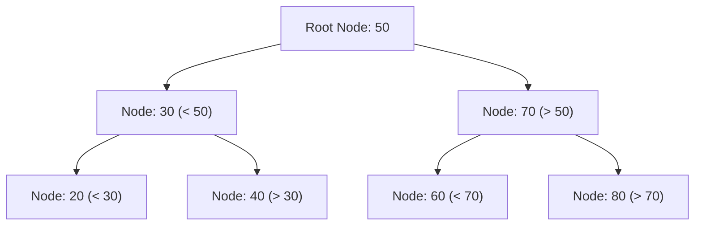
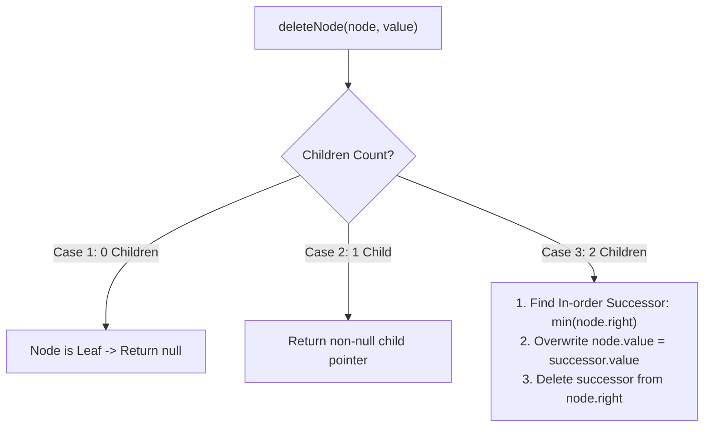

# Module 13: Binary Search Trees (BST), Deletion, and Self-Balancing Concepts

## Theoretical Overview & Order Invariant

A **Binary Search Tree (BST)** is a binary tree that satisfies the strict **Binary Search Property** for every node $N$:
1. All node values in the **left subtree** of $N$ are strictly less than $N.\text{value}$.
2. All node values in the **right subtree** of $N$ are strictly greater than $N.\text{value}$.
3. Both left and right subtrees must also be valid Binary Search Trees.



### In-Order Traversal Invariant
An **In-order traversal** (Left $\to$ Root $\to$ Right) across a valid BST yields values in **strictly ascending sorted order**.

---

## 1. BST Complexity Matrix

| Operation | Balanced BST Time | Skewed / Degenerate BST Time | Auxiliary Space |
| :--- | :--- | :--- | :--- |
| **Search** | $\mathcal{O}(\log n)$ | $\mathcal{O}(n)$ | $\mathcal{O}(h)$ call stack |
| **Insert** | $\mathcal{O}(\log n)$ | $\mathcal{O}(n)$ | $\mathcal{O}(h)$ call stack |
| **Delete** | $\mathcal{O}(\log n)$ | $\mathcal{O}(n)$ | $\mathcal{O}(h)$ call stack |
| **Find Min / Max**| $\mathcal{O}(\log n)$ | $\mathcal{O}(n)$ | $\mathcal{O}(1)$ iterative |
| **In-order Range**| $\mathcal{O}(\log n + k)$ | $\mathcal{O}(n)$ | $\mathcal{O}(h)$ where $k$ is output count |

---

## 2. Core Class Implementation & 3-Case Deletion

```javascript
class TreeNode {
  constructor(value) {
    this.value = value;
    this.left = null;
    this.right = null;
  }
}

class BST {
  constructor() { this.root = null; }

  insert(value) {
    const newNode = new TreeNode(value);
    if (this.root === null) { this.root = newNode; return this; }
    let current = this.root;
    while (true) {
      if (value === current.value) return this;
      if (value < current.value) {
        if (current.left === null) { current.left = newNode; return this; }
        current = current.left;
      } else {
        if (current.right === null) { current.right = newNode; return this; }
        current = current.right;
      }
    }
  }

  search(value) {
    let current = this.root;
    while (current !== null) {
      if (value === current.value) return current;
      current = value < current.value ? current.left : current.right;
    }
    return null;
  }

  findMin(node = this.root) {
    let current = node;
    while (current && current.left) current = current.left;
    return current;
  }
}
```

### The Three Node Deletion Scenarios



```javascript
delete(value) { this.root = this._deleteNode(this.root, value); }

_deleteNode(node, value) {
  if (node === null) return null;
  if (value < node.value) { node.left = this._deleteNode(node.left, value); }
  else if (value > node.value) { node.right = this._deleteNode(node.right, value); }
  else {
    // Case 1 & Case 2: 0 or 1 child
    if (!node.left && !node.right) return null;
    if (node.left === null) return node.right;
    if (node.right === null) return node.left;
    
    // Case 3: 2 children
    const successor = this.findMin(node.right);
    node.value = successor.value;
    node.right = this._deleteNode(node.right, successor.value);
  }
  return node;
}
```

---

## 3. Validation & Specialized Algorithms

### 1. Robust BST Validation (`isValidBST`)
Validating only immediate children (`node.left < node` and `node.right > node`) is insufficient. The algorithm must enforce dynamic range bounds $[min, max]$ recursively down the tree.

```javascript
function isValidBST(node, min = -Infinity, max = Infinity) {
  if (node === null) return true;
  if (node.value <= min || node.value >= max) return false;
  return isValidBST(node.left, min, node.value) && isValidBST(node.right, node.value, max);
}
```

### 2. In-order Successor & Predecessor (`inorderSuccessor`)
Find the smallest node value greater than `target`.

```javascript
function inorderSuccessor(root, target) {
  let successor = null, current = root;
  while (current !== null) {
    if (target < current.value) { successor = current; current = current.left; }
    else current = current.right;
  }
  return successor;
}
```

### 3. K-th Smallest Element (`kthSmallest`)
Perform an iterative in-order traversal stopping at step $k$ in **$\mathcal{O}(h + k)$** time.

```javascript
function kthSmallest(root, k) {
  const stack = [];
  let current = root, count = 0;
  while (current !== null || stack.length > 0) {
    while (current !== null) { stack.push(current); current = current.left; }
    current = stack.pop();
    count++;
    if (count === k) return current.value;
    current = current.right;
  }
  return -1;
}
```

### 4. Lowest Common Ancestor in BST (`lowestCommonAncestor`)
Exploits BST ordering: if both values $p, q < \text{current.value}$, jump left; if both $p, q > \text{current.value}$, jump right. The first splitting node is the LCA.

```javascript
function lowestCommonAncestor(root, p, q) {
  let current = root;
  while (current !== null) {
    if (p < current.value && q < current.value) current = current.left;
    else if (p > current.value && q > current.value) current = current.right;
    else return current;
  }
  return null;
}
```

### 5. Convert Sorted Array to Balanced BST (`sortedArrayToBST`)
Recursively selects the median array element as root to build a height-balanced BST ($\mathcal{O}(n)$ time).

```javascript
function sortedArrayToBST(arr, left = 0, right = arr.length - 1) {
  if (left > right) return null;
  const mid = left + Math.floor((right - left) / 2);
  const node = new TreeNode(arr[mid]);
  node.left = sortedArrayToBST(arr, left, mid - 1);
  node.right = sortedArrayToBST(arr, mid + 1, right);
  return node;
}
```

---

## 4. Self-Balancing Trees Overview

1. **AVL Trees**: Maintains strict height balance ($|height(left) - height(right)| \le 1$). Uses single and double tree rotations upon insertion/deletion.
2. **Red-Black Trees**: Relaxed balance using node color rules (Red/Black). Powers standard library maps (e.g., C++ `std::map`, Java `TreeMap`).
3. **B-Trees & B+ Trees**: High-branching factor trees designed for disk storage engines and database indexing (PostgreSQL, MongoDB).

---

## Key Takeaways

1. **Invariant Property**: Left $< \text{Root} < \text{Right}$ across all subtrees.
2. **Deletion Mechanics**: Two-child nodes require replacement with the in-order successor (`min` node of the right subtree).
3. **Range Validation**: Always validate BST using $[min, max]$ bounding parameters.
4. **Optimal Ancestor Lookups**: LCA executes in $\mathcal{O}(h)$ time by comparing target values directly against node values.
