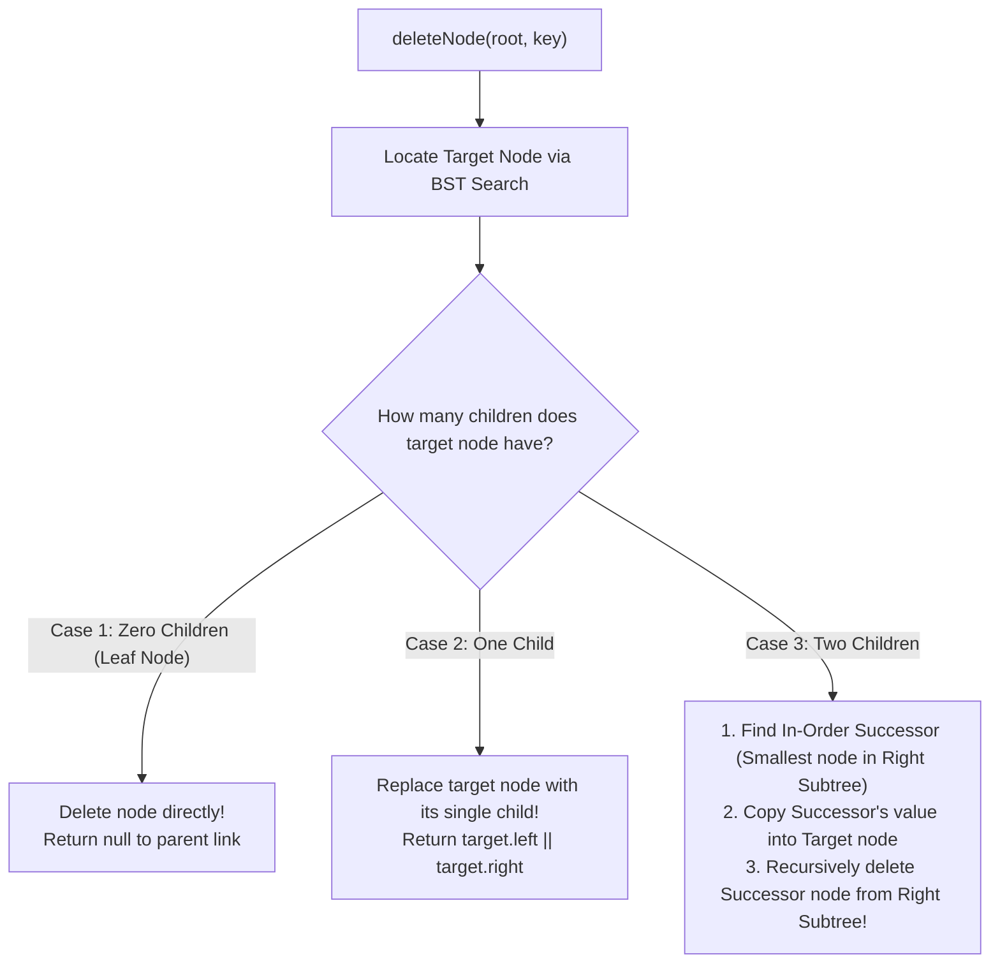

# Module 13: Binary Search Trees (BST), Deletion Mechanics, and Self-Balancing Trees

## Overview

A **Binary Search Tree (BST)** is a binary tree defined by a strict structural invariant for every node:
1. All node values in its **Left Subtree** are strictly less than the node's value ($\text{Left} < \text{Node}$).
2. All node values in its **Right Subtree** are strictly greater than the node's value ($\text{Right} > \text{Node}$).

When a BST is **Balanced** (height $H \approx \log_2 N$), operations run in logarithmic **$\mathcal{O}(\log N)$ time**. However, un-balanced insertion sequences degrade the BST into a linear linked list ($\mathcal{O}(N)$ worst-case).

---

## 1. Balanced vs. Degenerate Unbalanced BSTs

```mermaid
graph TD
    subgraph Balanced BST: O(log N) Height
        B10["10"] --> B5["5"]
        B10 --> B15["15"]
        B5 --> B2["2"]
        B5 --> B8["8"]
        B15 --> B12["12"]
        B15 --> B20["20"]
    end

    subgraph Degenerate Line Tree: O(N) Worst Case
        D2["2"] --> D5["5"]
        D5 --> D8["8"]
        D8 --> D10["10"]
        D10 --> D12["12"]
    end
```

---

## 2. Deletion Algorithm: 3 Node Deletion Cases

Deleting a node from a BST must preserve the BST invariant. The operation handles **three distinct node cases**:



---

## 3. Operations Complexity & Self-Balancing Trees Overview

| Operations | Average-Case (Balanced BST) | Worst-Case (Degenerate BST) | Self-Balancing (AVL / Red-Black) |
| :--- | :--- | :--- | :--- |
| **Search / Lookup** | $\mathcal{O}(\log N)$ | $\mathcal{O}(N)$ | **$\mathcal{O}(\log N)$ Guaranteed** |
| **Insertion** | $\mathcal{O}(\log N)$ | $\mathcal{O}(N)$ | **$\mathcal{O}(\log N)$ Guaranteed** |
| **Deletion** | $\mathcal{O}(\log N)$ | $\mathcal{O}(N)$ | **$\mathcal{O}(\log N)$ Guaranteed** |
| **Auxiliary Space** | $\mathcal{O}(H)$ ($H = \log N$) | $\mathcal{O}(N)$ | **$\mathcal{O}(\log N)$ Guaranteed** |

### Self-Balancing Trees: AVL vs. Red-Black
- **AVL Trees**: Maintains strict height balance ($\text{height(left)} - \text{height(right)} \le 1$) via tree rotations. Optimized for lookup-heavy workloads.
- **Red-Black Trees**: Uses color bits (Red/Black) to ensure no path is more than double the length of any other path. Used internally in C++ `std::map` and Java `TreeMap`.

---

## 4. Production Binary Search Tree Code Implementation

```javascript
class BSTNode {
  constructor(val, left = null, right = null) {
    this.val = val;
    this.left = left;
    this.right = right;
  }
}

class BinarySearchTree {
  constructor() {
    this.root = null;
  }

  // Iterative Insertion - O(log N) Avg, O(N) Worst
  insert(val) {
    const newNode = new BSTNode(val);
    if (!this.root) {
      this.root = newNode;
      return this;
    }

    let current = this.root;
    while (true) {
      if (val === current.val) return this; // Ignore duplicates
      if (val < current.val) {
        if (!current.left) {
          current.left = newNode;
          return this;
        }
        current = current.left;
      } else {
        if (!current.right) {
          current.right = newNode;
          return this;
        }
        current = current.right;
      }
    }
  }

  // Node Deletion Method - O(log N) Avg
  delete(val) {
    this.root = this._deleteNode(this.root, val);
  }

  _deleteNode(node, key) {
    if (!node) return null;

    if (key < node.val) {
      node.left = this._deleteNode(node.left, key);
    } else if (key > node.val) {
      node.right = this._deleteNode(node.right, key);
    } else {
      // Node to delete found!
      // Case 1 & 2: 0 or 1 Child
      if (!node.left) return node.right;
      if (!node.right) return node.left;

      // Case 3: 2 Children -> Find In-Order Successor (Min node in right subtree)
      let successor = node.right;
      while (successor.left !== null) {
        successor = successor.left;
      }

      // Copy successor value to current node
      node.val = successor.val;

      // Delete the duplicate successor node from right subtree
      node.right = this._deleteNode(node.right, successor.val);
    }

    return node;
  }
}

// 5. Validating Binary Search Tree Algorithm - O(N) Time, O(H) Space
function isValidBST(root, min = -Infinity, max = Infinity) {
  if (!root) return true;

  if (root.val <= min || root.val >= max) {
    return false; // Violation of BST invariant!
  }

  return (
    isValidBST(root.left, min, root.val) &&
    isValidBST(root.right, root.val, max)
  );
}

// Verification
const bst = new BinarySearchTree();
bst.insert(10);
bst.insert(5);
bst.insert(15);
bst.insert(2);
bst.insert(8);

console.log("Is Valid BST?", isValidBST(bst.root)); // true
bst.delete(5);
console.log("Is Valid BST after deletion?", isValidBST(bst.root)); // true
```

---

## Key Production Takeaways

1. **Understand Degenerate Tree Risks**: Inserting pre-sorted items into a naive BST creates a linked list of height $N$. Use Self-Balancing Trees (AVL/Red-Black) or shuffle array data prior to insertion.
2. **Master Case 3 Node Deletion**: Always replace nodes with 2 children using their **In-Order Successor** (smallest node in right subtree) or **In-Order Predecessor** (largest node in left subtree).
3. **Use Range Bound Validation for `isValidBST()`**: Validating a BST requires checking that every node satisfies lower and upper bounds `(min < node.val < max)`, not just checking immediate parent-child relationships.
4. **Leverage In-Order Traversal for Sorted Arrays**: In-order traversal of a valid BST yields array elements in strictly sorted order in $\mathcal{O}(N)$ time.

