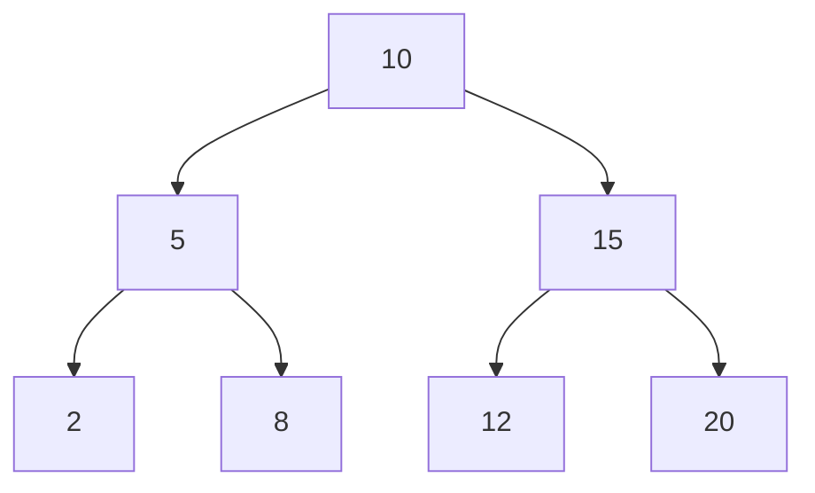

# File 13: Binary Search Tree (BST)

## Overview
A **Binary Search Tree (BST)** is a binary tree where for every node:
- All values in its **left subtree** are strictly smaller ($<$) than the node's value.
- All values in its **right subtree** are strictly greater ($>$) than the node's value.

---

## 1. Binary Search Tree Invariant



---

## 2. BST Insertion & Search Implementation

```javascript
class BSTNode {
    constructor(val) {
        this.val = val;
        this.left = null;
        this.right = null;
    }
}

class BinarySearchTree {
    constructor() {
        this.root = null;
    }

    insert(val) {
        const newNode = new BSTNode(val);
        if (!this.root) {
            this.root = newNode;
            return this;
        }

        let current = this.root;
        while (true) {
            if (val === current.val) return undefined; // Duplicates ignored
            if (val < current.val) {
                if (!current.left) {
                    current.left = newNode;
                    return this;
                }
                current = current.left;
            } else {
                if (!current.right) {
                    current.right = newNode;
                    return this;
                }
                current = current.right;
            }
        }
    }

    contains(val) {
        if (!this.root) return false;
        let current = this.root;
        while (current) {
            if (val < current.val) current = current.left;
            else if (val > current.val) current = current.right;
            else return true; // Found match!
        }
        return false;
    }
}

const bst = new BinarySearchTree();
bst.insert(10).insert(5).insert(15).insert(2).insert(8);
console.log(bst.contains(8));  // true
console.log(bst.contains(99)); // false
```

---

## Key Takeaways
1. BST insertion, deletion, and lookup run in **$O(\log n)$ Average Time** for balanced trees.
2. Degenerate unbalanced trees (linked-list shape) degrade to **$O(n)$ Worst Case** time.
3. Self-balancing trees (AVL, Red-Black Trees) guarantee $O(\log n)$ balancing.
