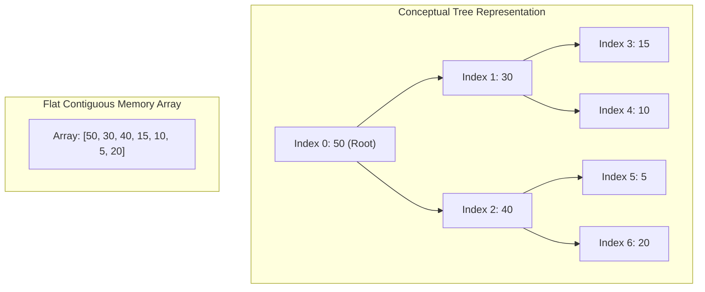
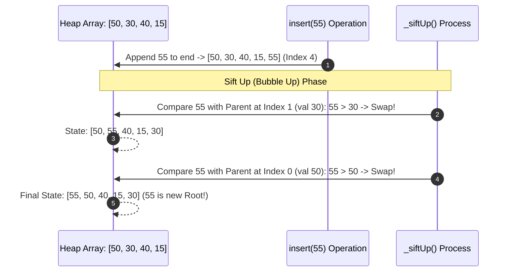

# Module 14: Binary Heaps, Priority Queues, and Linear $\mathcal{O}(N)$ Heapify

## Overview

A **Binary Heap** is a complete binary tree implemented inside a compact 1D array without explicit node pointer objects.

In a **Max-Heap**, every parent node's value is greater than or equal to its children ($\text{Parent} \ge \text{Child}$). In a **Min-Heap**, every parent node's value is less than or equal to its children ($\text{Parent} \le \text{Child}$). Heaps form the underlying data structure for **Priority Queues** and **Heap Sort**.

---

## 1. Array Index Mapping & Memory Representation

Because a binary heap is a **Complete Binary Tree** (filled level-by-level left-to-right), parent-child relationships are calculated using fast integer index arithmetic:



### Parent & Child Index Index Formulas (0-Based Array)

For any element at index $i$:
- **Parent Index**: $\lfloor (i - 1) / 2 \rfloor$ or `(i - 1) >> 1`
- **Left Child Index**: $2i + 1$ or `(i << 1) + 1`
- **Right Child Index**: $2i + 2$ or `(i << 1) + 2`

---

## 2. Heap Operations Lifecycle: `insert` and `extractMax`



---

## 3. $\mathcal{O}(N)$ Heapify Algorithm vs. $\mathcal{O}(N \log N)$ Successive Insertions

Converting an unsorted array of $N$ elements into a heap can be done in **Linear $\mathcal{O}(N)$ Time** by running `_siftDown()` starting from the last non-leaf node down to the root (`Math.floor(N/2) - 1` down to `0`).

> **Mathematical Proof**: Most nodes reside near the bottom of the tree (height 0 and 1) where `_siftDown()` does $\mathcal{O}(1)$ swaps. Only 1 node (root) can sift down $\log N$ levels. The converging summation $\sum_{h=0}^{\log N} \frac{N}{2^{h+1}} \cdot h = \mathcal{O}(N)$.

---

## 4. Production Min-Heap & Priority Queue Implementation

```javascript
class MinPriorityQueue {
  constructor() {
    this.heap = [];
  }

  peek() {
    return this.heap.length > 0 ? this.heap[0] : null;
  }

  size() {
    return this.heap.length;
  }

  // O(log N) Enqueue
  enqueue(val, priority) {
    const node = { val, priority };
    this.heap.push(node);
    this._siftUp(this.heap.length - 1);
  }

  // O(log N) Dequeue Min Priority
  dequeue() {
    if (this.heap.length === 0) return null;
    if (this.heap.length === 1) return this.heap.pop();

    const minNode = this.heap[0];
    this.heap[0] = this.heap.pop(); // Replace root with last element
    this._siftDown(0);

    return minNode;
  }

  _siftUp(index) {
    while (index > 0) {
      const parentIdx = (index - 1) >> 1;
      if (this.heap[index].priority >= this.heap[parentIdx].priority) break;

      // Swap with parent
      [this.heap[index], this.heap[parentIdx]] = [this.heap[parentIdx], this.heap[index]];
      index = parentIdx;
    }
  }

  _siftDown(index) {
    const length = this.heap.length;

    while (true) {
      let smallest = index;
      const leftIdx = (index << 1) + 1;
      const rightIdx = (index << 1) + 2;

      if (leftIdx < length && this.heap[leftIdx].priority < this.heap[smallest].priority) {
        smallest = leftIdx;
      }

      if (rightIdx < length && this.heap[rightIdx].priority < this.heap[smallest].priority) {
        smallest = rightIdx;
      }

      if (smallest === index) break; // Heap property satisfied!

      [this.heap[index], this.heap[smallest]] = [this.heap[smallest], this.heap[index]];
      index = smallest;
    }
  }
}

// Verification
const pq = new MinPriorityQueue();
pq.enqueue("Low Priority Task", 10);
pq.enqueue("Critical Alert", 1);
pq.enqueue("Medium Priority Task", 5);

console.log("Dequeued Min Priority:", pq.dequeue().val); // "Critical Alert" (Priority 1)
```

---

## 5. Heap Operations Complexity Matrix

| Heap Operation | Time Complexity | Auxiliary Space | V8 Memory Impact |
| :--- | :--- | :--- | :--- |
| **`peek()` / Root Access** | $\mathcal{O}(1)$ | $\mathcal{O}(1)$ | Returns `heap[0]` immediately. |
| **`enqueue()` / `insert()`** | $\mathcal{O}(\log N)$ | $\mathcal{O}(1)$ amortized | Appends to array and sifts up. |
| **`dequeue()` / `extractMin()`**| $\mathcal{O}(\log N)$ | $\mathcal{O}(1)$ | Replaces root with end element and sifts down. |
| **`buildHeap()` (Heapify)** | **$\mathcal{O}(N)$** | $\mathcal{O}(1)$ | In-place array transformation. |
| **Heap Sort** | $\mathcal{O}(N \log N)$ | $\mathcal{O}(1)$ | In-place sorting without extra memory allocation. |

---

## Key Production Takeaways

1. **Use Flat Arrays for Heaps**: Store binary heaps in 1D arrays instead of pointer node objects to maximize CPU cache locality and eliminate GC memory allocation.
2. **Use $\mathcal{O}(N)$ Heapify to Build Heaps from Existing Arrays**: When initializing a heap from an array of $N$ items, call `buildHeap()` ($\mathcal{O}(N)$ time) instead of calling `insert()` $N$ times ($\mathcal{O}(N \log N)$ time).
3. **Use Priority Queues for Top-K Problems**: Problems asking for "Top K Frequent Elements" or "Kth Largest Item" can be solved in $\mathcal{O}(N \log K)$ time using a Min-Heap of fixed capacity $K$.
4. **Use Bitwise Shift Operators for Index Arithmetic**: Use `(i - 1) >> 1` for parent index and `(i << 1) + 1` for left child index for high-performance JIT execution in hot loops.

