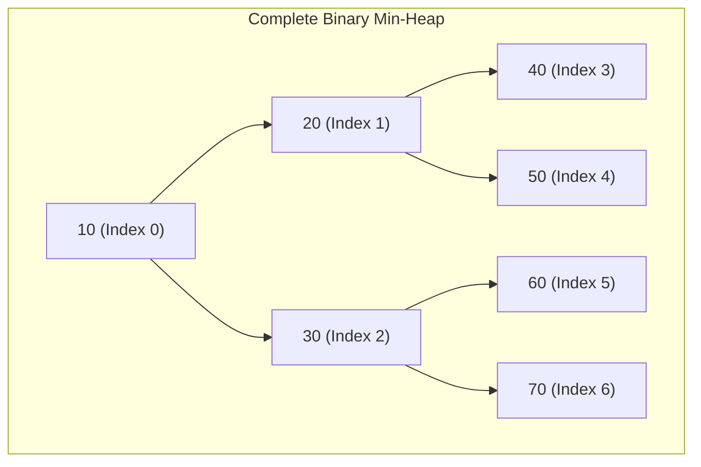
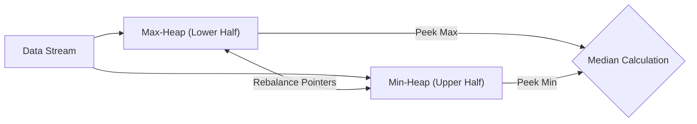

# Module 14: Binary Heaps, Priority Queues, & Heap Sort

## Theoretical Overview & Array Representation

A **Binary Heap** is a Complete Binary Tree stored compactly in a contiguous array without explicit node pointers. It satisfies the **Heap Property**:
- **Min-Heap**: The value of every parent node is $\le$ the values of its children ($A[\text{parent}] \le A[\text{child}]$). The absolute minimum element resides at root index `0`.
- **Max-Heap**: The value of every parent node is $\ge$ the values of its children ($A[\text{parent}] \ge A[\text{child}]$). The absolute maximum element resides at root index `0`.



### Contiguous Array Indexing Arithmetic
For any element at zero-based index $i$:

$$\text{Parent}(i) = \left\lfloor \frac{i - 1}{2} \right\rfloor, \quad \text{Left Child}(i) = 2i + 1, \quad \text{Right Child}(i) = 2i + 2$$

---

## 1. Heap Operations & Complexity Matrix

| Operation | Description | Time Complexity | Auxiliary Space |
| :--- | :--- | :--- | :--- |
| **Peek Min / Max**| Returns root element $A[0]$. | **$\mathcal{O}(1)$** | $\mathcal{O}(1)$ |
| **Insert Value** | Appends element to end and bubbles up (`_bubbleUp`). | **$\mathcal{O}(\log n)$** | $\mathcal{O}(1)$ |
| **Extract Min / Max**| Swaps root with last element, pops, and bubbles down (`_bubbleDown`). | **$\mathcal{O}(\log n)$** | $\mathcal{O}(1)$ |
| **Build Heap (`heapify`)**| Converts an arbitrary array into a valid heap bottom-up. | **$\mathcal{O}(n)$** (Floyd's algorithm) | $\mathcal{O}(1)$ |
| **Heap Sort** | In-place comparison sort using Max-Heap. | **$\mathcal{O}(n \log n)$** | **$\mathcal{O}(1)$** in-place |

---

## 2. Core MinHeap Implementation

```javascript
class MinHeap {
  constructor() { this.heap = []; }

  size() { return this.heap.length; }
  isEmpty() { return this.heap.length === 0; }
  peek() { return this.isEmpty() ? null : this.heap[0]; }

  insert(value) {
    this.heap.push(value);
    this._bubbleUp(this.heap.length - 1);
  }

  _bubbleUp(index) {
    while (index > 0) {
      const parentIdx = Math.floor((index - 1) / 2);
      if (this.heap[parentIdx] <= this.heap[index]) break;
      [this.heap[parentIdx], this.heap[index]] = [this.heap[index], this.heap[parentIdx]];
      index = parentIdx;
    }
  }

  extractMin() {
    if (this.isEmpty()) return null;
    if (this.size() === 1) return this.heap.pop();
    const min = this.heap[0];
    this.heap[0] = this.heap.pop();
    this._bubbleDown(0);
    return min;
  }

  _bubbleDown(index) {
    const length = this.heap.length;
    while (true) {
      let smallest = index;
      const left = 2 * index + 1, right = 2 * index + 2;
      if (left < length && this.heap[left] < this.heap[smallest]) smallest = left;
      if (right < length && this.heap[right] < this.heap[smallest]) smallest = right;
      if (smallest === index) break;
      [this.heap[index], this.heap[smallest]] = [this.heap[smallest], this.heap[index]];
      index = smallest;
    }
  }
}
```

---

## 3. Mathematical Proof of $O(n)$ `heapify` Construction

Inserting $n$ elements sequentially takes $\mathcal{O}(n \log n)$ time. However, building a heap bottom-up using Floyd's algorithm (`heapify`) executes in **$\mathcal{O}(n)$ linear time**.

### Proof
In a complete binary tree of height $h = \log_2 n$, there are at most $\lceil n / 2^{k+1} \rceil$ nodes at height $k$. Each node at height $k$ performs at most $k$ comparisons during `bubbleDown`.

$$\text{Total Operations } S = \sum_{k=0}^{\log n} \frac{n}{2^{k+1}} \cdot k = \frac{n}{2} \left( 0 + \frac{1}{2} + \frac{2}{4} + \frac{3}{8} + \dots \right)$$

The infinite series $\sum_{k=1}^{\infty} k / 2^k$ converges exactly to **2**.

$$S \le \frac{n}{2} \times 2 = \mathcal{O}(n)$$

```javascript
function heapify(arr) {
  for (let i = Math.floor(arr.length / 2) - 1; i >= 0; i--) {
    bubbleDown(arr, i, arr.length);
  }
  return arr;
}
```

---

## 4. In-Place Heap Sort Algorithm

Heap Sort builds a Max-Heap in $\mathcal{O}(n)$ time, then repeatedly swaps the max root element `arr[0]` to the array tail boundary `arr[i]`, invoking `bubbleDownMax` on reduced lengths.
- **Complexity**: Time $\mathcal{O}(n \log n)$ guaranteed across all cases, Space $\mathcal{O}(1)$ in-place.

```javascript
function heapSort(arr) {
  const n = arr.length;
  for (let i = Math.floor(n / 2) - 1; i >= 0; i--) bubbleDownMax(arr, i, n);
  for (let i = n - 1; i > 0; i--) {
    [arr[0], arr[i]] = [arr[i], arr[0]];
    bubbleDownMax(arr, 0, i);
  }
  return arr;
}
```

---

## 5. Major Algorithmic Problem Patterns

### 1. K-th Largest Element (`kthLargest`)
Find the $K$-th largest element in an unsorted stream or array in **$\mathcal{O}(n \log K)$** time.
- **Strategy**: Maintain a `MinHeap` capped at maximum size $K$. When heap size exceeds $K$, pop the smallest element via `extractMin()`. The root `peek()` holds the $K$-th largest value.

```javascript
function kthLargest(arr, k) {
  const heap = new MinHeap();
  for (const num of arr) {
    heap.insert(num);
    if (heap.size() > k) heap.extractMin();
  }
  return heap.peek();
}
```

### 2. Merge K Sorted Arrays (`mergeKSortedArrays`)
Merge $K$ sorted arrays into a single unified sorted array.
- **Strategy**: Insert initial elements from each array into a `PriorityQueue` of size $K$. Pop minimum element, append to output, and enqueue next element from the same source array.
- **Complexity**: Time $\mathcal{O}(N \log K)$ where $N$ is total elements across all arrays.

### 3. Dual-Heap Streaming Median Finder (`MedianFinder`)
Maintain real-time median calculations over an incoming data stream in **$\mathcal{O}(\log n)$ insertion** and **$\mathcal{O}(1)$ lookup**.
- **Architecture**:
  - `maxHeap`: Holds lower half of numbers.
  - `minHeap`: Holds upper half of numbers.
  - Keep heap sizes balanced such that `maxHeap.size()` equals or exceeds `minHeap.size()` by at most 1.



```javascript
class MedianFinder {
  constructor() {
    this.maxHeap = new MaxHeap();
    this.minHeap = new MinHeap();
  }

  addNum(num) {
    if (this.maxHeap.isEmpty() || num <= this.maxHeap.peek()) this.maxHeap.insert(num);
    else this.minHeap.insert(num);

    if (this.maxHeap.size() > this.minHeap.size() + 1) this.minHeap.insert(this.maxHeap.extractMax());
    else if (this.minHeap.size() > this.maxHeap.size()) this.maxHeap.insert(this.minHeap.extractMin());
  }

  findMedian() {
    if (this.maxHeap.size() > this.minHeap.size()) return this.maxHeap.peek();
    return (this.maxHeap.peek() + this.minHeap.peek()) / 2;
  }
}
```

---

## Key Takeaways

1. **Array Storage Efficiency**: Binary heaps require no node pointer memory; parent/child links are derived via index math ($2i + 1, 2i + 2$).
2. **Optimal Extremum Access**: `peek()` returns absolute min/max in $\mathcal{O}(1)$ time.
3. **Linear Heap Building**: Floyd's `heapify` constructs a heap in $\mathcal{O}(n)$ time.
4. **Dual-Heap Pattern**: Combining a Max-Heap and Min-Heap enables $\mathcal{O}(1)$ median queries over streaming data.
