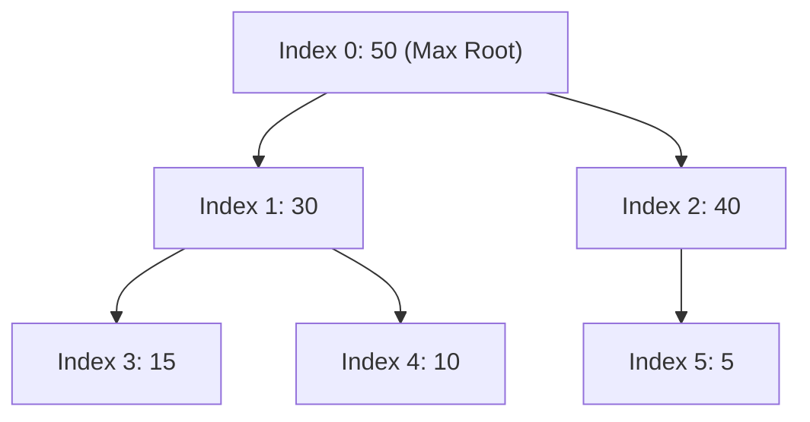

# File 14: Binary Heaps and Priority Queues

## Overview
A **Binary Heap** is a complete binary tree used to implement **Priority Queues**. In a **Max-Heap**, parent nodes are greater than or equal to their children; in a **Min-Heap**, parent nodes are smaller than or equal to their children.

---

## 1. Array Index Pointer Mapping in Binary Heaps



### Parent & Child Index Formulas

For element at 0-based array index $i$:
- **Parent Index**: $\lfloor (i - 1) / 2 \rfloor$
- **Left Child Index**: $2i + 1$
- **Right Child Index**: $2i + 2$

---

## 2. Max-Heap Implementation

```javascript
class MaxBinaryHeap {
    constructor() {
        this.values = [];
    }

    insert(element) {
        this.values.push(element);
        this._bubbleUp();
    }

    _bubbleUp() {
        let idx = this.values.length - 1;
        const element = this.values[idx];

        while (idx > 0) {
            let parentIdx = Math.floor((idx - 1) / 2);
            let parent = this.values[parentIdx];

            if (element <= parent) break; // Heap property satisfied!

            // Swap with parent
            this.values[parentIdx] = element;
            this.values[idx] = parent;
            idx = parentIdx;
        }
    }

    extractMax() {
        const max = this.values[0];
        const end = this.values.pop();
        if (this.values.length > 0) {
            this.values[0] = end;
            this._sinkDown();
        }
        return max;
    }

    _sinkDown() {
        let idx = 0;
        const length = this.values.length;
        const element = this.values[0];

        while (true) {
            let leftChildIdx = 2 * idx + 1;
            let rightChildIdx = 2 * idx + 2;
            let leftChild, rightChild;
            let swap = null;

            if (leftChildIdx < length) {
                leftChild = this.values[leftChildIdx];
                if (leftChild > element) swap = leftChildIdx;
            }

            if (rightChildIdx < length) {
                rightChild = this.values[rightChildIdx];
                if (
                    (swap === null && rightChild > element) ||
                    (swap !== null && rightChild > leftChild)
                ) {
                    swap = rightChildIdx;
                }
            }

            if (swap === null) break;
            this.values[idx] = this.values[swap];
            this.values[swap] = element;
            idx = swap;
        }
    }
}

const heap = new MaxBinaryHeap();
heap.insert(41);
heap.insert(39);
heap.insert(33);
heap.insert(55); // Bubbles to root!

console.log("Max Element:", heap.extractMax()); // 55
```

---

## Key Takeaways
1. Binary Heaps are stored efficiently in **compact 1D Arrays** without explicit pointer objects.
2. `insert` and `extractMax` run in **$O(\log n)$ Logarithmic Time**.
3. Peak root element access (`peek`) runs in **$O(1)$ Constant Time**.
