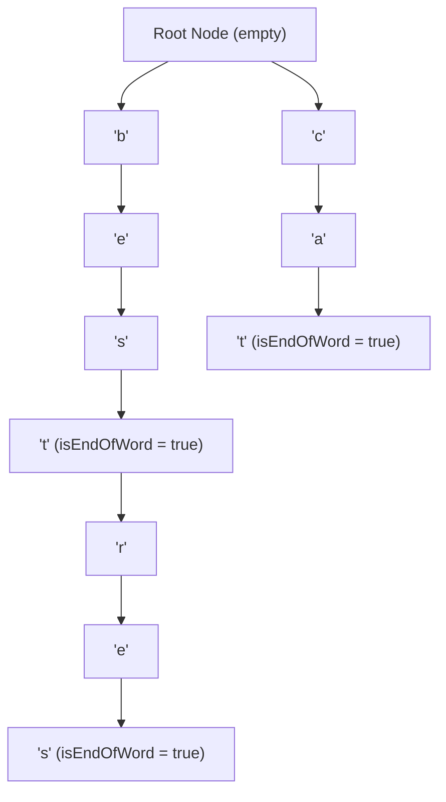

# Module 15: Tries (Prefix Trees), Autocomplete Engines, & Prefix Searching

## Theoretical Overview & Shared Prefix Architecture

A **Trie** (pronounced "try", originating from *re-trie-val*) or **Prefix Tree** is a tree-based data structure optimized for character string lookups. Unlike a standard binary tree, node keys are not stored explicitly within individual nodes; instead, a node's position in the tree defines its associated character prefix.



### Shared Memory Overhead Optimization
In a Trie, words sharing common prefixes (e.g., `"best"`, `"bestresort"`, `"cat"`, `"cattle"`) share identical ancestor node paths. This eliminates duplicate storage for overlapping prefixes.

---

## 1. Complexity & Structural Comparison Matrix

Let $m$ be the length of the string query and $n$ be the total number of words in the dictionary.

| Data Structure / Operation | Insert Word | Exact Search | Prefix Search (`startsWith`) | Autocomplete Return | Space Complexity |
| :--- | :--- | :--- | :--- | :--- | :--- |
| **Hash Map / Set** | $\mathcal{O}(m)$ | **$\mathcal{O}(m)$** | $\mathcal{O}(n \cdot m)$ (Full Scan) | $\mathcal{O}(n \cdot m)$ | $\mathcal{O}(n \cdot m)$ duplicate keys |
| **Trie (Prefix Tree)** | **$\mathcal{O}(m)$** | **$\mathcal{O}(m)$** | **$\mathcal{O}(m)$** | **$\mathcal{O}(m + k)$** | **$\mathcal{O}(\text{unique prefixes})$** |

---

## 2. Core Trie Implementation

```javascript
class TrieNode {
  constructor() {
    this.children = new Map(); // Map character -> TrieNode
    this.isEndOfWord = false;
  }
}

class Trie {
  constructor() { this.root = new TrieNode(); }

  insert(word) {
    let current = this.root;
    for (const char of word) {
      if (!current.children.has(char)) {
        current.children.set(char, new TrieNode());
      }
      current = current.children.get(char);
    }
    current.isEndOfWord = true;
  }

  search(word) {
    const node = this._findNode(word);
    return node !== null && node.isEndOfWord;
  }

  startsWith(prefix) { return this._findNode(prefix) !== null; }

  _findNode(str) {
    let current = this.root;
    for (const char of str) {
      if (!current.children.has(char)) return null;
      current = current.children.get(char);
    }
    return current;
  }

  delete(word) { this._deleteHelper(this.root, word, 0); }

  _deleteHelper(node, word, depth) {
    if (node === null) return false;
    if (depth === word.length) {
      if (!node.isEndOfWord) return false;
      node.isEndOfWord = false;
      return node.children.size === 0;
    }
    const char = word[depth];
    const child = node.children.get(char);
    if (!child) return false;
    if (this._deleteHelper(child, word, depth + 1)) {
      node.children.delete(char);
      return node.children.size === 0 && !node.isEndOfWord;
    }
    return false;
  }

  getWordsWithPrefix(prefix) {
    const node = this._findNode(prefix);
    if (node === null) return [];
    const results = [];
    this._collectWords(node, prefix, results);
    return results;
  }

  _collectWords(node, currentWord, results) {
    if (node.isEndOfWord) results.push(currentWord);
    for (const [char, child] of node.children) {
      this._collectWords(child, currentWord + char, results);
    }
  }

  autocomplete(prefix, limit = 5) {
    return this.getWordsWithPrefix(prefix).slice(0, limit);
  }
}
```

---

## 3. Practical Algorithmic Problem Patterns

### 1. Count Words Matching Prefix (`countWordsWithPrefix`)
Find the total number of dictionary words sharing a specified prefix in $\mathcal{O}(m + k)$ time.

```javascript
function countWordsWithPrefix(trie, prefix) {
  const node = trie._findNode(prefix);
  if (node === null) return 0;
  return countEndOfWords(node);
}

function countEndOfWords(node) {
  let count = node.isEndOfWord ? 1 : 0;
  for (const [, child] of node.children) count += countEndOfWords(child);
  return count;
}
```

### 2. Longest Common Prefix (`longestCommonPrefix`)
Find the longest common prefix among an array of strings by traversing single-child paths starting from the root.

```javascript
function longestCommonPrefix(words) {
  if (words.length === 0) return "";
  const lcpTrie = new Trie();
  words.forEach(w => lcpTrie.insert(w));

  let current = lcpTrie.root, prefix = "";
  while (current.children.size === 1 && !current.isEndOfWord) {
    const [char, child] = current.children.entries().next().value;
    prefix += char;
    current = child;
  }
  return prefix;
}
```

### 3. Word Break Problem (`wordBreak`)
Validate if string `s` can be segmented into space-separated dictionary words using Dynamic Programming combined with a Trie.

```javascript
function wordBreak(s, wordDict) {
  const dictTrie = new Trie();
  wordDict.forEach(w => dictTrie.insert(w));
  const dp = new Array(s.length + 1).fill(false);
  dp[0] = true;
  for (let i = 1; i <= s.length; i++) {
    for (let j = 0; j < i; j++) {
      if (dp[j] && dictTrie.search(s.substring(j, i))) {
        dp[i] = true;
        break;
      }
    }
  }
  return dp[s.length];
}
```

### 4. Sentence Token Prefix Replacement (`replaceWords`)
Replace words in a sentence with their shortest matching root prefix (e.g., `"the cattle was rattled"` $\to$ `"the cat was rat"`).

```javascript
function replaceWords(roots, sentence) {
  const rootTrie = new Trie();
  roots.forEach(r => rootTrie.insert(r));

  return sentence.split(" ").map(word => {
    let current = rootTrie.root, prefix = "";
    for (const char of word) {
      if (current.isEndOfWord) return prefix;
      if (!current.children.has(char)) return word;
      current = current.children.get(char);
      prefix += char;
    }
    return current.isEndOfWord ? prefix : word;
  }).join(" ");
}
```

### 5. Amazon Search Suggestion Engine (`searchSuggestions`)
Generate real-time search suggestions as a user types each character of a query string.

```javascript
function searchSuggestions(products, searchWord) {
  const sugTrie = new Trie();
  products.forEach(p => sugTrie.insert(p));
  const results = [];
  let prefix = "";
  for (const char of searchWord) {
    prefix += char;
    const matches = sugTrie.getWordsWithPrefix(prefix);
    matches.sort();
    results.push(matches.slice(0, 3));
  }
  return results;
}
```

---

## Key Takeaways

1. **Prefix Search Dominance**: Tries execute prefix checks and autocomplete in $\mathcal{O}(m)$ time, outperforming Hash Maps which require full $\mathcal{O}(n \cdot m)$ table scans.
2. **Node Map vs Fixed Array**: Utilizing `new Map()` for child nodes optimizes RAM compared to fixed 26-element arrays for mixed alphabets and Unicode strings.
3. **Pruning Deletion**: Deleting words requires bottom-up recursive pruning of child nodes that no longer lead to valid word ends.
4. **Autocomplete Architecture**: Powers search engines, dictionary spell-checkers, IP routing tables, and IDE code completion.
