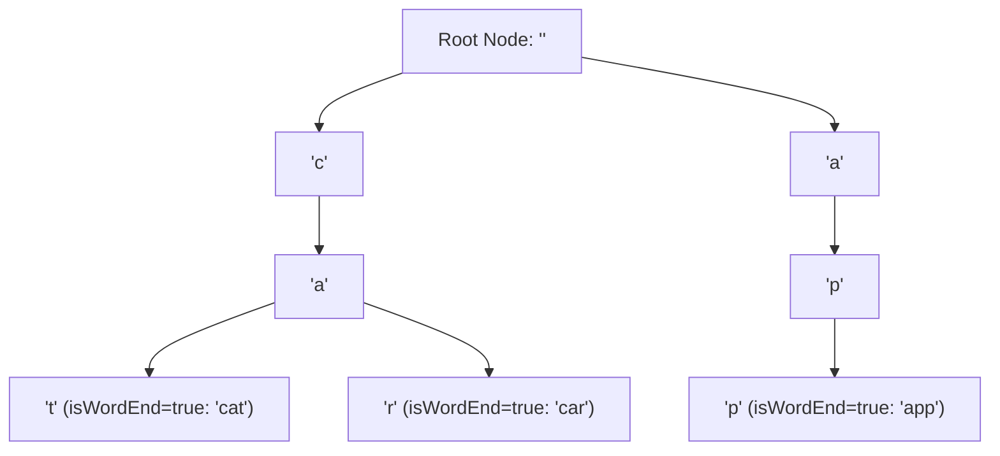

# File 15: Tries (Prefix Trees)

## Overview
A **Trie (Prefix Tree)** is a specialized tree-based data structure used to store associative keys (typically strings). Tries provide $O(k)$ time complexity (where $k$ is word length) for **Autocomplete** suggestions and prefix searches.

---

## 1. Trie Search Tree Architecture



---

## 2. Trie Autocomplete Implementation

```javascript
class TrieNode {
    constructor() {
        this.children = {};
        this.isWordEnd = false;
    }
}

class Trie {
    constructor() {
        this.root = new TrieNode();
    }

    insert(word) {
        let node = this.root;
        for (const char of word) {
            if (!node.children[char]) {
                node.children[char] = new TrieNode();
            }
            node = node.children[char];
        }
        node.isWordEnd = true;
    }

    search(word) {
        let node = this.root;
        for (const char of word) {
            if (!node.children[char]) return false;
            node = node.children[char];
        }
        return node.isWordEnd;
    }

    startsWith(prefix) {
        let node = this.root;
        for (const char of prefix) {
            if (!node.children[char]) return false;
            node = node.children[char];
        }
        return true;
    }
}

const trie = new Trie();
trie.insert("cat");
trie.insert("car");
trie.insert("app");

console.log(trie.search("cat"));       // true
console.log(trie.startsWith("ca"));   // true
console.log(trie.search("cab"));       // false
```

---

## Key Takeaways
1. Insert and search complexity depend **solely on word length $k$ ($O(k)$)**, independent of the number of words stored ($n$).
2. Ideal for implementing **Autocomplete**, **Spellcheckers**, and **IP Routing Tables**.
