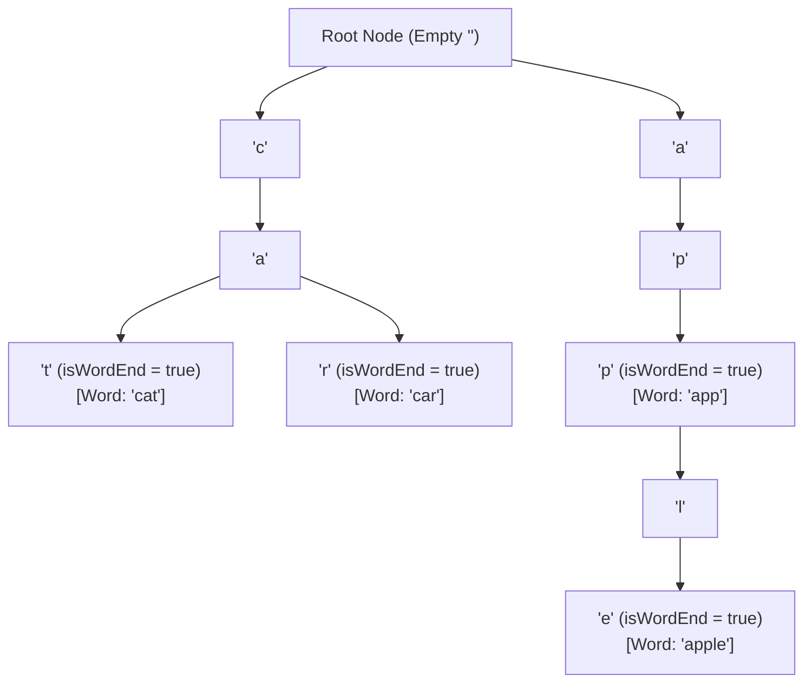
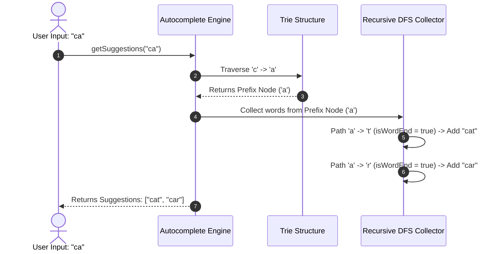

# Module 15: Tries (Prefix Trees), Autocomplete Engines, and Prefix Search

## Overview

A **Trie** (derived from "re**trie**val", pronounced "try") is an $N$-ary **Prefix Tree** designed for storing strings and performing prefix-based searches.

Unlike Hash Maps—where string keys are evaluated as a whole—a Trie breaks strings down character-by-character along directed path branches. This guarantees **$\mathcal{O}(K)$ operation time** (where $K$ is the length of the string), completely independent of the total number of words ($N$) stored in the dictionary!

---

## 1. Trie Node Architecture & Path Branching



---

## 2. Autocomplete Suggestion Generation Workflow

To generate autocomplete predictions for a user's typed prefix (e.g. `"ca"`):
1. **Navigate to Prefix Node**: Traverse the Trie following characters `'c'` then `'a'`.
2. **Collect Descendants via DFS**: Run a Depth-First Search from the prefix node to gather all complete words where `isWordEnd === true`.



---

## 3. Operations Complexity Matrix

| Operation | Time Complexity | Auxiliary Space | Key Factor |
| :--- | :--- | :--- | :--- |
| **Insert Word** | $\mathcal{O}(K)$ | $\mathcal{O}(K)$ | $K = \text{length of word being inserted}$. |
| **Search Word** | $\mathcal{O}(K)$ | $\mathcal{O}(1)$ | Returns true only if path exists AND `isWordEnd === true`. |
| **StartsWith Prefix**| $\mathcal{O}(K)$ | $\mathcal{O}(1)$ | Returns true if valid path exists for prefix. |
| **Autocomplete** | $\mathcal{O}(K + P)$ | $\mathcal{O}(P)$ | $P = \text{total characters across matched suggestion words}$. |

---

## 4. Production Trie & Autocomplete Implementation Code

```javascript
class TrieNode {
  constructor() {
    this.children = new Map(); // Character -> TrieNode mapping
    this.isWordEnd = false;
  }
}

class Trie {
  constructor() {
    this.root = new TrieNode();
  }

  // O(K) Insertion
  insert(word) {
    let current = this.root;

    for (let i = 0; i < word.length; i++) {
      const char = word[i];
      if (!current.children.has(char)) {
        current.children.set(char, new TrieNode());
      }
      current = current.children.get(char);
    }

    current.isWordEnd = true;
  }

  // O(K) Exact Word Search
  search(word) {
    let current = this.root;

    for (let i = 0; i < word.length; i++) {
      const char = word[i];
      if (!current.children.has(char)) return false;
      current = current.children.get(char);
    }

    return current.isWordEnd;
  }

  // O(K) Prefix Check
  startsWith(prefix) {
    let current = this.root;

    for (let i = 0; i < prefix.length; i++) {
      const char = prefix[i];
      if (!current.children.has(char)) return false;
      current = current.children.get(char);
    }

    return true;
  }

  // Autocomplete Suggestions Engine - O(K + P) Time
  getAutocompleteSuggestions(prefix) {
    let current = this.root;

    // 1. Navigate to Prefix Node
    for (let i = 0; i < prefix.length; i++) {
      const char = prefix[i];
      if (!current.children.has(char)) return []; // Prefix not found
      current = current.children.get(char);
    }

    // 2. DFS Traversal to collect all words starting from prefix node
    const results = [];
    this._dfsCollectWords(current, prefix, results);
    return results;
  }

  _dfsCollectWords(node, currentPath, results) {
    if (node.isWordEnd) {
      results.push(currentPath);
    }

    for (const [char, childNode] of node.children.entries()) {
      this._dfsCollectWords(childNode, currentPath + char, results);
    }
  }
}

// Verification
const dictionary = new Trie();
dictionary.insert("cat");
dictionary.insert("car");
dictionary.insert("card");
dictionary.insert("care");
dictionary.insert("app");
dictionary.insert("apple");

console.log("Search 'cat'     :", dictionary.search("cat"));                // true
console.log("StartsWith 'ca'  :", dictionary.startsWith("ca"));            // true
console.log("Suggestions 'ca' :", dictionary.getAutocompleteSuggestions("ca")); 
// Output: ["cat", "car", "card", "care"]
```

---

## Key Production Takeaways

1. **Independent of Dictionary Size**: Searching in a Trie depends strictly on word length $K$ ($\mathcal{O}(K)$), not the number of words $N$. This makes Tries faster than Hash Maps for prefix searches.
2. **Ideal for Autocomplete & Search Suggestions**: Tries allow instantly locating prefix subtrees and iterating descendants to suggest top query completions.
3. **Be Mindful of Memory Overhead**: Tries create many small `TrieNode` objects in memory. For memory-constrained environments, use a **Radix Tree (Compressed Trie)** which merges single-child node chains (e.g. `'a' -> 'p' -> 'p' -> 'l' -> 'e'` into `'apple'`).
4. **Use Fixed Length Arrays for Monomorphic Character Sets**: For standard lowercase English alphabet inputs (`a-z`), replacing `Map` with a fixed `new Array(26)` yields faster V8 pointer lookups.

