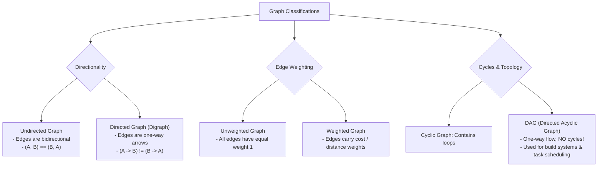

# Module 16: Graph Fundamentals, Taxonomy, and Adjacency Representations

## Overview

A **Graph** $G = (V, E)$ is a non-linear data structure consisting of a set of **Vertices (Nodes, $V$)** interconnected by a set of **Edges (Links, $E$)**.

Graphs model complex real-world relationships—such as social network friend graphs, internet IP routing, package dependency trees, and GPS road networks. Choosing between **Adjacency Lists** and **Adjacency Matrices** directly dictates algorithm memory consumption and lookup speed.

---

## 1. Graph Taxonomy & Classification



---

## 2. Adjacency List vs. Adjacency Matrix Representations

```mermaid
graph TD
    subgraph Adjacency List Representation: O(V + E) Space
        NodeA["'Delhi'"] --> EdgeA["['Mumbai', 'Bengaluru']"]
        NodeB["'Mumbai'"] --> EdgeB["['Delhi', 'Goa']"]
        NodeC["'Bengaluru'"] --> EdgeC["['Delhi']"]
    end

    subgraph Adjacency Matrix Representation: O(V²) Space
        Matrix["2D Matrix Grid V x V<br/>[0, 1, 1]<br/>[1, 0, 1]<br/>[1, 1, 0]"]
    end
```

### Representation Comparison Matrix

| Operations / Characteristics | Adjacency List (`Map<Vertex, Set>`) | Adjacency Matrix (`2D Array [V][V]`) |
| :--- | :--- | :--- |
| **Space Complexity** | **$\mathcal{O}(V + E)$ (Optimal for Sparse Graphs)** | $\mathcal{O}(V^2)$ (Heavy for large sparse graphs) |
| **Add Vertex** | $\mathcal{O}(1)$ | $\mathcal{O}(V^2)$ (Must resize 2D matrix) |
| **Add Edge** | $\mathcal{O}(1)$ | $\mathcal{O}(1)$ |
| **Query Edge Existence (`A -> B`)** | $\mathcal{O}(\text{degree}(V))$ or $\mathcal{O}(1)$ with Set | **$\mathcal{O}(1)$ Constant** |
| **Find All Neighbors of Node $V$**| **$\mathcal{O}(\text{degree}(V))$** | $\mathcal{O}(V)$ (Must scan entire row) |
| **Best Used For** | Real-world sparse graphs ($E \ll V^2$) | Small or extremely dense graphs ($E \approx V^2$) |

---

## 3. Production Graph Class Implementation (Adjacency List)

```javascript
class Graph {
  constructor(isDirected = false) {
    this.adjacencyList = new Map(); // Vertex -> Set of Neighbor Vertices
    this.isDirected = isDirected;
  }

  addVertex(vertex) {
    if (!this.adjacencyList.has(vertex)) {
      this.adjacencyList.set(vertex, new Set());
    }
  }

  addEdge(v1, v2) {
    this.addVertex(v1);
    this.addVertex(v2);

    this.adjacencyList.get(v1).add(v2);

    if (!this.isDirected) {
      this.adjacencyList.get(v2).add(v1); // Undirected link
    }
  }

  removeEdge(v1, v2) {
    if (this.adjacencyList.has(v1)) {
      this.adjacencyList.get(v1).delete(v2);
    }
    if (!this.isDirected && this.adjacencyList.has(v2)) {
      this.adjacencyList.get(v2).delete(v1);
    }
  }

  removeVertex(vertex) {
    if (!this.adjacencyList.has(vertex)) return;

    // 1. Remove edges pointing to this vertex from all neighbors
    for (const [v, neighbors] of this.adjacencyList.entries()) {
      neighbors.delete(vertex);
    }

    // 2. Delete the vertex entry itself
    this.adjacencyList.delete(vertex);
  }

  getNeighbors(vertex) {
    return this.adjacencyList.get(vertex) || new Set();
  }
}

// Verification
const network = new Graph(false); // Undirected Social Network
network.addEdge("Delhi", "Mumbai");
network.addEdge("Delhi", "Bengaluru");
network.addEdge("Mumbai", "Goa");

console.log("Delhi Neighbors :", Array.from(network.getNeighbors("Delhi")));
// Output: ["Mumbai", "Bengaluru"]
```

---

## Key Production Takeaways

1. **Prefer Adjacency Lists for Real-World Applications**: Real-world graphs (social networks, web page links, road maps) are sparse ($E \ll V^2$). Adjacency Lists consume optimal $\mathcal{O}(V + E)$ memory.
2. **Use ES6 `Set` for Constant-Time Neighbor Edge Operations**: Storing neighbors in an ES6 `Set` rather than a standard array provides $\mathcal{O}(1)$ time edge deletion and existence checks.
3. **Use Adjacency Matrix for Dense Graphs or Floyd-Warshall**: Adjacency Matrices offer direct $\mathcal{O}(1)$ lookup for checking whether edge $(u, v)$ exists, making them suitable for dynamic programming dense graph algorithms.
4. **Identify Directed Acyclic Graphs (DAGs)**: DAGs are fundamental for task scheduling (e.g. Airflow DAGs, Webpack dependency graphs, Makefiles).

